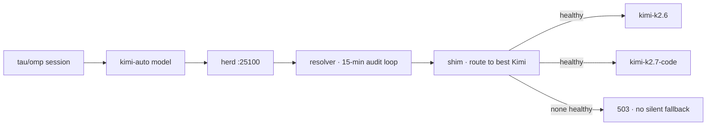

# tau-kimi-auto

<div align="right">

[](https://github.com/toxicwind/tau-extensions/blob/main/LICENSE)
[](https://github.com/toxicwind/sovereign-projects)
[](https://github.com/toxicwind/tau-extensions/tree/main/packages/tau-kimi-auto)

</div>

Part of [`toxicwind/tau-extensions`](https://github.com/toxicwind/tau-extensions) —
a monorepo of Tau/omp extensions.

A Tau extension (`@toxicwind/tau-kimi-auto` v1.0.0) that registers the
`kimi-auto` virtual model as a first-class, selectable model inside
Tau/omp sessions. `kimi-auto` is a herd-side alias (see
[`toxicwind/kimi-auto`](https://github.com/toxicwind/kimi-auto)): the herd
shim resolves it to the **best available Kimi model per request**. It is
Kimi-only by design — when no Kimi candidate is healthy the shim answers
503 instead of silently routing you to a non-Kimi model.



## Features

- **Virtual model registration** — `kimi-auto` appears in the model picker
  like any other model; no per-request flags.
- **Herd-side resolution** — the actual pick happens on the herd shim, so
  every session benefits from the resolver's health data automatically.
- **Fail-loud, not fail-silent** — 503 when no Kimi candidate is healthy,
  never a quiet reroute to a different provider.
- **Observability** — the extension includes a state reader over the
  resolver's state file (`KIMI_AUTO_STATE`).

## Quick start

```bash
# from the monorepo
cd packages/tau-kimi-auto && bun install
omp --extension .
```

Requires `@oh-my-pi/pi-coding-agent` (peer, `^18.0.11`).

## Architecture

Model selection lives in `resolver.py` (15-min audit loop, pitchfork-managed);
routing lives in `shim.py` (herd sidecar, started via a `--config-dir`
fragment). This package is deliberately thin: an OpenAI-compatible provider
pointed at herd's `kimi-auto` route, plus the state reader for observability.
The extension entry is `./src/extension.ts` (declared in `package.json`
under `tau.extensions`).

## Config

| Env var | Default | Purpose |
| --- | --- | --- |
| `KIMI_AUTO_HERD` | `http://127.0.0.1:25100` | Herd base URL |
| `KIMI_AUTO_STATE` | `~/.local/share/kimi-auto/state.json` | Resolver state file |

## Dev / contributing

```bash
bun install
bun test
bun run typecheck
```

## License & security

MIT — see [LICENSE](../LICENSE).

- The extension points at your own herd instance; it adds no new network
  surface and carries no credentials.
- A 503 from `kimi-auto` means *no healthy Kimi* — that is the contract
  working, not an outage to route around.
