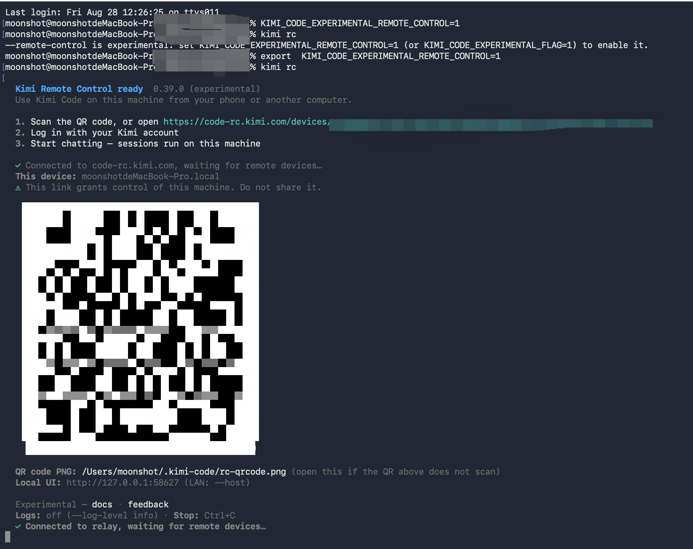

# 远程控制

在终端里使用 `kimi rc` 命令启动 Kimi Code CLI 并开启远程控制后，会自动生成一个可以远程控制本机的链接。你可以使用手机扫描二维码打开链接，或在其他设备上直接访问该链接。打开链接后，登录和本地 Kimi Code CLI 中相同的 Kimi 账号，就能远程查看任务进度、处理权限确认、继续对话，或新建会话。任务始终在本机执行，网页只是一个远程窗口。

## 开始使用

### 使用前准备

开启远程控制前，请确认本机满足以下条件：

- **已安装 Kimi Code CLI**：安装见 [开始使用](../guides/getting-started.md)
- **已登录 Kimi 账号且为付费会员**：远程控制需要会员权限，免费用户无法使用
- **本机保持唤醒并联网**：远程控制依赖本机与 Kimi 服务保持连接，关机、休眠或断网后远程会话不可用

### 第一步：启动远程控制

在本机用以下任一方式启动，效果相同：启动一个前台进程并打印远程访问信息。

- **`kimi rc`**（别名 `kimi remote`）：直接启动远程控制
- **`kimi web --remote-control`**：与 `kimi rc` 等价，在启动本地网页界面的同时把它暴露到公网
- **`/remote-control`**（别名 `/rc`）：已在 CLI 会话中时使用，把当前会话直接交给远程界面

启动成功后，终端会打印访问链接（形如 `https://code-rc.kimi.com/devices/<设备 ID>/`）、二维码和本机设备名（主机名），同时默认浏览器会自动打开该链接（加 `--no-open` 可关闭）。二维码除了显示在终端里，还会保存为 PNG 文件（路径见启动信息），终端里无法正常显示二维码时，可以直接打开该文件。

::: warning 注意
远程控制链接是这台机器的远程控制入口，获得链接的人可能控制你的会话和文件，请勿分享给他人或发布到公开渠道。
:::

两个使用限制：

- 一台机器同时只能运行一个远程控制实例。重复启动会提示已有实例在运行，并给出在用的链接；停止旧实例的方法见 [如何关闭远程控制](#如何关闭远程控制)
- 远程控制不能与 `--dangerous-bypass-auth` 同时使用，也只绑定本机回环地址（不能用 `--host` 做局域网共享，远程访问统一走 Kimi 中转服务）

### 第二步：从其他设备连接

1. 在手机或另一台电脑的浏览器中打开启动信息里的访问链接，手机也可以直接扫终端里的二维码。
2. 使用与本机相同的 Kimi 账号登录。
3. 登录后在设备列表中选择这台机器（显示主机名），即可看到它的会话列表并开始操作。

远程控制通过浏览器访问。

::: info 设备数量限制
当前每个账号最多支持约 **3 台**设备。
:::

### 如何关闭远程控制

远程控制是前台进程，停止方式取决于你能否找到启动它的终端：

- **终端还在**：在该终端按 `Ctrl+C`（或直接关闭该终端窗口），设备会立即从远程列表中下线
- **找不到终端**：单实例锁文件 `~/.kimi-code/server/rc.json` 里记录着进程 pid 和在用的链接（重复启动时的报错也会打印这两个信息），执行 `kill <pid>` 即可
- **进程已异常退出**（断电、崩溃等）：残留的锁文件会在下次启动时自动清理，无需手动删除

想新开一个实例时，先把旧的按上面任一方式停掉再重新 `kimi rc` 即可。设备 ID 按本机数据目录生成，重开后设备和访问链接都不变。网页端设备管理与撤销的具体入口以最终发布版本为准。

## 远程会话中可以做什么

远程会话与本地会话能力基本一致，支持：

- **发送新的任务**：直接向 AI 描述需求，任务在本机执行
- **查看当前进度**：实时展示执行步骤和正在使用的工具
- **继续对话**：在已有会话基础上追加指令
- **查看工具调用**：展开每次工具执行的输入与结果
- **处理权限确认**：文件修改、Shell 执行等确认请求，可直接在网页上批准或拒绝
- **中断或停止任务**：随时停止当前任务
- **查看子 Agent / workflow 状态**：任务派发的子 Agent 或 workflow，可在任务面板中查看进度

## 本地电脑上发生什么

远程控制只是一个远程窗口，所有计算和文件操作仍在本机完成。边界如下：

| 内容 | 是否在本地完成 |
| --- | --- |
| 读取项目文件 | 是 |
| 修改项目文件 | 是 |
| 执行 Shell 命令 | 是 |
| 使用本地 MCP | 是 |
| 手机或浏览器界面 | 否 |
| 会话同步 | 通过 Kimi 服务完成 |

## 断线、休眠和恢复

- **关闭浏览器**：任务在本机继续执行，不会中断。重新打开访问链接即可恢复会话视图
- **本机断网**：断网期间远程界面断开，无法操作。本机的远程控制进程和本地服务保持运行，但执行中的任务可能因模型请求发不出去而暂停或失败；网络恢复后本机会自动重连中转服务，刷新远程页面即可，无需重启
- **电脑休眠**：休眠后远程控制连接断开，任务可能暂停或失败。建议在系统设置中将电脑设为永不休眠，或在使用期间保持唤醒
- **本地进程退出**：按 `Ctrl+C` 或关闭终端后远程控制停止，设备从远程列表中下线。重新启动后可恢复
- **结束远程连接但保留本地任务**：直接关闭网页即可，本机任务不受影响

## 远程控制和 Kimi Code 网页版有什么区别？

[Kimi Code 网页版](../guides/web.md) 是本机或局域网里的图形界面，远程控制把它延伸到了公网任意设备：

| 对比项 | Kimi Code 网页版 | 远程控制 |
| --- | --- | --- |
| 访问范围 | 本机 `localhost`，或 `--host` 开启的局域网 | 公网任意设备（经 Kimi 中转） |
| 启动方式 | 终端运行 `kimi web` | `kimi rc`、`kimi web --remote-control` 或 CLI 中 `/remote-control` |
| 鉴权方式 | 本地 token | 登录同一个 Kimi 账号 |
| 数据与执行位置 | 本机 | 本机（网页只是远程窗口） |
| 典型场景 | 本机浏览器图形界面操作 | 手机、平板、另一台电脑远程跟进 |

网页界面的详细功能见 [在网页中使用](../guides/web.md)。

## 安全与权限

### 远程设备如何鉴权

远程设备必须登录与本机相同的 Kimi 账号，才能查看和控制会话。不会向其他账号暴露你的设备，也不存在无需登录即可访问的公开链接。

### 访问链接是否包含敏感信息

访问链接本身不包含会话数据或本地 token，所有内容都需要登录后按账号权限展示。但它是这台机器的远程控制入口，启动信息中也会提示不要分享给他人。

## 常见问题

### 从微信里访问链接，无法打开怎么办？

微信内置浏览器会基于自身安全策略限制部分外部网页的应用内访问，远程控制的访问链接（`https://code-rc.kimi.com/…`）在微信中直接打开可能被拦截，出现"已停止访问该网页"等提示。

解决方式：点击页面右上角"…"菜单并选择"在浏览器中打开"，或将链接复制到 Safari、Chrome 等系统浏览器中访问。使用微信"扫一扫"扫描启动二维码时同理，扫码后请选择在浏览器中打开，即可获得完整的会话功能。

### 关闭浏览器后任务会停止吗？

不会。浏览器只是窗口，任务在本机执行。关闭网页不影响本机继续运行，重新打开链接即可恢复视图。

### 关闭本地终端后还能继续吗？

不能。远程控制依赖本机的远程控制进程保持运行，进程退出后远程连接即断开。重新启动后可恢复。

### 手机能直接访问本地文件吗？

不能。手机端没有直接访问本机文件系统的通道：你在手机上看到的是会话界面里展示的内容（例如 AI 修改文件后的 diff 和文件卡片），但文件的读写和命令执行都发生在本机。手机无法脱离会话，直接浏览、打开或下载本机文件。

### 远程连接失败如何排查？

按以下顺序检查：

1. **唤醒状态**：确认本机处于唤醒状态，没有进入休眠
2. **网络连通性**：本机能否正常访问互联网
3. **进程状态**：本机的远程控制进程是否正在运行
4. **账号一致性**：网页端登录的 Kimi 账号与本机是否一致
5. **防火墙与代理**：公司网络或代理是否拦截了 `code-rc.kimi.com`

## 下一步

- [在网页中使用](../guides/web.md) — 远程控制打开的就是网页界面，了解界面本身的功能与操作
