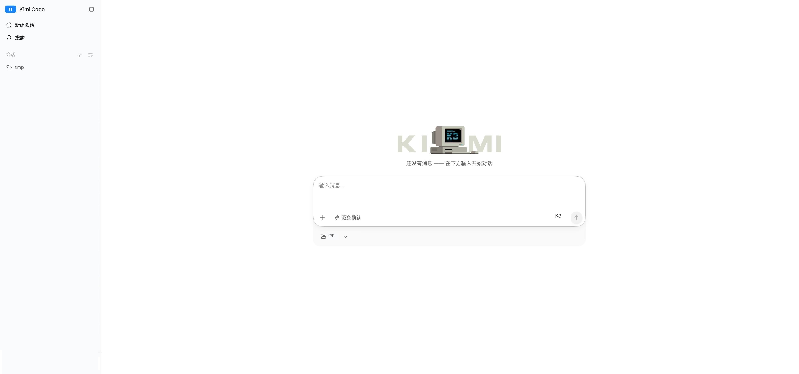

# 在网页中使用

Kimi Code Web 是 Kimi Code CLI 内置的浏览器图形界面：在终端运行 `kimi web`，就能在浏览器里新建会话、对话、处理审批、查看文件改动——界面更易读，会话和数据仍全部保存在你的本机。



## 开始使用

<div class="step">
<span class="step-num">1</span> <strong>安装并登录 Kimi Code CLI</strong>

`kimi web` 是 CLI 的内置命令，未安装 CLI 时不可用。安装与登录见 [开始使用](./getting-started.md)。
</div>

<div class="step">
<span class="step-num">2</span> <strong>在终端运行 <code>kimi web</code></strong>

如果你已经在 CLI 里，也可以输入 `/web`，把当前会话交接到浏览器。
</div>

<div class="step">
<span class="step-num">3</span> <strong>服务就绪后自动用默认浏览器打开 Web 界面</strong>

启动横幅会打印访问地址，浏览器没有自动打开时，手动复制这行地址打开即可：

```text
Local:   http://127.0.0.1:58627/#token=...
Token:   ...
Stop:    Ctrl+C
```

::: warning 注意
地址里的 `#token=` 是访问凭证，请勿外发，停止服务在终端按 `Ctrl+C`。
:::
</div>

### 常用指令

| 选项 | 说明 |
| --- | --- |
| `--port <port>` | 绑定端口；默认 `58627`，被占用时自动 +1 重试 |
| `--host [host]` | 实现同一局域网下的手机、平板或其他电脑都能用 web 地址访问，也可指定 IP，如 `--host 192.168.1.10` |
| `--no-open` | 就绪后不自动打开浏览器 |
| `--log-level <level>` | 按所选级别开启服务日志；默认不输出 |


## 与 CLI 的关系

Web 界面和 CLI 共享同一份登录态、配置（`config.toml`）和会话数据。

Web 里的斜杠命令与 CLI 不完全一致，支持常用指令 `/new`、`/goal`、`/compact`，部分 CLI 指令在 Web 里有对应的图形入口（设置页、模型选择器、账户菜单、任务面板）。

两端能力对照如下：

<div class="feature-compare-table">

| 功能 | CLI | Web | 说明 |
| --- | --- | --- | --- |
| 流式对话 | ✓ | ✓ | Web 为富格式增量渲染（表格、代码高亮、diff、工具卡片） |
| 会话管理 | ✓ | ✓ | Web 可把不常用的会话归档收起，在已归档页按时间排序、随时恢复；Open / Done / Workspaces 标签页为 Lab 实验特性，默认关闭，需在设置的 Lab 页开启 |
| 审批处理 | ✓ | ✓ | Web 可在图形页面中点击处理，无需指令 |
| 后台任务 | ✓ | ✓ | Web 为任务面板实时展示进度 |
| 文件与改动 | ✓ | ✓ | Web 有改动文件摘要卡与逐文件 diff |
| 设置 | ✓ | ✓ | Web 另有图形化设置页（供应商、账号与用量、Lab 实验特性） |
| 全局搜索 | — | ✓ | Web 可实现跨会话、跨工作区搜索 |
| 移动端适配 | — | ✓ | `--host` 开启局域网共享后，可实现在同一局域网下的手机浏览器中使用 |

</div>

## 安全注意

- **建议设置并列凭证**：绑定局域网地址后，额外设置 `KIMI_CODE_PASSWORD` 环境变量，服务端会对鉴权失败自动限流。
- **不要彻底关闭鉴权**：`--dangerous-bypass-auth` 会关闭所有鉴权，任何能访问该端口的人都能控制你的会话、文件系统和 shell。仅在可信网络或自有鉴权代理之后使用，详见 [kimi 命令参考](../reference/kimi-command.md#kimi-web)。


## 常见问题

### 端口被占用了怎么办

不用处理。`kimi web` 会自动用下一个端口重试（58628、58629……），以启动横幅里实际打印的地址为准。

### 浏览器打不开地址

先确认终端里的服务还在运行（它前台挂在这个终端上）。地址必须完整复制，包含 `#token=` 部分；只输 `http://127.0.0.1:58627` 会停在输入 token 的页面，手动粘贴横幅里的 `Token` 值也可以进入。

### token 失效了怎么恢复

运行 `kimi web rotate-token` 生成新 token，然后用启动横幅里的新地址重新打开。所有运行中的实例会自动换用新 token，无需重启。

### 同一 WiFi 下其他设备访问不到

确认启动时带了 `--host`（裸写即可），并用横幅中局域网地址（形如 `http://192.168.x.x:58627/#token=...`）访问。仍不通时检查电脑防火墙是否放行了该端口，以及两台设备是否真的在同一网段（访客 WiFi、VPN、4G/5G 热点切换都会造成隔离）。

## 下一步

- [服务 API](../reference/server-api.md) — 面向脚本与第三方集成的 REST / WebSocket 接口（实验性）
- [kimi 命令](../reference/kimi-command.md#kimi-web) — `kimi web` 的全部命令行选项
- [远程控制](./remote-control.md) — 从公网任意设备远程查看和接管本机会话
