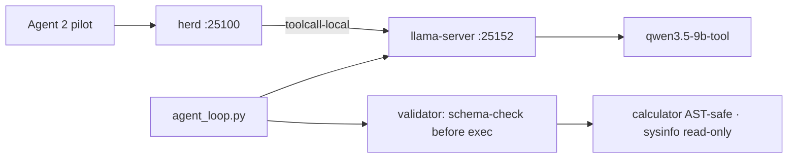
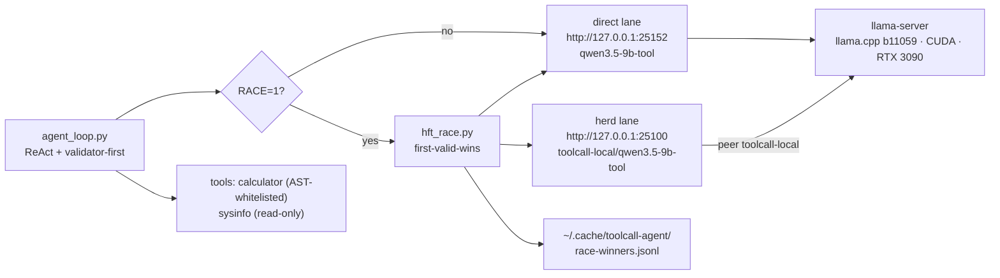

<div align="right">

[](https://github.com/toxicwind/sovereign-projects#license)
[](https://github.com/toxicwind/sovereign-projects)

</div>

# toolcall-agent

> Persistent tool-capable local LLM endpoint + validator-first harness — on the RTX 3090.

> **Why care? Cloud daemon keys were stale, the 1.2B `fast` model can't tool-call, and the pollinations gate was closed — the openfang Agent 2 pilot was stuck with no tool-capable model. This ships one: a local llama-server endpoint with a ReAct harness that schema-validates every tool call *before* executing it, closing the SLM↔large-model tool-call gap.**

- **Local endpoint — `llama-server` (llama.cpp b11059, CUDA, `-ngl 99`) on `:25152`, model alias `qwen3.5-9b-tool`**
- **Validator-first execution — tool name + args schema-checked before running; violations feed back for repair (max 2)**
- **Safe calculator — AST-whitelisted, no `eval()` of raw code; sysinfo is read-only**
- **Herd-routed — peer `toolcall-local` on `:25100`, addressable as `toolcall-local/qwen3.5-9b-tool`**
- **Verified live — GPU query → MiB→GiB conversion chained correctly in 3.6s; parallel tool calls in 3.4s**



## Quick start

```bash
cd /home/toxic/sovereign/projects/toolcall-agent
TOOLCALL_BASE=http://127.0.0.1:25152 python3 agent_loop.py "your prompt"
# or via herd: model=toolcall-local/qwen3.5-9b-tool on http://127.0.0.1:25100
```

## License & security

- **License:** [MIT](https://github.com/toxicwind/sovereign-projects#license)
- **Security:** Endpoint binds 127.0.0.1 only — reachable via herd or the local harness, never exposed directly. The calculator never `eval()`s raw model output (AST whitelist); `sysinfo` is read-only. Research grounding: arXiv:2510.03847 (SLM agentic survey), ToolSpec (arXiv:2604.13519), BFCL v4.

---

<div align="right">


</div>

**A local LLM that can actually call tools — so agents stop being stuck waiting on cloud keys.** Built to unblock the openfang Agent 2 (Shingle) pilot, which was stalled because no tool-capable model was available: cloud daemon keys were stale, `fast`=1.2B can't tool-call, and the pollinations gate was closed. This ships a persistent endpoint, a validator-first agent harness, and an HFT-style lane racer — all on the box's own RTX 3090.

## What's here

- **`agent_loop.py`** — ReAct-style agent harness with **validator-first execution**: the tool name + args are schema-checked against the declared JSON schema *before* running; on violation, the schema error feeds back for a repair attempt (max 2). Calculator is AST-whitelisted (no `eval()` of raw code); sysinfo is read-only.
- **`hft_race.py`** — HFT-doctrine lane racing for inference: races the **direct** lane (`:25152`) against the **herd** lane (`:25100`), first-*valid*-wins, fail-fast ceilings, one hot persistent connection per lane, winner ledger at `~/.cache/toolcall-agent/race-winners.jsonl` (P50/P95/P99 bench). Wire it in with `RACE=1`.
- **`OPPORTUNITIES.md`** — the running killer-feature hunt for this track (acted-on vs open items; acted-on items graduate into this README).

## The endpoint

| | |
|---|---|
| **URL** | `http://127.0.0.1:25152` |
| **Server** | `llama-server` — llama.cpp b11059, CUDA 13.3 build, RTX 3090, `-ngl 99` |
| **Model alias** | `qwen3.5-9b-tool` (Qwen3.5-9B-DeepSeek-V4-Flash, Q5_K_M, 32K ctx) |
| **Daemon** | pitchfork `sovereign/toolcall-llm`, `TOOLCALL_PORT=25152`, auto-restarts via pitchfork |
| **Herd route** | peer `toolcall-local` in `config/herd.yaml` proxies to `:25152`; address it as `toolcall-local/qwen3.5-9b-tool` through herd on `:25100` |

## Architecture



## Quick Start

```bash
cd projects/toolcall-agent
TOOLCALL_BASE=http://127.0.0.1:25152 python3 agent_loop.py "your prompt"
RACE=1 TOOLCALL_BASE=http://127.0.0.1:25152 python3 agent_loop.py "your prompt"
```

## Verified live (2026-09-20)

1. **Direct:** `agent_loop.py "What GPU...? convert MiB to GiB"` → `sysinfo(gpu)` → `24576 MiB` → `calculator(24576/1024)` → `24.0` → correct final answer. 3 rounds, 3.6s.
2. **Through pitchfork daemon `:25152`:** parallel `sysinfo(hostname)` + `sysinfo(cpu)` in one round, chained `calculator(16*7)` → `112`. 3.4s.
3. **Through llama-swap `:25100`** as `toolcall-local/qwen3.5-9b-tool`: `finish_reason=tool_calls`, `calculator{"expression": "1234 * 5678"}`.

## Config

- **Daemon control** — `pitchfork status toolcall-llm`; if unhealthy: `pitchfork restart toolcall-llm`; logs via `pitchfork logs toolcall-llm`.
- **Via herd** — set the model to `toolcall-local/qwen3.5-9b-tool` on `http://127.0.0.1:25100`.
- **Racing** — `RACE=1` enables `hft_race.py`; the ledger at `~/.cache/toolcall-agent/race-winners.jsonl` records ts, winner, per-lane latencies, finish reasons. Doctrine: if one lane always wins, the other is dead weight — cut it or fix it.

## Dev / Contributing

- The beellama fork (`engines/beellama.cpp`) has no built binary (herd-config worker's track is rebuilding it). This endpoint uses upstream llama.cpp prebuilt CUDA binaries instead — it does **not** block that track; when the beellama binary lands it can take over `${BEELLAMA_BIN}` duties.
- Research grounding: arXiv:2510.03847 (SLM agentic survey — validator-first execution closes the SLM↔large-model tool-call gap), ToolSpec (arXiv:2604.13519 — schema-aware constrained decoding for tool calls), BFCL v4 (Berkeley Function-Calling Leaderboard — single-turn schema-constrained calling is the solved regime at 7-9B scale).
- Open ideas live in `OPPORTUNITIES.md` — race-log auto lane-cutting, a third NIM/kimi lane, tool-result caching, speculative prefetch, grammar-constrained args, P95 SLO alerting.

## License + Security

- This directory ships **no standalone LICENSE file**; it is part of the sovereign-projects tree.
- **Security posture:** the endpoint is localhost-bound (`127.0.0.1:25152`) — no external exposure by design. The harness never `eval()`s model output: the calculator only runs AST-whitelisted expressions, sysinfo is strictly read-only, and validator-first execution rejects malformed tool calls before they run (max 2 repair attempts, then the loop moves on).
