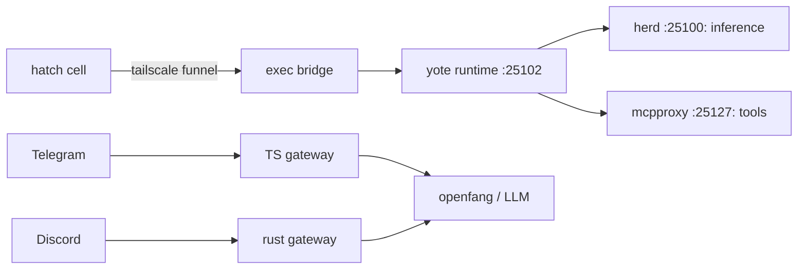

<div align="right">

[](https://github.com/toxicwind/sovereign-projects#license)
[](https://github.com/toxicwind/sovereign-projects)

</div>

# Yote — Sovereign Lightweight Agent

> Minimal, embeddable agent runtime for the Sovereign ecosystem — plus the box it runs on.

> **Why care? **Yote** is two things at once: a lightweight agent runtime for diffing, scaffolding, and tool orchestration — and Chris's CachyOS box (`awrawr-pc`), the 16-core / 62GB / RTX 3090 home server the whole Sovereign stack lives on. This directory is the canonical consolidation point for both.**

- **Light agent runtime — `:25102`, inference via Herd (`:25100`), tools via the MCP gateway (`:25127/mcp`)**
- **TS gateway — Telegram gateway over OpenFang HTTP (bun + hono)**
- **Rust gateway — unified Telegram + Discord gateway, extracted from OpenFang**
- **Exec bridge — hatch ↔ yote over the Tailscale funnel (`bin/exec.py`, `ws_daemon.py`, …)**
- **Box ops — `yote-doctor.sh` diagnoses every serve backend, `yote-fix.sh` repairs autonomously**



## Quick start

```bash
curl -sf http://127.0.0.1:25102/health && echo "yote HEALTHY"
curl -sf http://127.0.0.1:25100/v1/models | jq '.data[].id' | grep -i yote
```

## License & security

- **License:** [MIT](https://github.com/toxicwind/sovereign-projects#license)
- **Security:** Consolidated 2026-09-20 (see `CONSOLIDATION.md` for the full merge manifest). The gateway duality (TS vs Rust on `:25102`) is an open decision — check the README body before wiring new clients to the port.

---

**Yote** is a minimal, embeddable agent runtime for the Sovereign ecosystem.

- **Port**: `:25102` (per ecosystem topology)
- **Inference**: Routes through Herd (`:25100`) via llama-swap dynamic swap
- **MCP**: Connects to `http://127.0.0.1:25127/mcp`
- **Purpose**: Light agent tasks, diffing, scaffolding, and tool orchestration

## Quickstart

```bash
# Verify yote is responsive
curl -sf http://127.0.0.1:25102/health && echo "yote HEALTHY"

# Check model availability via Herd
curl -sf http://127.0.0.1:25100/v1/models | jq '.data[].id' | grep -i yote
```

## Configuration

Yote integrates with the Sovereign stack through:

- **Herd**: Primary inference router at `:25100`
- **MCP Gateway**: Tool federation via `:25127/mcp` (mcpproxy-go)
- **Tau**: Agent orchestration and subagent coordination

## Status

Yote is under active development as a first-class citizen of the Sovereign monorepo.

*Added as part of sovereign/tau/herd consolidation.*

---

## Consolidation index (2026-09-20)

**Yote** is Chris's CachyOS box (`awrawr-pc` = `github-mcp-host.tailc9ac71.ts.net` = `100.72.199.93`)
and the software that runs on it or talks to it. This directory is the canonical
consolidation point for all Yote material on GitHub (consolidated 2026-09-20;
see `CONSOLIDATION.md` for the full merge manifest).

### What's here (post-consolidation)

| Path | What it is | Source |
|---|---|---|
| `src/`, `lib/`, `scripts/`, `package.json` | **TS gateway** — Telegram gateway using OpenFang as an external HTTP service (bun + hono + telegram) | native to this dir (untouched by merge) |
| `SOUL.md`, `IDENTITY.md` | **Yote 🌵 persona** — desert-coyote trickster agent | native to this dir (untouched) |
| `rust-gateway/` | **Rust gateway** — unified messaging gateway (Telegram + Discord), extracted from OpenFang (`src/main.rs`, `src/discord.rs`, `src/telegram.rs`) | `toxicwind/yote` (private) |
| `bridge/` | **awrawr-mcp exec bridge client** — hatch ↔ yote over Tailscale funnel (`bin/exec.py`, `bin/ws_daemon.py`, `bin/wsframe.py`, `bin/xfer.py`, `SKILL.md`, …) | `toxicwind/gear/awrawr-mcp/` (private) |
| `ops/` | **Box operations** — `yote-doctor.sh` (diagnose every serve backend), `yote-fix.sh` (autonomous repair), `deploy/` (staged deploy bundle for `/home/toxic/sovereign`) | gist `e817e04416…` (deprecated) |
| `CONSOLIDATION.md` | Merge manifest: every move, SHA, commit, decision | this merge |

## Already in `sovereign-projects` (repo-root, referenced by configs — not moved)

- `src/services/yote.ts` — canonical yote service (Telegram gateway via OpenFang HTTP)
- `src/coyote/coyote-loop.py` — Coyote Loop v3.1 autonomous agent runtime
- `agents/coyote/{agent.toml,system.md}` — coyote agent config + system prompt
- `stack/services/coyote.sh` — pitchfork service launcher
- `shingle-workspace/awrawr_ws_exec.py` — the yote box's WS **server** source (port 8379)
- `gear/awrawr-mcp/bin/` — older vendored bridge snapshot (`ws_daemon.py` re-synced 2026-09-20)
- `docs/ws-exec-8379-audit-20260914.md`, `docs/connector-bridge-routing-d4734168.md` — bridge docs
- Bridge credential flow: `toxicwind/hatch-docs` → `runtime/credential-broker.md`

## Gateway duality (open decision)

Two implementations share the name **yote** and port **25102**:

- **TS** (`src/`, this dir) — Telegram via external OpenFang HTTP service.
- **Rust** (`rust-gateway/`, from `toxicwind/yote`) — Telegram + Discord, extracted from OpenFang crates.

Both are preserved. Nothing was deleted; both source repos still exist with full history.
Unification is Chris's call.

## Run commands (live GitHub — the gist is deprecated)

```bash
curl -sSL https://raw.githubusercontent.com/toxicwind/sovereign-projects/main/projects/yote/ops/yote-doctor.sh -o yote-doctor.sh && chmod +x yote-doctor.sh && sudo ./yote-doctor.sh
curl -sSL https://raw.githubusercontent.com/toxicwind/sovereign-projects/main/projects/yote/ops/yote-fix.sh -o yote-fix.sh && chmod +x yote-fix.sh && sudo ./yote-fix.sh
```

---
*Up: [master README](../../README.md) · [projects/](../README.md) · [fleet knowledgebase](../../docs/fleet-knowledgebase.md)*
