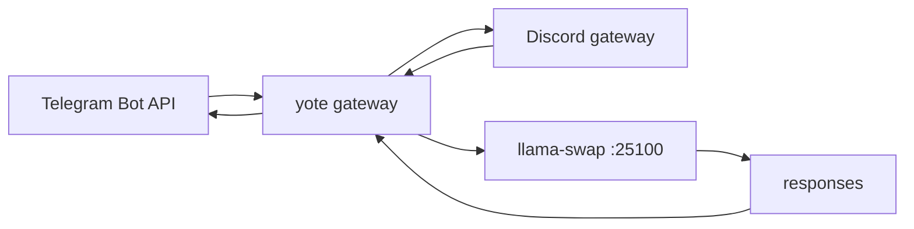

<div align="right">

[](https://github.com/toxicwind/sovereign-projects#license)
[](https://github.com/toxicwind/sovereign-projects)

</div>

# Yote — Unified Messaging Gateway

> Telegram + Discord gateway in Rust, extracted from OpenFang.

> **Why care? One service, both chat networks: the gateway unifies Telegram Bot API and Discord into a single LLM-backed service, extracted from `openfang-channels` so it can evolve independently.**

- **Telegram + Discord in one binary — unified message ingress**
- **LLM-backed — routes through llama-swap (`:25100`)**
- **Sovereign port discipline — `:25102` via `YOTE_PORT`, per the ports SSOT**
- **Extracted from OpenFang — `crates/openfang-channels` lineage, standalone future**



## Quick start

```bash
git clone https://github.com/toxicwind/yote.git && cd yote
cargo build --release
TELEGRAM_BOT_TOKEN=... DISCORD_BOT_TOKEN=... LLM_ENDPOINT=http://127.0.0.1:25100/v1 ./target/release/yote
```

## License & security

- **License:** [MIT](https://github.com/toxicwind/sovereign-projects#license)
- **Security:** Bot tokens via environment variables — never in the repo. Binds per the sovereign ports SSOT (`YOTE_PORT`).

---

> Extracted from [OpenFang](https://github.com/toxicwind/openfang) `crates/openfang-channels`.  
> Telegram + Discord gateway unified into a single service.

## Architecture

```
┌─────────────┐     ┌─────────────┐     ┌─────────────────┐
│  Telegram   │────→│             │     │                 │
│   Bot API   │     │   Yote      │────→│  LLM (llama-    │
└─────────────┘     │  Gateway    │     │   swap :25100)  │
┌─────────────┐     │             │     │                 │
│   Discord   │────→│             │     │                 │
│  Gateway    │     │             │     │                 │
└─────────────┘     └─────────────┘     └─────────────────┘
```

## Quick Start

```bash
git clone https://github.com/toxicwind/yote.git
cd yote
cargo build --release

# Configure
export TELEGRAM_BOT_TOKEN=your_token
export DISCORD_BOT_TOKEN=your_token
export LLM_ENDPOINT=http://127.0.0.1:25100/v1

# Run
./target/release/yote
```

## Ports (Sovereign SSOT)

| Service | Port | Env Var |
|---------|------|---------|
| Yote HTTP API | 25102 | `YOTE_PORT` |

## License

Apache-2.0 OR MIT (same as OpenFang)
