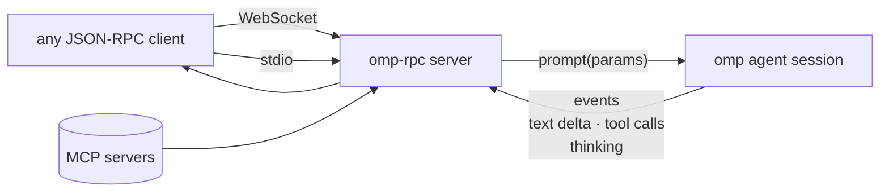

<div align="right">

[](https://github.com/toxicwind/sovereign-projects#license)
[](https://github.com/toxicwind/sovereign-projects)

</div>

# omp-rpc

Async JSON-RPC 2.0 server over WebSocket and stdio for driving the omp agent programmatically — including session events and MCP tool support.

> Scripts and dashboards need the agent without the TUI. This server is that seam: a WebSocket endpoint (and stdio for single-shot automation) that accepts JSON-RPC prompts, streams back session events, and exposes MCP tools as JSON-Schema — async-first, with cancellation and timeouts built in.

## Features

- **JSON-RPC 2.0 over WebSocket or stdio** — drive the agent from any language
- **Session events** — tool calls, thinking, text deltas streamed back live
- **MCP tool support** — MCP servers exposed as JSON-Schema tool definitions
- **Async-first** — cancellable operations with per-call timeouts
- **Typed client** — the Bun/TypeScript client ships with the package

## Protocol flow



## Quick start

```bash
uvx omp-rpc
```

A minimal client (`python/examples/minimal.py`) shows the whole flow: connect, create session, send prompt, consume the event stream.

## License & Security

**License:** MIT — see [LICENSE](https://github.com/toxicwind/sovereign-projects#license).

**Security:** the server drives your agent with your credentials — bind it to loopback and keep the port off shared networks. WebSocket clients should present only the prompts they intend the agent to act on; anyone who can reach the endpoint can prompt the agent.

## Layout

```
python/omp-rpc/
  server.py            # JSON-RPC 2.0 server (WebSocket + stdio)
  client.ts            # typed Bun/TypeScript client
  examples/minimal.py  # minimal end-to-end client
```

## Configuration

| Option | Meaning |
|---|---|
| `--port` | WebSocket listen port (default 7681) |
| `--host` | Bind address — keep `127.0.0.1` unless you mean it |
| `--timeout` | Per-call timeout in seconds |
| `--stdio` | Single-shot mode over stdio instead of WebSocket |

## Development

```bash
cd python/omp-rpc
uv run server.py --port 7681
python examples/minimal.py
```
