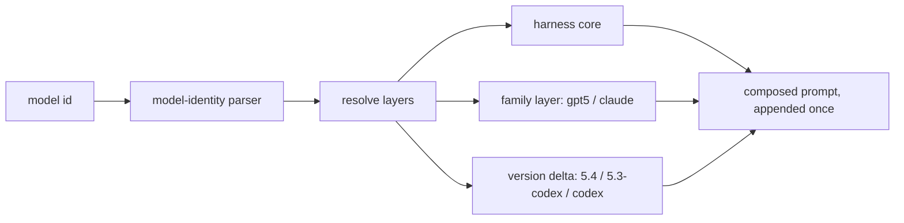

<div align="right">

[](https://github.com/toxicwind/sovereign-projects#license)
[](https://github.com/toxicwind/sovereign-projects)

</div>

# pi-per-model-prompt

> Model-scoped system prompt correction layers for pi.

> **Why care? Every model family has its own failure modes — verbosity here, weak follow-through there. This package appends one shared harness-core layer plus targeted per-family corrections, so the same pi extension behaves well on GPT-5, Codex, and Claude without becoming a second prompt framework.**

- **One harness core — `output_contract`, `scope_discipline`, `tool_discipline`, `verification_contract` for every model**
- **Family layers — GPT-5 baseline, Codex-line coding corrections, GPT-5.4 execution delta, Claude family + coding-agent layer**
- **Additive composition — `gpt-5.4-codex` → core + family + codex + 5.4, resolved by model-id parsing**
- **Idempotent — unique markers, appended once; partial prompt reuse stays safe**
- **Narrow by design — doesn't replace Pi's baseline harness policy**



## Quick start

```bash
pi install npm:pi-per-model-prompt        # after publishing
pi install /path/to/pi-per-model-prompt  # from a local checkout
```

## License & security

- **License:** [MIT](https://github.com/toxicwind/sovereign-projects#license)
- **Security:** Prompt layers only — no credentials, no network. The `before_provider_request` hook can set Responses API params (e.g. `text.verbosity`) for exact model matches.

---

Model-scoped system prompt correction layers for [pi](https://github.com/badlogic/pi-mono/tree/main/packages/coding-agent).

This package ships a single pi extension that appends a small all-model harness core and then layers targeted model corrections on top. It stays intentionally narrow: it does not replace Pi's baseline harness policy and it does not try to become a second general-purpose prompt framework.

## What it does

Every model receives one shared harness-core append layer with:

- `output_contract`
- `scope_discipline`
- `tool_discipline`
- `dependency_checks`
- `verification_contract`
- `user_updates_spec`
- `safety_boundary`

On top of that, the package targets two model families used inside Pi:

**OpenAI GPT-5**

- `gpt-5*` → GPT-5 family baseline layer
- `gpt-5.*-codex` → adds Codex-line coding corrections
- `gpt-5.4*` → adds GPT-5.4 execution/follow-through delta
- exact selected model `gpt-5.4` → forces Responses API `text.verbosity = "low"` at runtime via `before_provider_request`
- `gpt-5.3-codex` → adds exact-model compact answer-shape / ambiguity delta

**Anthropic Claude**

- `*claude*` (any id containing `opus`, `sonnet`, or `haiku`) → Claude family baseline + coding-agent layer

Layer composition is additive. For example:

- `mistral-large` → `HARNESS_CORE`
- `gpt-5.4` → `HARNESS_CORE` + `GPT5_FAMILY` + `GPT54`
- `gpt-5.4-codex` → `HARNESS_CORE` + `GPT5_FAMILY` + `GPT5_CODEX` + `GPT54`
- `gpt-5.3-codex` → `HARNESS_CORE` + `GPT5_FAMILY` + `GPT5_CODEX` + `GPT53_CODEX`
- `claude-sonnet-4-5` → `HARNESS_CORE` + `CLAUDE_FAMILY` + `CLAUDE_CODING_AGENT`

Each layer is appended once via a unique marker, so repeated turns or partial prompt reuse stay idempotent.

## Install

### From npm

After publishing:

```bash
pi install npm:pi-per-model-prompt
```

### From a local checkout

```bash
pi install /path/to/pi-per-model-prompt
```

### Temporary loading during development

```bash
pi --no-extensions -e /path/to/pi-per-model-prompt/index.ts
```

## Package layout

```text
index.ts                                   # package entry declared in package.json -> pi.extensions
src/index.ts                               # extension implementation; registers before_agent_start + before_provider_request hooks
src/model-identity.ts                      # model id parser (gpt-5*, claude-*)
src/resolve.ts                             # layer resolution by family/version/tags
src/prompt.ts                              # prompt composition helpers
src/layers/base.ts                         # all-model harness-core append layer
src/layers/openai/gpt5/family.ts           # GPT-5 family baseline
src/layers/openai/gpt5/codex.ts            # GPT-5 Codex line layer
src/layers/openai/gpt5/gpt-5.4.ts         # GPT-5.4 delta
src/layers/openai/gpt5/gpt-5.3-codex.ts   # GPT-5.3-Codex delta
src/layers/anthropic/claude/family.ts      # Claude family baseline
src/layers/anthropic/claude/coding-agent.ts # Claude coding-agent layer
test/*.test.ts                             # coverage for parsing, composition, resolution, extension hook
```

The package uses a `pi` manifest in `package.json`:

```json
{
  "keywords": ["pi-package"],
  "pi": {
    "extensions": ["./index.ts"]
  }
}
```

This matches Pi's package-loading rules from `docs/packages.md` and `docs/extensions.md`.

## Development

```bash
npm install
npm test
```

Optional packaging check:

```bash
npm pack --dry-run
```

## Design guard rails

- Keep the shared harness-core append layer stable, minimal, and model-agnostic.
- Keep family and exact-model rules evidence-driven and narrower than the shared core.
- Prefer additive layers over branching prompt trees.
- Keep exact-model deltas narrow and auditable.

See [`docs/architecture.md`](docs/architecture.md) for maintenance guidance.

## License

[MIT](LICENSE)
