# scratch/ — non-production staging

The estate's workbench: one-off scripts, staging dirs, audits, patch harnesses. **NOT a service home** — do not add pitchfork daemon `run` paths here.

- One-off scripts, audits, and staging subdirs land here, not in service dirs.
- Production files that used to live here were **extracted**: the exec bridge → [`bridge/`](../bridge/), bin tools → `bin/`, bridge docs → `hatch/docs/bridge-docs/`.
- Compat: `shingle-workspace` → `scratch` (symlink) — the old name still resolves.

```mermaid
flowchart LR
    subgraph SCRATCH[scratch/ — staging only]
        S1[one-off scripts]
        S2[audits & patch harnesses]
        S3[staging dirs]
    end
    PROD[production] -->|extracted| SCRATCH
    SCRATCH -.->|promoted| SVC[bridge/ · bin/ · services]
    style SCRATCH fill:#3a2b00
```



## Quick start

```bash
# survey what's staged
ls /home/toxic/.worktrees/readme-max/scratch/
```

```bash
# staging dirs with their own READMEs: buildsrv-src/ readmefix-herd/ tau-ext-forks/ tau-extensions-readme/ whatsapp-mcp-staging/
```

## What's inside

| Entry | What it is |
|---|---|
| `buildsrv-src/` | Source tree for the buildsrv build daemon |
| `readmefix-herd/` | Staging for herd README fixes (`push.py`, `verify.py`, `refmove.py`) |
| `tau-ext-forks/` | The `toxicwind/tau-extensions` monorepo working tree |
| `tau-extensions-readme/` | README staging for tau-extensions |
| `whatsapp-mcp-staging/` | WhatsApp MCP server staging (`server.py`, `test_server.py`) |
| `README-fleet.md` | Fleet-facing readme notes |
| `*.py` | One-off patch/audit/model scripts (see filename for intent) |

## Rules

1. **Nothing here runs as a service.** No pitchfork daemons point at `scratch/`.
2. Promote by extracting — when a staged script becomes production, move it to its real home (repo + commit), don't leave a fork behind.
3. No credentials in staging files. Ever.

## License + security

Staging content inherits the repo's MIT-where-marked licensing. Staging dirs are not exposed to the network and carry no auth surface — keep it that way. Scripts that touch credentials must read them from the environment or `~/.secrets`, never from a checked-in file.
