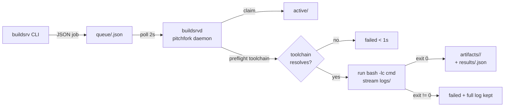

# buildsrv — the fleet's continuous-modification engine

Submit a build as a JSON job file; the daemon runs it through your login shell, streams the log to a tail-able file, and caches artifacts keyed by the content hash of the job spec. Re-submitting an identical job is a **no-op that returns the cached result**. Builds never touch your working tree — they iterate forward.

- **Disk-backed queue** — `buildsrv` CLI and `buildsrvd` share only the filesystem: no RPC to break, no protocol to version.
- **Forward-only semantics** — no `git checkout`, no stash, no revert. A failed build leaves the tree alone; you fix forward and resubmit.
- **Content-hash caching** — identical spec (repo + cmd + toolchain + env + artifacts) → `CACHED`, nothing runs.
- **Real toolchains** — jobs run through `bash -lc`, so mise shims resolve exactly as they do interactively. The daemon orchestrates; it never installs.



## Quick start

```bash
buildsrv submit --name my-tool --repo /home/toxic/sovereign/tools/my-tool --toolchain bun --cmd "bunx tsc --noEmit"
```

```bash
buildsrv logs <id> -f        # tail the streaming log
buildsrv status               # recent jobs table
```

## Submitting jobs

```bash
# Rust — build one crate of the tau engine workspace
buildsrv submit --name tau-pi-ast \
  --repo /home/toxic/sovereign/tau/engine \
  --toolchain rust \
  --cmd "cargo build -p pi-ast"

# Go — with an artifact to cache
buildsrv submit --name caddy-auth \
  --repo /home/toxic/sovereign/projects/packages/caddy-sovereign-auth \
  --toolchain go \
  --cmd "go build ./..." \
  --artifact bin/

# Python — extras: --workdir, repeatable --env KEY=VAL, repeatable --artifact, --timeout seconds
buildsrv submit --name mysuite \
  --repo /home/toxic/sovereign/tools/some-py-tool \
  --toolchain python \
  --cmd "python3 -m pytest -q" \
  --timeout 900
```

Idempotent resubmit — the second call never runs:

```bash
$ buildsrv submit --name tau-pi-ast --repo /home/toxic/sovereign/tau/engine \
    --toolchain rust --cmd "cargo build -p pi-ast"
CACHED  identical job already succeeded as b260914-175901-a1b2c3d4
        result: exit=0 duration=17.7s
        logs: /home/toxic/buildsrv/logs/b260914-175901-a1b2c3d4.log
```

## Architecture

The daemon (`buildsrvd.py`, stdlib-only, pitchfork-managed) polls `queue/` every 2s:

1. **Claim** — moves the job to `active/` (atomic; on boot, `active/` moves back to `queue/`).
2. **Preflight** — `<toolchain>` through `bash -lc "command -v …"`; missing toolchain → `failed` in <1s with a clear "install/enable it via mise" message.
3. **Run** — `bash -lc "<cmd>"` in the job workdir; stdout+stderr streamed to `logs/<id>.log`.
4. **Cache** — on success, declared artifacts → `artifacts/<jobhash>/` + manifest.
5. **Record** — `results/<id>.json` + `state.json` (atomic tmp+rename).

Job-spec hash = sha256 of `{repo, workdir, toolchain, cmd, env, artifacts}`. Any previously *succeeded* job with the same hash makes a resubmit return `CACHED`.

| Path | Purpose |
|---|---|
| `/home/toxic/buildsrv/queue/` | pending job specs (`<id>.json`) |
| `/home/toxic/buildsrv/active/` | claimed by the daemon (transient) |
| `/home/toxic/buildsrv/logs/` | `<id>.log` — streamed during the build |
| `/home/toxic/buildsrv/results/` | `<id>.json` — terminal result |
| `/home/toxic/buildsrv/artifacts/` | `<jobhash>/` — cached outputs + `manifest.json` |
| `/home/toxic/buildsrv/state.json` | job ledger (status/attempts/hashes/timings) |

Health: `http://127.0.0.1:25148/health` (pitchfork `ready_http`).

## Config

pitchfork stanza (hand-added to `pitchfork.toml` — hand-edited file; the generator must never run):

```toml
[daemons.buildsrv]
run = "exec /usr/bin/python3 /home/toxic/sovereign/tools/buildsrv/buildsrvd.py"
dir = "/home/toxic/sovereign/tools/buildsrv"
mise = false
retry = true
boot_start = true
ready_http = "http://127.0.0.1:25148/health"
env = { BUILDSRV_ROOT = "/home/toxic/buildsrv", BUILDSRV_PORT = "25148", BUILDSRV_WORKERS = "2" }
auto = ["start"]
```

Env knobs: `BUILDSRV_PORT` (default 25148), `BUILDSRV_WORKERS` (default 2), `BUILDSRV_POLL` (queue poll seconds, default 2).

Reload/start: `pitchfork start buildsrv` · `pitchfork restart buildsrv` · `pitchfork status buildsrv`.

## Toolchains

`rust`/`cargo`, `go`, `bun`, `node`, `python`/`python3`, `tsc`. The daemon **orchestrates, never installs**.

## Failure modes

- Toolchain missing → `failed` in <1s, clear message, nothing ran.
- Build fails → `failed`, exit code + full log kept, tree untouched.
- Timeout (default 1200s, `--timeout`) → process group SIGKILLed, `failed`.
- Daemon dies mid-build → on boot, `active/` jobs return to `queue/` and re-run from scratch (children run in their own process group; builds are expected to be re-runnable).
- State file corrupt → daemon logs a warning and starts fresh (queue dir is the source of truth for pending work, results/ for history).

## Dev / contributing

- Source: `tools/buildsrv/` in `toxicwind/sovereign-projects` (also checked out at `/home/toxic/sovereign` on the box).
- The CLI is `buildsrv` (symlinked into `/home/toxic/bin`, on the login PATH).
- This directory (`scratch/buildsrv-src/`) holds the staging source tree: `buildsrv` (CLI), `buildsrvd.py` (daemon), `chunks/`.
- Verified end-to-end 2026-09-14: Rust `cargo build -p pi-ast` (17.7s), Bun `bunx tsc --noEmit` (1.4s), Go `go build ./...` — all green through the daemon, plus cache-hit no-op and retry paths.

## License + security

Stack glue: MIT where marked. The daemon runs arbitrary shell commands submitted to it — it is a **localhost-only build service**: keep it behind the login boundary, never expose `:25148` to a network you don't trust, and treat submitted commands as fully trusted input from the fleet. Build jobs run as the daemon user with no sandboxing beyond process-group isolation.
