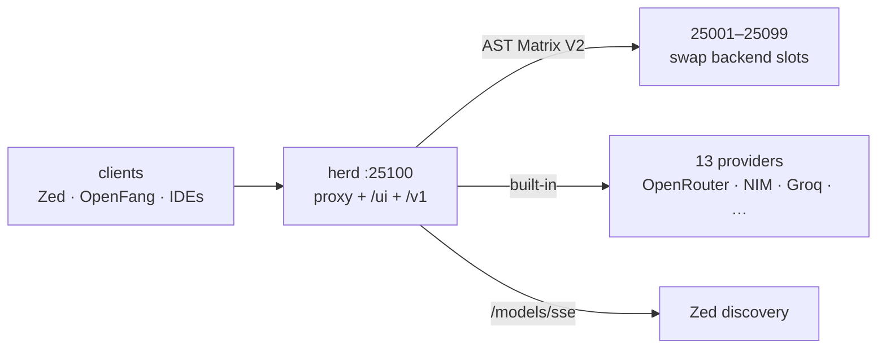

# herd — run a whole herd of LLM backends behind one OpenAI-compatible API

> **herd** is a fork of [mostlygeek/llama-swap](https://github.com/mostlygeek/llama-swap) (upstream), extended with herd-specific infrastructure: our own unified Docker images, AST Matrix V2 smart routing, an agentic lens suite, and hardening fixes for real-world deployments.

Why should you care? Upstream swaps models in and out of VRAM on demand and speaks OpenAI — but it assumes you babysit it. herd adds the production layer Sovereign actually needs: **smart multi-provider routing**, stable streaming across heterogeneous backends, model discovery for Zed, and process management that survives orphaned `llama-server` processes holding your ports.

- **AST Matrix V2 smart routing** — token-bucket rate limiting + 5-strike circuit breaker (30s cooldown), 8 routing strategies.
- **13 built-in providers** with base URLs (`internal/astmatrix/providers.go`).
- **Stable OpenAI-compatible streaming** even when backends differ → `normalize_sse`.
- **Model discovery events for Zed** → `GET /models/sse` (`internal/server/models_sse.go`).
- **Port reclaim on restart** — pre-spawn `fuser -k` kills orphan `llama-server` holders (`internal/process/process_command.go`).
- **IPv4 loopback defaults** (`127.0.0.1`) so dual-stack `localhost` doesn't break dial (`internal/config/model_config.go`).
- **Own unified Docker images** — `ghcr.io/toxicwind/herd:unified-<backend>`, not upstream's.
- **Built-in sovereign provider** at `http://127.0.0.1:25100/v1`.
- **Agentic lens suite** — stylometric authorship, OSINT infra recon, crypto leak detection.



## Quick start

```bash
git clone https://github.com/toxicwind/herd.git && cd herd
make clean all        # or: go build -o herd .
./herd --config config.yaml --listen 127.0.0.1:8080
```

Health: `curl -sS http://127.0.0.1:25100/health` → `OK`

## What's different from upstream

| Area | herd |
|---|---|
| Docker images | Own unified images: `ghcr.io/toxicwind/herd:unified-<backend>` |
| Routing | AST Matrix V2: token-bucket rate limiting + 5-strike circuit breaker (30s cooldown), 8 routing strategies |
| Providers | 13 built-in providers with base URLs (`internal/astmatrix/providers.go`) |
| SSE | `GET /models/sse` synthesized for Zed; SSE normalization via `normalize_sse` |
| Networking | IPv4 loopback default `127.0.0.1` (avoids localhost→::1 breakage) |
| Process mgmt | Frees stale ports with `fuser -k` before spawning backends |
| Sovereign | Built-in sovereign provider at `http://127.0.0.1:25100/v1` |
| Lenses | Agentic lens suite (stylometric authorship, OSINT infra recon, crypto leak detection) |
| Bench | Bench orchestrator in `internal/bench/orchestrator.go` |

## Why a fork

Sovereign clients need things upstream doesn't provide:

1. Stable **OpenAI-compatible streaming** even when backends differ → `normalize_sse`
2. **Model discovery events** for Zed → `GET /models/sse` (`internal/server/models_sse.go`)
3. Reliable restarts when an orphan `llama-server` holds a port → pre-spawn `fuser -k` (`internal/process/process_command.go`)
4. **IPv4 loopback** defaults (`127.0.0.1`) so dual-stack `localhost` does not break dial (`internal/config/model_config.go`)

## AST Matrix V2

Smart routing layer in `internal/astmatrix/` (stdlib-only, zero external dependencies). Full details in `README_ASTMATRIX_V2.md` (upstream doc — not in this worktree).

- **Rate limiting:** token bucket (`ratelimit.go`)
- **Circuit breaker:** 5-strike, 30s cooldown (`circuit.go`)
- **Strategies (8):** `hybrid`, `ast_race`, `sticky_affinity`, `weighted_elo`, `least_latency`, `round_robin`, `free`, `circuit_chain`
- **Endpoints:** `/astmatrix/status`, `/astmatrix/metrics`

```yaml
astMatrix:
  astStrategy: hybrid
  requestTimeout: 30s
  maxRetries: 3
  healthProbeInterval: 10s
  enableCoalescing: true
```

## Ports

| Env | Port | Surface |
|---|---|---|
| `LLAMA_SWAP_PORT` | **25100** | Proxy + `/ui` + `/v1` |
| `LLAMA_START_PORT`–`LLAMA_END_PORT` | 25001–25099 | Backend slots owned by swap |

## Unified Docker images

herd publishes its own images (not upstream's):

```
ghcr.io/toxicwind/herd:unified-<backend>
```

Built by `docker/unified/build-image.sh`, published by `.github/workflows/unified-docker.yml`.

> **Rootless build note (2026-09-14):** the rootless build stage must use plain `docker build` (docker driver), **not** the buildx container driver — otherwise `FROM ghcr.io/toxicwind/herd:unified-<backend>` fails to resolve the local tag. Nightly unified builds were failing for a week before this was fixed.

## Agentic lens suite

`src/_11ty/lenses/*.js` + `lib/lens-orchestrator.js`, run by `.github/workflows/tectonic-drift.yml`:

- Stylometric authorship analysis
- OSINT infrastructure reconnaissance
- Cryptographic leak detection
- Tectonic drift lenses

Configure via `.env.example`.

## Dev / contributing

- Bench orchestration lives in `internal/bench/orchestrator.go`.
- Remotes: `origin` → `toxicwind/herd`, `upstream` → `mostlygeek/llama-swap`. Fork-specific work lives on `main` here; herd tracks upstream.

```bash
git remote -v
# origin    https://github.com/toxicwind/herd.git (fetch)
# origin    https://github.com/toxicwind/herd.git (push)
# upstream  https://github.com/mostlygeek/llama-swap.git (fetch)
```

## License + security

This repo is a fork — upstream [llama-swap](https://github.com/mostlygeek/llama-swap) retains its own license; fork additions are MIT where marked. herd is an **inference-proxy surface**: keep it on `127.0.0.1` + your Tailscale boundary; never expose `:25100` or the backend slots to the open internet without your own auth gate. Provider keys come from env/secret files, never from the config in git.
