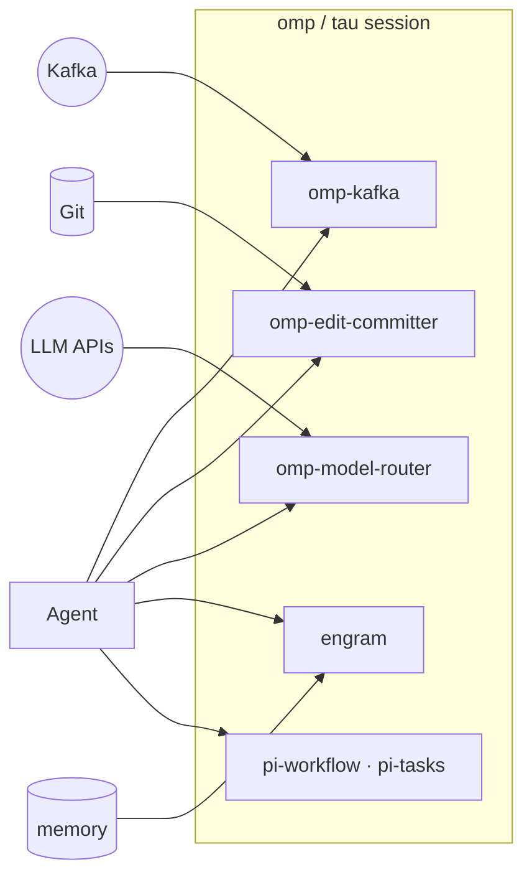

# tau-extensions — ten extensions for your Tau / `omp` agent session

[`toxicwind/tau-extensions`](https://github.com/toxicwind/tau-extensions) — a monorepo of Tau extensions that plug straight into your Tau (oh-my-pi / `omp`) agent session. Two built here, eight vendored forks of community extensions — all MIT-licensed, all cataloged under the `tau-extensions` marketplace.

Tau is our fork of [oh-my-pi (`omp`)](https://github.com/can1357/oh-my-pi); extension names keep their upstream `omp-*` spelling so they stay compatible with the `omp` plugin contract.



- **Kafka → session** — consume topics in push or pull mode with slash commands + an LLM tool.
- **Auto-commit on every edit** — Conventional-Commits messages, commit badge in the TUI.
- **Cost-optimized model routing** — cheap/mid/expensive tiers by task complexity, budgets enforced.
- **Persistent memory, undo/redo, workflows, best-of-N agents** — the community's best, vendored and cataloged.

## Extensions

| Extension | Category | What it does | Provenance |
|---|---|---|---|
| [`omp-kafka`](packages/omp-kafka) | Integration | Consume Kafka topics into a session; auto (push) and pull modes with `/kafka-*` slash commands and a `kafka_consume` LLM tool | Built here (from RekunDzmitry/omp-extensions) |
| [`omp-edit-committer`](packages/omp-edit-committer) | Workflow | Auto-commit every Edit/Write with a Conventional-Commits message; renders a commit badge next to the tool result (works with `modem-dev/hunk`) | Built here (from RekunDzmitry/omp-extensions) |
| [`omp-model-router`](packages/omp-model-router) | Model routing | Route prompts to cheap/mid/expensive models by task complexity; tracks per-turn and session costs | Fork of cakriwut/omp-model-router |
| [`engram`](packages/engram) | Memory | Persistent memory for the agent session | Vendored from thebtf/engram (locally adapted; not yet in the marketplace manifest) |
| [`gsd-omp`](packages/gsd-omp) | Orchestration | GSD Embeddable Orchestration System host plugin for Tau | Fork of tchivs/gsd-omp |
| [`omp-best-of`](packages/omp-best-of) | Agents | Best-of-N coding agents with LLM-as-a-verifier selection | Fork of wolfiesch/omp-best-of |
| [`omp-undo-redo`](packages/omp-undo-redo) | Workflow | Session and file undo/redo; snapshot-based undo of agent edits | Fork of Baylar55/omp-undo-redo |
| [`pi-agent-browser-native`](packages/pi-agent-browser-native) | Automation | Exposes agent-browser as a native Tau tool for scripted browser automation | Fork of fitchmultz/pi-agent-browser-native |
| [`pi-tasks`](packages/pi-tasks) | Productivity | Claude Code-style task tracking and coordination | Fork of tintinweb/pi-tasks |
| [`pi-workflow`](packages/pi-workflow) | Workflow | Named, repeatable multi-step workflow orchestration | Fork of AgwaB/pi-workflow |

Fork provenance and attribution live in [`NOTICE`](./NOTICE). Forks keep their upstream LICENSE files; repo URLs are repointed at this monorepo.

## Quick start

```bash
git clone --depth 1 https://github.com/toxicwind/tau-extensions ~/.tau/agent/extensions/tau-extensions
cd ~/.tau/agent/extensions/tau-extensions/packages/omp-kafka && bun install
omp plugin link .
```

Swap `packages/omp-kafka` for any package from the table above. Requires `omp >= 17.0.0` and [Bun](https://bun.sh) 1.3.x.

## Marketplace

`.omp-plugin/marketplace.json` is the plugin catalog: `tau-extensions` by `toxicwind`, `pluginRoot: packages`, 9 registered plugins. (The Tau engine reads `.omp-plugin/marketplace.json`; `engram` ships in the tree but isn't registered yet.)

## Install options

**Option A — clone the monorepo and link** (recommended):

```bash
git clone --depth 1 --filter=blob:none --sparse https://github.com/toxicwind/tau-extensions ~/.tau/agent/extensions/tau-extensions
cd ~/.tau/agent/extensions/tau-extensions
git sparse-checkout set packages/omp-kafka
cd packages/omp-kafka
bun install
omp plugin link .
```

Drop `--filter=blob:none --sparse` and the `sparse-checkout` lines to take everything.

**Option B — install via npm:**

```bash
bun add -g @toxicwind/omp-kafka
```

Then add to `~/.tau/agent/config.yml`:

```yaml
extensions:
  - @toxicwind/omp-kafka
```

**Option C — load once for a single session:**

```bash
omp --extension /path/to/tau-extensions/packages/omp-kafka
```

## Architecture

```
tau-extensions/
├── .omp-plugin/marketplace.json   # OMP plugin manifest (9 plugins)
├── package.json                   # bun workspace root (workspaces: packages/*)
├── tsconfig.json / tsconfig.base.json
├── NOTICE                         # fork provenance + attribution
├── AGENTS.md                      # repo conventions for agentic workers
├── scripts/typecheck.mjs          # workspace typecheck runner
└── packages/<name>/               # each extension: package.json + README + src/extension.ts
```

Entry point convention: `src/extension.ts` registered as `"omp": { "extensions": ["./src/extension.ts"] }` in each package manifest.

## Dev / contributing

Requires **Bun 1.3.x** — lockfiles are generated with 1.3.x and CI installs with `--frozen-lockfile`.

```bash
bun install
bun run test        # bun test packages/*
bun run typecheck   # bun scripts/typecheck.mjs
```

All packages typecheck and test cleanly (enforced in CI). TypeScript is strict (`strict`, `noUncheckedIndexedAccess`, `noImplicitOverride`).

**Adding a new extension:**

1. Create `packages/<name>/` with `package.json`, `README.md`, `LICENSE`, and `src/extension.ts` as the entry point.
2. Add it to the workspace (already covered by `packages/*`), run `bun install`.
3. Register it in `.omp-plugin/marketplace.json` (`plugins[]`: name, description, version, source, category, keywords, homepage, license).
4. Verify: `bun run typecheck && bun run test`.

## License + security

MIT — vendored forks retain their upstream MIT licenses; see [NOTICE](./NOTICE) for attribution. Extensions run inside your agent session with the session's full tool access — review any fork's `src/` before linking it, and keep secrets in `~/.tau/agent/` config (never committed), not in extension files.
