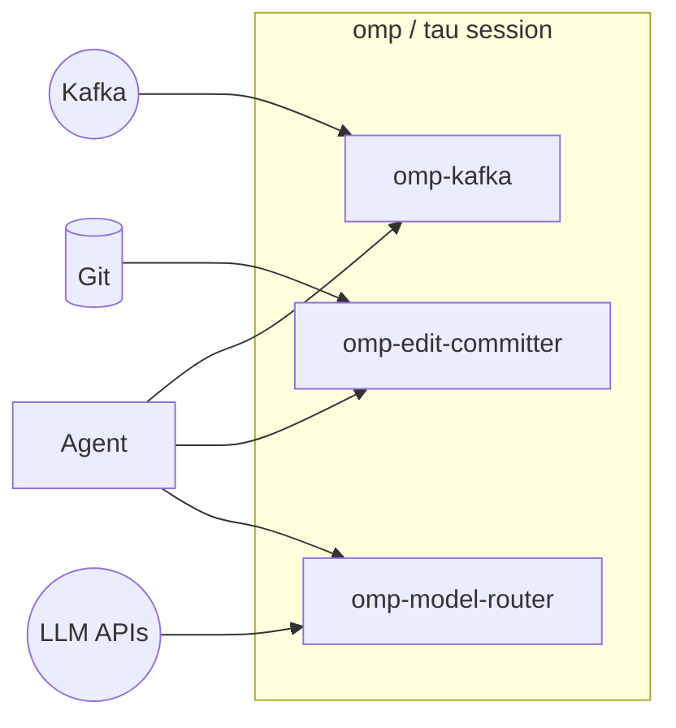

# tau-extensions

**A monorepo of Tau extensions by [toxicwind](https://github.com/toxicwind/tau-extensions)** — our own extensions plus forks of others, all plugging into your Tau/`omp` agent session.

Tau is the working name for our fork of [oh-my-pi (`omp`)](https://github.com/can1357/oh-my-pi) — the underlying runtime this repo targets. Extension names keep their upstream `omp-*` spelling so they stay compatible with the `omp` plugin contract; the repo itself is branded **tau-extensions**.



## Extensions

| Extension | Category | What it does | Provenance |
|---|---|---|---|
| [`omp-kafka`](packages/omp-kafka) | Integration | Consume Kafka topics into a session in auto (push) or pull mode; `/kafka-*` slash commands + `kafka_consume` LLM tool | Fork |
| [`omp-edit-committer`](packages/omp-edit-committer) | Workflow | Auto-commit every Edit/Write with a descriptive Conventional-Commits message; commit SHA badge in the TUI for review with `modem-dev/hunk` | Fork |
| [`omp-model-router`](omp-model-router) | Cost optimization | Route prompts to cheap/mid/expensive models by task complexity; per-turn and session cost tracking, budgets, `/router` commands | Fork of [`cakriwut/omp-model-router`](https://github.com/cakriwut/omp-model-router) |

> **Repo status (2026-09-14):** the extension *source code* (`*/src/`) is currently missing from the pushed tree — the root `.gitignore` ignores `src/` (labeled "stale cache artifacts"), which deletes the actual implementations. Until that is fixed, the install steps below will not produce working extensions. See [Known gaps](#known-gaps) for the full list of TODOs.

## Requirements

- `omp >= 17.0.0` (the Tau/`omp` runtime) — TODO: verify whether the Tau fork changes the minimum version.
- [Bun](https://bun.sh) (the monorepo uses bun workspaces; CI installs `bun 1.3.x`).
- A working `git` — required by `omp-edit-committer`.
- A reachable Apache Kafka broker — required only by `omp-kafka`.
- LLM API access configured in your Tau/`omp` setup — required by `omp-model-router`'s adaptive calibration classifier.

## Repo map

```
tau-extensions/
├── marketplace.json                  # Claude Code marketplace manifest
│                                     # (lists omp-kafka + omp-edit-committer)
├── .omp-plugin/marketplace.json      # OMP plugin manifest
├── package.json                      # bun workspace root (workspaces: packages/*)
├── bun.lock
├── tsconfig.json / tsconfig.base.json
├── .github/workflows/ci.yml          # CI: bun install + typecheck
├── AGENTS.md                         # repo conventions for agentic workers
├── packages/
│   ├── omp-kafka/                    # Kafka → session integration
│   │   ├── package.json  (@toxicwind/omp-kafka 0.2.0)
│   │   └── README.md
│   └── omp-edit-committer/           # auto-commit on Edit/Write
│       ├── package.json  (@toxicwind/omp-edit-committer 0.2.0)
│       ├── scripts/smoke.test.ts
│       └── README.md
└── omp-model-router/                 # cost-optimized model routing
    ├── package.json  (@cakriwut/omp-model-router 0.8.9)
    ├── model-router.example.json
    └── README.md
```

## Install

### Option A — via Claude Code marketplace

TODO: verify the exact CLI spelling once the manifest is validated in a live Claude Code session.

```text
/plugin marketplace add toxicwind/tau-extensions
```

`marketplace.json` currently registers two plugins (`omp-kafka`, `omp-edit-committer`); `omp-model-router` is not yet listed — TODO.

### Option B — clone the monorepo and link

```bash
git clone --depth 1 --filter=blob:none --sparse https://github.com/toxicwind/tau-extensions ~/.tau/agent/extensions/tau-extensions
cd ~/.tau/agent/extensions/tau-extensions
git sparse-checkout set packages/omp-kafka
cd packages/omp-kafka
bun install
omp plugin link .
```

Drop `--filter=blob:none --sparse` and the `sparse-checkout` lines to take the whole monorepo (e.g. `set packages/omp-edit-committer` for the committer instead).

> Note: existing docs inside the per-package READMEs still point at the old `toxicwind/omp-extensions` clone URL — TODO to update them repo-wide.

### Option C — install via npm (once published)

TODO: `@toxicwind/omp-kafka` and `@toxicwind/omp-edit-committer` are not yet published to npm, so this path does not work today.

```bash
bun add -g @toxicwind/omp-kafka
bun add -g @toxicwind/omp-edit-committer
```

Then add to `~/.tau/agent/config.yml`:

```yaml
extensions:
  - @toxicwind/omp-kafka
  - @toxicwind/omp-edit-committer
```

### Option D — load once for a single session

```bash
omp --extension /path/to/tau-extensions/packages/omp-kafka
omp --extension /path/to/tau-extensions/packages/omp-edit-committer
```

## Extension: omp-kafka

Stream [Apache Kafka](https://kafka.apache.org) topics into a Tau/`omp` session. One repo = many consumers; each consumer has its own client ID, topic set, group ID, and mode, configured in a single `kafka.yml`.

- **auto (push) mode** — every consumed message is delivered into the running session as a user message (`sendUserMessage`) and shown as a `ctx.ui.notify`, so the agent reacts without being asked.
- **pull mode** — messages buffer silently; pull them on demand with slash commands or the LLM tool.

### Configure

Create `kafka.yml` next to your project. `loadConfig` resolves it in this order (first hit wins):

1. `$KAFKA_CONFIG` (absolute path wins, otherwise resolved against `cwd`)
2. `<cwd>/kafka.yml`
3. `<cwd>/.tau/kafka.yml`
4. `~/.tau/agent/kafka.yml`

```yaml
# ~/.tau/agent/kafka.yml
consumers:
  - name: events
    mode: auto               # "auto" (push) or "pull"
    brokers:
      - localhost:9092
    clientId: omp-events
    groupId: omp-events
    topics:
      - user.signup
      - billing.invoice
    fromBeginning: false
    notify: true             # also flash a UI notification on each message
    maxQueue: 500
    auto:
      deliverAs: steer       # "steer" or "followUp" (only meaningful in auto mode)
      prefix: "[kafka:events] "

  - name: ops-pull
    mode: pull
    brokers:
      - kafka.internal:9092
    topics:
      - ops.alerts
    # Everything else falls back to sensible defaults.
```

### Field reference

| Field | Default | Notes |
|---|---|---|
| `name` | required | Unique per `kafka.yml`. Used in `/kafka-*` commands and `ctx.ui.setStatus`. |
| `mode` | required | `auto` = push to session; `pull` = buffer only. |
| `brokers` | required | Non-empty array of `"host:port"` strings. |
| `topics` | required | Non-empty array of topic names. |
| `clientId` | `"omp-kafka"` | KafkaJS client ID. |
| `groupId` | `"omp-kafka-<name>"` | Consumer group. Set explicitly to share with another consumer. |
| `fromBeginning` | `false` | `false` = latest offset on first connect (good for live tails). |
| `notify` | `true` | Flash a UI notification for each message (works in both modes). |
| `maxQueue` | `200` | Ring-buffer size for the in-memory tail. Older records drop off. |
| `auto.deliverAs` | `"steer"` | How `sendUserMessage` injects: `steer` (current turn) or `followUp` (queued). |
| `auto.prefix` | `"[kafka:<name>] "` | Prepended to the formatted record body. |
| `sasl` | unset | `{ mechanism, username, password }` for SASL auth. |
| `ssl` | `false` | Enable TLS. |
| `clientConfig` | `{}` | Extra KafkaJS `KafkaConfig` fields. |

### Slash commands

| Command | Effect |
|---|---|
| `/kafka` | List every consumer and its current status. |
| `/kafka-tail <name> [limit]` | Print the last `limit` records (default 20) from `<name>`'s ring buffer. |
| `/kafka-drop <name>` | Clear `<name>`'s ring buffer. |
| `/kafka-reload` | Disconnect every consumer and reconnect (re-reads `kafka.yml`). |
| `/kafka-pause <name>` | Stop fetching new records (keep the buffer). |
| `/kafka-resume <name>` | Resume fetching for a paused consumer. |

The TUI status line mirrors the same info, e.g. `kafka: events[auto]=running (12)  ops-pull[pull]=idle`.

### LLM-callable tool

`kafka_consume` is registered automatically so the agent can peek at the ring buffer without a user slash command:

```json
{
  "name": "kafka_consume",
  "parameters": {
    "consumer": "string? — name from kafka.yml",
    "limit":    "integer 1..500? — default 20",
    "since":    "ISO 8601 timestamp? — only records after this"
  }
}
```

### Environment overrides

| Variable | Effect |
|---|---|
| `KAFKA_DISABLED=1` | Skip connect on startup (config still loads). |
| `KAFKA_DEBUG=1` | Log lifecycle and connect events to stderr. |
| `KAFKA_CONFIG=<path>` | Force a specific config file. |

Full details: [`packages/omp-kafka/README.md`](https://github.com/toxicwind/tau-extensions/tree/main/packages/omp-kafka#readme)

## Extension: omp-edit-committer

**Commits every Edit and Write** the agent performs, with a descriptive message, and surfaces the resulting commit SHA directly under the tool result in the TUI. Designed to pair with [`modem-dev/hunk`](https://github.com/modem-dev/hunk) for rich diff review.

Each auto-commit message carries:

- a `type(scope): subject` first line (Conventional-Commits-flavored),
- an **Intent** section (what the change is meant to do),
- a **Trade-offs** section (what was deliberately *not* done),
- a **Diagram** section (small ASCII scaffold for complex diffs: multi-file, multi-hunk, create/delete/rename),
- a **Refs** footer (file list, `+`/`-` counts, hunk counts),
- a static `hunk: yes` marker footer (the live SHA is in the TUI badge — see below).

The TUI badge renders right below the Edit tool result with the short SHA, subject, stat line, and a `hunk <sha>` hint.

Example message:

```text
edit(kafka): swap to failure-aware helper

Intent
- swap to failure-aware helper

Trade-offs
- kept the diff shape minimal; no refactor / no rename / no formatting churn

Refs: src/agent/kafka.rs, +3/-1, 1 hunks
hunk: yes
```

The agent can supply a richer intent on the tool call by passing `intent: "..."` (or `commit_message: "..."`) on the `Edit`/`Write` input; when absent the committer falls back to the first added line.

### Safety rules

The committer is conservative and **no-ops (silently)** when any of these hold:

- `cwd` is not inside a git working tree,
- `git config user.name` or `user.email` is unset (commits would fail anyway),
- the Edit/Write tool returned `isError === true` (the change didn't apply),
- the index has no changes for the target paths (no empty commits),
- `OMP_EDIT_COMMITTER_DISABLED=1` is set.

When it acts, it runs `git add -- <paths>` then `git commit --only --no-verify --no-gpg-sign -m <message> -- <paths>` — so pre-existing staged work is never swept in, hooks are skipped, and nothing is amended, force-pushed, rebased, or pushed. Pushing is out of scope entirely.

Deliberate trade-offs (see the package README): the commit body carries a static `hunk:` marker rather than the SHA (embedding the post-commit SHA would require a rewrite that orphans it); the diff stat is read from `git diff --cached` because tool events don't carry diff details for writes.

### Environment overrides

| Variable | Effect |
|---|---|
| `OMP_EDIT_COMMITTER_DISABLED=1` | Disable the extension entirely. |
| `OMP_EDIT_COMMITTER_DEBUG=1` | Log tool-call/result/commit events to stderr. |

Full details: [`packages/omp-edit-committer/README.md`](https://github.com/toxicwind/tau-extensions/tree/main/packages/omp-edit-committer#readme)

## Extension: omp-model-router

Cost-optimized model routing for Tau/`omp` — routes each prompt to a cheap/mid/expensive model based on task complexity, tracks per-turn and session costs, and enforces session budgets. Forked from [`cakriwut/omp-model-router`](https://github.com/cakriwut/omp-model-router) (upstream author: Riwut Libinuko, MIT).

- **Intelligent routing** — tier-based High/Medium/Low classification; optional LLM-powered classifier (telemetry or adaptive mode); configurable profiles (`auto`, `deep`, `cheap`, `hybrid`, `oss`, custom); manual tier pinning; heuristic refinement (clarifications, code edits, planning, explicit speed requests); keyword → tier rules.
- **Cost optimization** — session budget tracking with automatic downgrade to cheaper tiers when exceeded; real-time usage display (`/router usage`).
- **Observability** — status widget (profile/tier/model), per-model usage and cost reports, session-persisted debug logs.

### Configure

Config lives at `~/.omp/agent/model-router.json` (TODO: confirm the canonical path — other extensions in this repo use `~/.tau/agent/`; pick one). Start from [`model-router.example.json`](https://github.com/toxicwind/tau-extensions/tree/main/omp-model-router/model-router.example.json).

```json
{
  "routerEnabled": true,
  "defaultProfile": "auto",
  "maxSessionBudget": 2.0,
  "rules": [
    { "matches": ["deploy", "production", "release"], "tier": "high" },
    { "matches": "changelog", "tier": "low" }
  ],
  "profiles": {
    "auto": {
      "high":   { "model": "anthropic/claude-sonnet-4-5", "thinking": "high" },
      "medium": { "model": "anthropic/claude-sonnet-4-5", "thinking": "medium" },
      "low":    { "model": "anthropic/claude-haiku-4-5", "thinking": "low" }
    }
  }
}
```

Key options: `routerEnabled`, `defaultProfile`, `debug`, `maxSessionBudget` (default `5.0` per the package README — the example file sets `2.0`; TODO: reconcile), `calibration` (classifier model + telemetry/adaptive mode), `rules`.

### Slash commands

| Command | Effect |
|---|---|
| `/router` | Show current router status. |
| `/router usage` | Show model usage and cost breakdown. |
| `/router profile <name>` | Switch profile (e.g. `hybrid`). |
| `/router pin <tier\|off>` | Force a tier, or remove the pin. |
| `/router set thinking <tier> <level>` | Override thinking level for a tier. |
| `/router set budget <dollars>` | Set the session budget. |
| `/router reset` | Reset to config defaults (clears pins and overrides). |
| `/router widget on` | Show the status widget. |
| `/router help` | Show all subcommands. |

### Calibration

An optional LLM classifier can drive routing decisions instead of the heuristic:

- **telemetry** — classifier runs in the background for data collection only; heuristics still route.
- **adaptive** — classifier verdict is the final tier (bypassed by pins, context triggers, rule matches; falls back to heuristic on failure).

A **pitfalls harness** injects known misclassification patterns from a `model-router-pitfalls.md` file (project-local or `~/.omp/agent/model-router/pitfalls.md`) into the classifier prompt.

> Caveat: the package's bundled README is still the upstream author's (`@cakriwut/omp-model-router`) and references scripts, `docs/`, a publish workflow, and `~/.omp/agent/...` paths — several of those files are not present in this repo. TODO: rebrand and prune it for the fork.

Full details: [`omp-model-router/README.md`](https://github.com/toxicwind/tau-extensions/tree/main/omp-model-router#readme)

## Development

Bun workspace layout. From the repo root:

```bash
bun install
bun run --workspaces test
bun run --workspaces typecheck
```

Root scripts (from `package.json`):

| Script | What it runs |
|---|---|
| `typecheck` | `tsc -b` |
| `build` | `tsc -b` |
| `lint` | `biome check packages/*/src` |
| `test` | `bun test packages/*` |
| `clean` | removes `dist`, `node_modules`, tsbuildinfo artifacts |

Per-package scripts: `typecheck` (`tsc --noEmit`) and `test` (`bun test`) in each `packages/*` manifest. TypeScript is strict (`tsconfig.base.json`: `strict`, `noUncheckedIndexedAccess`, `noImplicitOverride`, etc.).

CI (`.github/workflows/ci.yml`) runs on push/PR to `main`: `bun install --frozen-lockfile` then `bun run typecheck`. Currently **red** — the typecheck finds no inputs (see Known gaps).

### Adding a new extension

1. Create `packages/<name>/` with `package.json`, `README.md`, `LICENSE`, and `src/extension.ts` as the entry point (`"omp": { "extensions": ["./src/extension.ts"] }` in the manifest).
2. Add it to the root workspace (`workspaces: ["packages/*"]` already covers it), run `bun install`.
3. Register it in `marketplace.json` (`plugins[]`: name, description, version, source, category, keywords, homepage, license).
4. Make sure `src/` is **not** ignored — see Known gaps item 1.
5. Verify: `bun run --workspace <name> typecheck && bun run --workspace <name> test`.

## Known gaps (TODO)

1. **`.gitignore` excludes `src/`** — the root ignore file lists `src/` under "Stale cache artifacts (removed)", so no extension implementation (`packages/*/src/`, `omp-model-router/src/`) is in the repo. The extensions cannot install or run as published. Remove that ignore line and commit the source trees. This is also why CI's typecheck fails (`TS18003`: `packages/*/src/**/*` matches no inputs).
2. **`omp-model-router` is not in `marketplace.json`** — it won't show up via `/plugin marketplace add`; add a plugin entry (and decide whether it belongs under `packages/` for the bun workspace).
3. **Upstream branding leftovers** — the per-package READMEs and install snippets still reference `toxicwind/omp-extensions` (a repo slated for removal), and `omp-model-router`'s README is still entirely upstream-branded (`@cakriwut/omp-model-router`, cakriwut GitHub URLs, `omp plugin install @cakriwut/omp-model-router`). Rebrand both to `toxicwind/tau-extensions`.
4. **Config path inconsistency** — `omp-model-router` documents `~/.omp/agent/...`; the other extensions use `~/.tau/agent/...`. Decide the canonical path for the Tau fork and unify.
5. **npm publish pending** — install Option C assumes `@toxicwind/omp-kafka` and `@toxicwind/omp-edit-committer` on npm; they aren't published yet.
6. **Marketplace install command unverified** — confirm the exact `/plugin marketplace add toxicwind/tau-extensions` spelling in a live session.
7. **`omp-model-router` outside the bun workspace** — root `package.json` workspaces cover only `packages/*`; the router sits at the repo root level and isn't covered.
8. **Minimum runtime version** — docs say `omp >= 17.0.0` but the peer dependency is `@oh-my-pi/pi-coding-agent ^18.0.11`; confirm the actual floor for the Tau fork.
9. **Extension names** — intentionally left as `omp-*` for plugin-contract compatibility; revisit only if Tau diverges from the `omp` extension format.

## License

MIT — see [LICENSE](https://github.com/toxicwind/tau-extensions/tree/main/LICENSE).

## Links

- Repo: https://github.com/toxicwind/tau-extensions
- Issues: https://github.com/toxicwind/tau-extensions/issues
- `packages/omp-kafka`: https://github.com/toxicwind/tau-extensions/tree/main/packages/omp-kafka
- `packages/omp-edit-committer`: https://github.com/toxicwind/tau-extensions/tree/main/packages/omp-edit-committer
- `omp-model-router`: https://github.com/toxicwind/tau-extensions/tree/main/omp-model-router
- Upstream of the router fork: https://github.com/cakriwut/omp-model-router
- Tau runtime (oh-my-pi fork): TODO — link the canonical `toxicwind` Tau repo once the consolidation work settles it.
