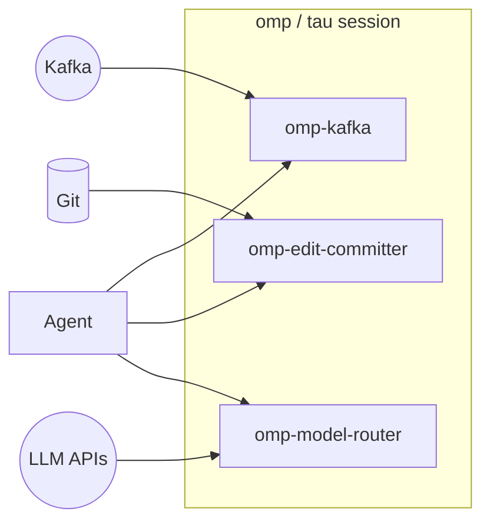

# tau-extensions — ten extensions for your Tau / `omp` agent session

[`toxicwind/tau-extensions`](https://github.com/toxicwind/tau-extensions) — a monorepo of Tau extensions that plug straight into your Tau (oh-my-pi / `omp`) agent session. Two built here, eight vendored forks of community extensions — all MIT-licensed, all cataloged under the `tau-extensions` marketplace.

Tau is the working name for our fork of [oh-my-pi (`omp`)](https://github.com/can1357/oh-my-pi) — the underlying runtime this repo targets. Extension names keep their upstream `omp-*` spelling so they stay compatible with the `omp` plugin contract; the repo itself is branded **tau-extensions**.


```mermaid
flowchart LR
    subgraph sess[omp / tau session]
        K[omp-kafka]
        E[omp-edit-committer]
        R[omp-model-router]
    end
    Kafka((Kafka)) --> K
    Git[(Git)] --> E
    LLM((LLM APIs)) --> R
    Agent --> K & E & R
```

## Extensions

| Extension | Category | What it does | Provenance |
|---|---|---|---|
| [`omp-kafka`](../../tau-extensions/packages/omp-kafka) | Integration | Consume Kafka topics into a session in auto (push) or pull mode; `/kafka-*` slash commands + `kafka_consume` LLM tool | Built here (from RekunDzmitry/omp-extensions) |
| [`omp-edit-committer`](../../tau-extensions/packages/omp-edit-committer) | Workflow | Auto-commit every Edit/Write with a descriptive Conventional-Commits message; commit SHA badge in the TUI for review with `modem-dev/hunk` | Built here (from RekunDzmitry/omp-extensions) |
| [`omp-model-router`](../../tau-extensions/omp-model-router) | Cost optimization | Route prompts to cheap/mid/expensive models by task complexity; per-turn and session cost tracking, budgets, `/router` commands | Fork of [cakriwut/omp-model-router](https://github.com/cakriwut/omp-model-router) |
| `engram` | Memory | Persistent memory for the agent session | Vendored from thebtf/engram (locally adapted) |
| `gsd-omp` | Orchestration | GSD Embeddable Orchestration System host plugin for Tau | Fork of tchivs/gsd-omp |
| `omp-best-of` | Agents | Best-of-N coding agents with LLM-as-a-verifier selection | Fork of wolfiesch/omp-best-of |
| `omp-undo-redo` | Workflow | Session and file undo/redo; snapshot-based undo of agent edits | Fork of Baylar55/omp-undo-redo |
| `pi-agent-browser-native` | Automation | Exposes agent-browser as a native Tau tool for scripted browser automation | Fork of fitchmultz/pi-agent-browser-native |
| `pi-tasks` | Productivity | Claude Code-style task tracking and coordination | Fork of tintinweb/pi-tasks |
| `pi-workflow` | Workflow | Named, repeatable multi-step workflow orchestration | Fork of AgwaB/pi-workflow |

Fork provenance and attribution live in `NOTICE` (referenced by the manifest; not present in this worktree). Only `omp-kafka`, `omp-edit-committer`, and `omp-model-router` are present under `tau-extensions/` here. Forks keep their upstream LICENSE files; repo URLs are repointed at this monorepo.

## Quick start

```bash
git clone --depth 1 https://github.com/toxicwind/tau-extensions ~/.tau/agent/extensions/tau-extensions
cd ~/.tau/agent/extensions/tau-extensions/packages/omp-kafka && bun install
omp plugin link .
```

Requires `omp >= 17.0.0` and [Bun](https://bun.sh) 1.3.x.

## Requirements

- `omp >= 17.0.0` (the Tau/`omp` runtime)
- [Bun](https://bun.sh) 1.3.x (the monorepo uses bun workspaces; CI installs with `--frozen-lockfile`)
- A working `git` — required by `omp-edit-committer`
- A reachable Apache Kafka broker — required only by `omp-kafka`
- LLM API access configured in your Tau/`omp` setup — required by `omp-model-router`'s adaptive calibration classifier

## Install options

**Option A — clone the monorepo and link** (recommended):

```bash
git clone --depth 1 --filter=blob:none --sparse https://github.com/toxicwind/tau-extensions ~/.tau/agent/extensions/tau-extensions
cd ~/.tau/agent/extensions/tau-extensions
git sparse-checkout set packages/omp-kafka
cd packages/omp-kafka
bun install
omp plugin link .
```

Drop `--filter=blob:none --sparse` and the `sparse-checkout` lines to take the whole monorepo.

**Option B — install via npm** (once published):

```bash
bun add -g @toxicwind/omp-kafka
```

Then add to `~/.tau/agent/config.yml`:

```yaml
extensions:
  - @toxicwind/omp-kafka
```

**Option C — load once for a single session:**

```bash
omp --extension /path/to/tau-extensions/packages/omp-kafka
```

## Extension: omp-kafka

Stream [Apache Kafka](https://kafka.apache.org) topics into a Tau/`omp` session. One repo = many consumers; each consumer has its own client ID, topic set, group ID, and mode, configured in a single `kafka.yml`.

- **auto (push) mode** — every consumed message is delivered into the running session as a user message (`sendUserMessage`) and shown as a `ctx.ui.notify`, so the agent reacts without being asked.
- **pull mode** — messages buffer silently; pull them on demand with slash commands or the LLM tool.

### Configure

Create `kafka.yml` next to your project. `loadConfig` resolves it in this order (first hit wins):

1. `$KAFKA_CONFIG` (absolute path wins, otherwise resolved against `cwd`)
2. `<cwd>/kafka.yml`
3. `<cwd>/.tau/kafka.yml`
4. `~/.tau/agent/kafka.yml`

```yaml
# ~/.tau/agent/kafka.yml
consumers:
  - name: events
    mode: auto               # "auto" (push) or "pull"
    brokers:
      - localhost:9092
    clientId: omp-events
    groupId: omp-events
    topics:
      - user.signup
      - billing.invoice
    fromBeginning: false
    notify: true             # also flash a UI notification on each message
    maxQueue: 500
    auto:
      deliverAs: steer       # "steer" or "followUp" (only meaningful in auto mode)
      prefix: "[kafka:events] "
```

### Slash commands

| Command | Effect |
|---|---|
| `/kafka` | List every consumer and its current status |
| `/kafka-tail <name> [limit]` | Print the last `limit` records (default 20) from `<name>`'s ring buffer |
| `/kafka-drop <name>` | Clear `<name>`'s ring buffer |
| `/kafka-reload` | Disconnect every consumer and reconnect (re-reads `kafka.yml`) |
| `/kafka-pause <name>` | Stop fetching new records (keep the buffer) |
| `/kafka-resume <name>` | Resume fetching for a paused consumer |

The TUI status line mirrors the same info, e.g. `kafka: events[auto]=running (12)  ops-pull[pull]=idle`.

### LLM-callable tool

`kafka_consume` is registered automatically so the agent can peek at the ring buffer without a user slash command:

```json
{
  "name": "kafka_consume",
  "parameters": {
    "consumer": "string? — name from kafka.yml",
    "limit":    "integer 1..500? — default 20",
    "since":    "ISO 8601 timestamp? — only records after this"
  }
}
```

### Environment overrides

| Variable | Effect |
|---|---|
| `KAFKA_DISABLED=1` | Skip connect on startup (config still loads) |
| `KAFKA_DEBUG=1` | Log lifecycle and connect events to stderr |
| `KAFKA_CONFIG=<path>` | Force a specific config file |

Full details: [`packages/omp-kafka/README.md`](https://github.com/toxicwind/tau-extensions/tree/main/packages/omp-kafka#readme)

## Extension: omp-edit-committer

**Commits every Edit and Write** the agent performs, with a descriptive message, and surfaces the resulting commit SHA directly under the tool result in the TUI. Designed to pair with [`modem-dev/hunk`](https://github.com/modem-dev/hunk) for rich diff review.

Each auto-commit message carries a `type(scope): subject` first line (Conventional-Commits-flavored), **Intent** and **Trade-offs** sections, a **Diagram** section for complex diffs (multi-file, multi-hunk, create/delete/rename), and a **Refs** footer (file list, `+`/`-` counts, hunk counts).

### Safety rules

The committer is conservative and **no-ops (silently)** when any of these hold:

- `cwd` is not inside a git working tree
- `git config user.name` or `user.email` is unset
- the Edit/Write tool returned `isError === true`
- the index has no changes for the target paths (no empty commits)
- `OMP_EDIT_COMMITTER_DISABLED=1` is set

When it acts, it runs `git add -- <paths>` then `git commit --only --no-verify --no-gpg-sign -m <message> -- <paths>` — so pre-existing staged work is never swept in, hooks are skipped, and nothing is amended, force-pushed, rebased, or pushed. Pushing is out of scope entirely.

### Environment overrides

| Variable | Effect |
|---|---|
| `OMP_EDIT_COMMITTER_DISABLED=1` | Disable the extension entirely |
| `OMP_EDIT_COMMITTER_DEBUG=1` | Log tool-call/result/commit events to stderr |

Full details: [`packages/omp-edit-committer/README.md`](https://github.com/toxicwind/tau-extensions/tree/main/packages/omp-edit-committer#readme)

## Extension: omp-model-router

Cost-optimized model routing for Tau/`omp` — routes each prompt to a cheap/mid/expensive model based on task complexity, tracks per-turn and session costs, and enforces session budgets. Forked from [`cakriwut/omp-model-router`](https://github.com/cakriwut/omp-model-router) (upstream author: Riwut Libinuko, MIT).

- **Intelligent routing** — tier-based High/Medium/Low classification; optional LLM-powered classifier (telemetry or adaptive mode); configurable profiles (`auto`, `deep`, `cheap`, `hybrid`, `oss`, custom); manual tier pinning; heuristic refinement; keyword → tier rules.
- **Cost optimization** — session budget tracking with automatic downgrade to cheaper tiers when exceeded; real-time usage display (`/router usage`).
- **Observability** — status widget (profile/tier/model), per-model usage and cost reports, session-persisted debug logs.

### Configure

```json
{
  "routerEnabled": true,
  "defaultProfile": "auto",
  "maxSessionBudget": 2.0,
  "rules": [
    { "matches": ["deploy", "production", "release"], "tier": "high" },
    { "matches": "changelog", "tier": "low" }
  ]
}
```

### Slash commands

`/router` · `/router usage` · `/router profile <name>` · `/router pin <tier|off>` · `/router set thinking <tier> <level>` · `/router set budget <dollars>` · `/router reset` · `/router widget on` · `/router help`

Full details: [`packages/omp-model-router/README.md`](https://github.com/toxicwind/tau-extensions/tree/main/packages/omp-model-router#readme)

## Marketplace

`.omp-plugin/marketplace.json` is the plugin catalog: `tau-extensions` by `toxicwind`, `pluginRoot: packages`. The Tau engine reads it first when discovering plugins.

## Dev / contributing

Bun workspace layout. From the repo root:

```bash
bun install
bun run test        # bun test packages/*
bun run typecheck   # bun scripts/typecheck.mjs
```

TypeScript is strict (`strict`, `noUncheckedIndexedAccess`, `noImplicitOverride`). CI runs `bun install --frozen-lockfile` then `bun run typecheck` on push/PR to `main`.

**Adding a new extension:**

1. Create `packages/<name>/` with `package.json`, `README.md`, `LICENSE`, and `src/extension.ts` as the entry point (`"omp": { "extensions": ["./src/extension.ts"] }` in the manifest).
2. Add it to the workspace (`workspaces: ["packages/*"]` already covers it), run `bun install`.
3. Register it in `.omp-plugin/marketplace.json` (`plugins[]`: name, description, version, source, category, keywords, homepage, license).
4. Verify: `bun run typecheck && bun run test`.

## License + security

MIT — see [LICENSE](https://github.com/toxicwind/tau-extensions/tree/main/LICENSE). Vendored forks retain their upstream MIT licenses; see [NOTICE](https://github.com/toxicwind/tau-extensions/tree/main/NOTICE) for attribution. Extensions run inside your agent session with the session's full tool access — review a fork's `src/` before linking it, and keep broker URLs and API tokens in `~/.tau/agent/` config (never committed), not in extension files.
