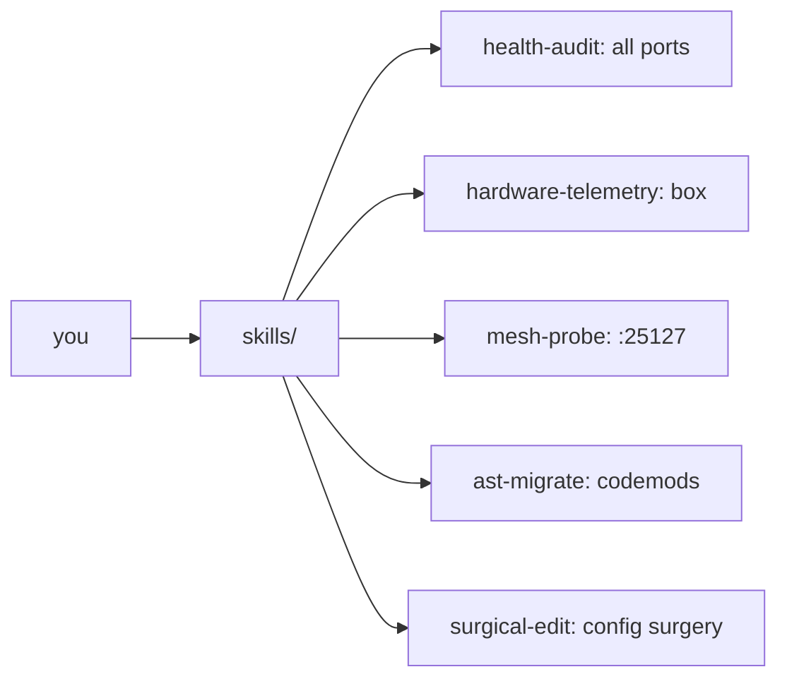

<div align="right">

[](https://github.com/toxicwind/sovereign-projects#license)
[](https://github.com/toxicwind/sovereign-projects)

</div>

# Skills — Sovereign Helpers Toolkit

> First-class reusable automation: health checks, telemetry, migration tools, fleet utilities.

> **Why care? The estate runs on small sharp tools, not tribal knowledge. Parallel health audits across every service port, hardware telemetry, MCP handshake probes, AST codemods, assertive config surgery — all here, all runnable, Bun/POSIX with zero data loss.**

- **`health-audit.ts` — parallel live probe across all service endpoints, full untruncated JSON**
- **`hardware-telemetry.sh` — CPU, L3, governor, swap, RTX 3090 metrics**
- **`mesh-probe.ts` — JSON-RPC 2.0 initialize handshake probe for the MCP gateway**
- **`ast-migrate.ts` — AST structural pattern matching and codemods via ast-grep**
- **`surgical-edit` / `herd-probe` / `hft-latency` — assertive config surgery, exact-token model probes, strategy racing**



## Quick start

```bash
bun run skills/health-audit.ts          # full parallel health audit
bun run skills/health-audit.ts --json   # untruncated JSON for tooling
./skills/hardware-telemetry.sh          # box + GPU metrics
```

## License & security

- **License:** [MIT](https://github.com/toxicwind/sovereign-projects#license)
- **Security:** Local operational tooling — `clean-orphans.sh` terminates runaway processes by design; review before running on a shared box. Symlinked as `helpers/` at the repo root.

---

First-class reusable automation for the Sovereign ecosystem: health checks,
telemetry, migration tools, and fleet utilities. Built for Bun / POSIX, zero
data loss. (Symlinked as `helpers/` at the repo root.)

## Tool catalog

| Script                 | Runtime      | Purpose                                                                        | Usage                                              |
| ---------------------- | ------------ | ------------------------------------------------------------------------------ | -------------------------------------------------- |
| **`health-audit.ts`**       | Bun / TypeScript | Parallel live probe across all service endpoints, full untruncated JSON      | `bun run skills/health-audit.ts [--json]`          |
| **`clean-orphans.sh`**      | POSIX bash   | Terminates orphan compiler loops (`cargo-watch`) and rogue agent workers       | `./skills/clean-orphans.sh`                        |
| **`mesh-probe.ts`**         | Bun / TypeScript | JSON-RPC 2.0 initialize handshake probe for the MCP gateway (`:25127`)     | `bun run skills/mesh-probe.ts`                     |
| **`hardware-telemetry.sh`** | POSIX bash   | CPU, L3 cache, frequency governor, swap, and RTX 3090 GPU metrics              | `./skills/hardware-telemetry.sh`                   |
| **`ast-migrate.ts`**        | Bun / TypeScript | AST structural pattern matching and codemods via `ast-grep`                | `bun run skills/ast-migrate.ts [dir] [scan\|rewrite]` |
| **`surgical-edit`**         | Python 3 (stdlib) | Assertive exact-text config surgery: all checks before any write, atomic  | `skills/surgical-edit/bin/surgical-edit patch.json` |
| **`herd-probe`**            | Python 3 (stdlib) | Exact-token probe of a herd model route (verbatim output check)            | `skills/surgical-edit/bin/herd-probe <model> <expected>` |
| **`hft-latency`**           | Python 3 (stdlib) | HFT strategy racer: concurrent first-valid-wins, fail-fast ceilings, `--hedge-ms` hedged launch | `skills/hft-latency/bin/race.py --strategies s.json --tag t [--hedge-ms 300]` |

More tools live in the directory (`engine-audit.ts`, `fleet-status`, `gguf-rank`,
`model-switch`, `repo-audit`, `tau-tmux`, …) — the table above is the core set.

## Quick examples

```bash
# Full parallel health audit across all ports
bun run skills/health-audit.ts

# Untruncated JSON health data for LLMs/tooling
bun run skills/health-audit.ts --json

# Clean runaway cargo-watch watchers causing CPU spikes
./skills/clean-orphans.sh

# Probe the Mesh JSON-RPC handshake
bun run skills/mesh-probe.ts

# Hardware scaling and memory metrics
./skills/hardware-telemetry.sh
```

---
*Up: [master README](../README.md) · [fleet knowledgebase](../docs/fleet-knowledgebase.md)*
