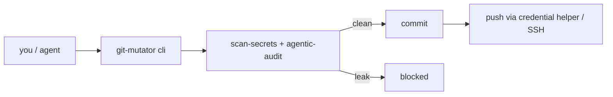

<div align="right">

[](https://github.com/toxicwind/sovereign-projects#license)
[](https://github.com/toxicwind/sovereign-projects)

</div>

# git-mutator

> Safe git operations with agentic completion auditing and secret boundary verification.

> **Why care?** Agents commit and push constantly — and one leaked token in a URL or one un-audited completion UUID can poison the repo. git-mutator wraps status/diff/commit/push with secret scanning and completion auditing, and `commit-push` blocks the push when it finds a leak.

- **Safe mutations** — `status`, `diff`, `commit`, `push`, `commit-push` with conventional-commit messages
- **Secret boundary** — `scan-secrets` catches credential patterns; pushes use credential helper/SSH, never token-in-URL
- **Agentic audit** — `agentic-audit` checks completion UUIDs, agent artifacts, and secret leaks
- **Repo hygiene** — `ensure-gitignore` adds security patterns; `diff-configs` diffs two config files



## Quick start

```bash
bun helpers/git-mutator/cli.ts status
bun helpers/git-mutator/cli.ts scan-secrets
bun helpers/git-mutator/cli.ts commit-push "feat: safe change"
```

| Command | Description |
|---|---|
| `status` | Show git status (staged/unstaged/untracked) |
| `diff [--staged]` | Show diff (working tree or staged) |
| `commit <msg>` | Commit with conventional commit message |
| `push [remote] [branch]` | Push via credential helper/SSH |
| `commit-push <msg>` | Audit → commit → push (blocks on leaks) |
| `ensure-gitignore` | Add security patterns to .gitignore |
| `scan-secrets [files]` | Scan for credential patterns |
| `agentic-audit [files]` | Audit completion UUIDs, agent artifacts, secret leaks |
| `diff-configs <A> <B>` | Diff two config files |

## License & security

- **License:** [MIT](https://github.com/toxicwind/sovereign-projects#license)
- **Security:** this tool exists to enforce the secret boundary — `commit-push` refuses to push when `scan-secrets` finds a leak. Never bypass with a raw `git push` carrying a token in the URL; see `SKILL.md` for the full trigger list and conventions.
