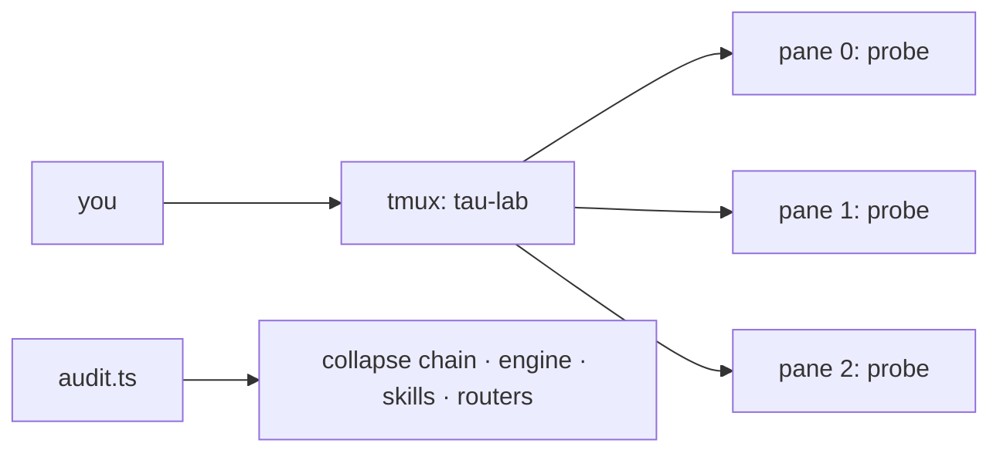

<div align="right">

[](https://github.com/toxicwind/sovereign-projects#license)
[](https://github.com/toxicwind/sovereign-projects)

</div>

# tau-tmux

> tmux lab for parallel tau experiments + a live audit of the tau install.

> **Why care? Parallel agent experiments need isolated panes you can drive programmatically — and the tau install itself needs proving, not assuming. This skill gives you both: a 3-pane lab recipe and a real audit where every check observes the box (nothing stubbed).**

- **Detached 3-pane lab — fire probes with `send-keys`, read results with `capture-pane`**
- **Real audit — collapse chain resolves, engine version, `PI_CONFIG_DIR` honored, skills symlink live**
- **Router checks — herd (`:25100`) and sovereign (`:25104`) reachable**
- **Verified flag table — every flag checked against `tau --help` (18.2.6)**
- **Honest history — the stub-helper era is documented, not hidden**



## Quick start

```bash
tmux new-session -d -s tau-lab -n lab
tmux send-keys -t tau-lab:0.0 "tau -p 'reply with exactly: PANE0_OK'" C-m
bun run /home/toxic/sovereign/skills/tau-tmux/helper/audit.ts
```

## License & security

- **License:** [MIT](https://github.com/toxicwind/sovereign-projects#license)
- **Security:** The audit is read-only and observes the live box. The earlier stub-helper version (checks that always returned true) was replaced 2026-09-20 — docs now match the box.

---

Run parallel tau experiments in tmux panes and audit the live tau install
with real checks. Nothing here is stubbed: every check observes the box.

## Quick start

```bash
# Detached 3-pane lab
tmux new-session -d -s tau-lab -n lab
tmux split-window -h -t tau-lab
tmux split-window -v -t tau-lab:0.1

# Fire a probe in pane 0 without attaching
tmux send-keys -t tau-lab:0.0 "tau -p 'reply with exactly: PANE0_OK'" C-m

# Read results programmatically
tmux capture-pane -t tau-lab:0.0 -p | tail -20

# Clean up
tmux kill-session -t tau-lab
```

## Audit

```bash
bun run /home/toxic/sovereign/skills/tau-tmux/helper/audit.ts [--verbose]
```

Exit 0 = all checks pass. Checks: tau launcher collapse chain resolves,
engine version 18.2.6+, `PI_CONFIG_DIR=.tau` honored, skills symlink live
with discoverable `SKILL.md` files, herd (:25100) and sovereign (:25104)
routers reachable, no stale `nvidia.json`/`cascade.json`.

## Flags that exist (verified against `tau --help`, 18.2.6)

| Flag | Meaning |
| ---- | ------- |
| `--skills "<glob>"` | Filter discovered skills (there is no singular `--skill`) |
| `--profile <name>` | Isolated profile (only `default` exists by default) |
| `-p` / `--print` | Non-interactive: process prompt and exit |
| `--no-skills` | Disable skills discovery (fastest boot) |
| `--config <file>` | Extra config.yml-style overlay for this run (repeatable) |

## History note

An earlier version of this skill audited `nvidia.json` / `cascade.json` /
`nvidia.ts` and shipped a helper whose checks always returned true. Those
files were removed on 2026-09-20 when the provider catalog moved to
`~/.tau/agent/models.yml` (herd + sovereign dynamic discovery), and the
stub helper was replaced with the real one above. Docs now match the box.
