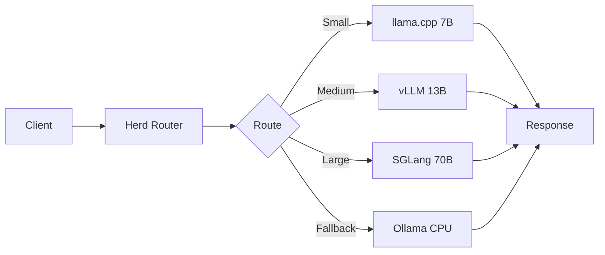

# Herd

> Orchestrate fleets of LLM inference engines. Zero downtime, zero friction.

[](https://github.com/toxicwind/herd/actions)
[](https://github.com/toxicwind/herd/actions)
[](https://github.com/toxicwind/herd/actions)
[](https://github.com/toxicwind/herd/actions)
[](./LICENSE)
[](https://github.com/toxicwind/herd/actions)

## Why Herd?

A swap is one action. A herd is orchestration.

We started with the same foundation — hot-swapping LLM models — and made it scale. Where the original handled one model at a time, Herd manages entire fleets. Where it dropped connections, Herd keeps them alive with SSE. Where it lacked visibility, Herd provides health dashboards and rate limiting.

## What Makes Herd Scale

| Feature | Original | Herd |
|---------|----------|------|
| Model switching | Single swap | **Fleet orchestration** |
| Connections | Drop on swap | **SSE keep-alive** |
| Monitoring | None | **Health UI + API** |
| Rate limiting | None | **AstMatrix engine** |
| Backends | llama.cpp | **llama.cpp + vLLM + SGLang + Ollama** |

## Architecture



## Quick Start

```bash
git clone https://github.com/toxicwind/herd.git
cd herd
go build -v -ldflags="-s -w" -o herd ./cmd
./herd --config config.yaml
```

## Lineage

Herd is a sovereign evolution of the inference gateway space. We maintain sync capability with the original [mostlygeek/llama-swap](https://github.com/mostlygeek/llama-swap) project — our common ancestor.

- **Daily automated sync** via GitHub Actions
- **29 commits ahead** with routing enhancements
- **All upstream contributions** preserved and attributed
- **Upstream code** remains under its original MIT license
- **Herd enhancements** are licensed under SOL v1.0

## License

Sovereign Open License (SOL) v1.0 — see [LICENSE](./LICENSE)

## Stars

If Herd saves you from model management hell, please ⭐ star it. Orchestrate, don't swap.
