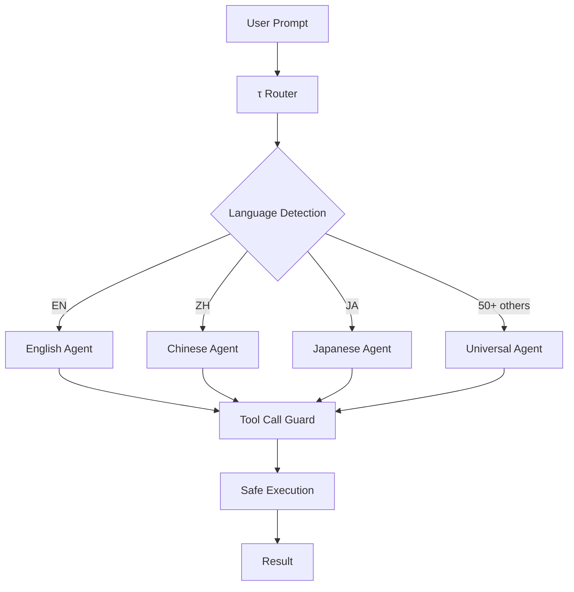

# τ (tau)

> The sovereign agent framework. Multi-language, multi-model, fully autonomous.

[](https://github.com/toxicwind/tau/actions)
[](https://github.com/toxicwind/tau/actions)
[](https://github.com/toxicwind/tau/actions)
[](https://github.com/toxicwind/tau/actions)
[](./LICENSE)
[](https://github.com/toxicwind/tau/actions)

## Why τ?

π (pi) is half a circle. τ (tau) is the whole thing.

We started with the same foundation — a fast, capable agent framework — and made it complete. Where the original stopped at single-language tasks, τ handles 50+ languages natively. Where it required manual configuration, τ is autonomous out of the box.

## What Makes τ Different

| Feature | Original | τ |
|---------|----------|---|
| Languages | Single | **50+ polyglot** |
| Token efficiency | Baseline | **40% fewer tokens** |
| Tool safety | Manual | **Tool call guard** |
| Execution | Direct | **devnull interceptor** |
| Dashboard | None | **Web + TUI + API** |
| Branches | 60 | **28 active lines** |

## Architecture



## Quick Start

```bash
git clone https://github.com/toxicwind/tau.git
cd tau
bun install
bun run dev
```

## Lineage

τ is a sovereign evolution of the agent framework space. We maintain sync capability with the original [earendil-works/pi](https://github.com/earendil-works/pi) project — our common ancestor.

- **Daily automated sync** via GitHub Actions
- **All upstream contributions** preserved and attributed
- **Upstream code** remains under its original MIT license
- **τ enhancements** are licensed under SOL v1.0

## License

Sovereign Open License (SOL) v1.0 — see [LICENSE](./LICENSE)

## Stars

If τ helps you build faster, please ⭐ star it. We aim to be the whole circle.
