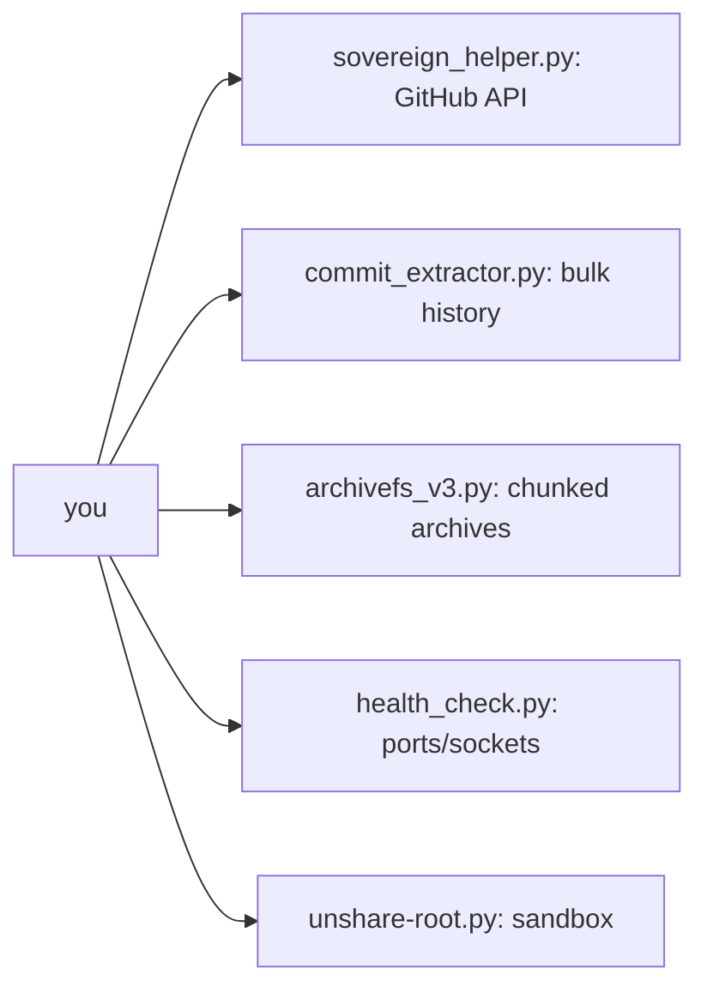

<div align="right">

[](https://github.com/toxicwind/sovereign-projects#license)
[](https://github.com/toxicwind/sovereign-projects)

</div>

# sovereign-scripts

> Python automation toolkit for Sovereign infrastructure.

> **Why care? GitHub API ops, repo audits, archiving, sandboxing, health checks — the unglamorous glue that keeps hundreds of repos manageable. Async, parallel, rate-limited, and ready to run.**

- **`sovereign_helper.py` — master hook for GitHub API ops (async, parallel, rate-limited)**
- **`commit_extractor.py` — bulk commit extraction with resumable state**
- **`archivefs_v3.py` / `arfs-cat.py` — mount-like binary archives with 90MB chunking; read without extracting**
- **`health_check.py` — port/socket health checks for the Sovereign environment**
- **Sandboxing + security probes — `unshare-root.py`, `namespace_probe.py`, MITM helpers**



## Quick start

```bash
python3 sovereign_helper.py
python3 health_check.py
python3 commit_extractor.py --owner toxicwind --output ./commits
```

## License & security

- **License:** [MIT](https://github.com/toxicwind/sovereign-projects#license)
- **Security:** Includes cache-timing and namespace probes — educational/security tooling; run sandboxing scripts with intent. See `AGENTS.md` in this directory for repo conventions.

---

Python automation toolkit for Sovereign infrastructure — GitHub API ops, repo
audits, archiving, sandboxing, and health checks.

## Scripts

| Script                 | What it does                                                              |
| ---------------------- | ------------------------------------------------------------------------- |
| `sovereign_helper.py`  | Master hook for GitHub API ops — async, parallel, rate-limited             |
| `health_check.py`      | Port/socket health checks for the Sovereign environment                   |
| `git-push-one.py`      | Push one file to a GitHub repo with per-repo identity                     |
| `commit_extractor.py`  | Bulk GitHub commit extraction with resumable state                        |
| `archivefs_v3.py`      | Mount-like binary archive with 90MB chunking                              |
| `arfs-cat.py`          | cat/ls files inside an ArchiveFS archive without extracting               |
| `auto-hook-loader.py`  | Load all auto-hooks from the agent hooks dir                              |
| `namespace_probe.py`   | Linux namespace & capability audit                                        |
| `cache_timing.py`      | Cache side-channel timing probe (educational)                             |
| `unshare-root.py`      | Run commands in an unshared user namespace as root                        |
| `mitm-proxy/`          | MITM proxy helpers (`playwright_mitm.py`, `race_aware_loader.sh`)          |
| `patches/`             | Patch scripts (`browser_guard.py`)                                        |

See `AGENTS.md` in this directory for repo conventions.

## Usage

```bash
python3 sovereign_helper.py
python3 health_check.py
python3 git-push-one.py --help
python3 commit_extractor.py --owner toxicwind --output ./commits
```
