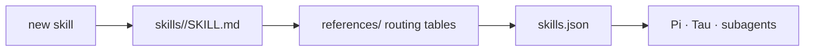

<div align="right">

[](https://github.com/toxicwind/sovereign-projects#license)
[](https://github.com/toxicwind/sovereign-projects)

</div>

# sovereign-skills

> Skill definitions, agent recipes, and behavioral conventions — for Pi, Tau, and subagents.

> **Why care? Agents need deterministic, atomic, self-contained instructions — not wiki pages. These are the recipes: engine audits that emit structured dataframes, contributor rules that fail loud, and a registration path for new skills.**

- **`engine-audit.ts` — audits the Tau engine fork against upstream oh-my-pi; emits structured diff dataframes**
- **`AGENTS.md` — contributor rules: verify live before claiming, fail loud, prefer `fd`/`rg`**
- **Atomic + deterministic — every definition self-contained**
- **Registration — `skills.json` tracks what's available**



## Quick start

```bash
bun run sovereign-skills/engine-audit.ts   # audit Tau engine vs upstream
# add a skill: create skills/<name>/SKILL.md, add references/, register in skills.json
```

## License & security

- **License:** [MIT](https://github.com/toxicwind/sovereign-projects#license)
- **Security:** Repo rules are the security posture: verify live before claiming, fail loud (never silence errors). Keep definitions atomic so a bad skill can't smuggle broad behavior.

---

Skill definitions, agent recipes, and behavioral conventions for the Sovereign
ecosystem — consumed by Pi, Tau, and subagents. Keep definitions atomic,
self-contained, and deterministic.

See `AGENTS.md` for the repo rules: verify live before claiming, fail loud
(never silence errors), prefer `fd`/`rg` over `find`/`grep`.

## Contents

| Path             | What it is                                                                                  |
| ---------------- | --------------------------------------------------------------------------------------------- |
| `engine-audit.ts`| Audits the Tau engine fork against upstream oh-my-pi; emits structured diff dataframes        |
| `AGENTS.md`      | Contributor rules for this repo                                                               |

```bash
# Audit the Tau engine vs upstream
bun run sovereign-skills/engine-audit.ts
```

## Adding a skill

1. Create `skills/<name>/SKILL.md` — atomic, self-contained, deterministic
2. Add `references/` for routing tables
3. Register in `skills.json`
