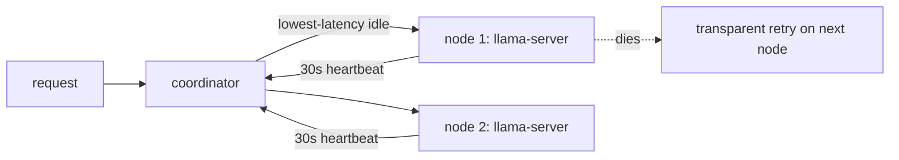

<div align="right">

[](https://github.com/toxicwind/sovereign-projects#license)
[](https://github.com/toxicwind/sovereign-projects)

</div>

# llama-server — First Class Provider

> Direct llama.cpp HTTP API — not an Ollama wrapper.

> **Why care? Inference without a single point of failure: workers run llama-server, register with a coordinator over WebSocket, and requests swap to the lowest-latency idle node automatically. A dead node is a retry, not an outage.**

- **llama swap — distributed node failover, transparent to the caller**
- **Direct llama.cpp HTTP — `/completion`, `/v1/chat/completions`, `/tokenize`, `/embedding`, `/props`, `/health`**
- **Coordinator-tracked — latency, VRAM, model, slots per node; 30s heartbeat, 120s eviction**
- **RTX 3090-tuned registry — Qwen 3.6 27B + drafter, Llama 4 Maverick, edge models for CDP nodes**
- **WebGPU edge — Phi-3 Mini / Gemma 2B in Chrome tabs**



## Quick start

```bash
llama-server -m ~/models/Qwen3.6-27B-Q5_K_S.gguf --port 8080 --flash-attn --chat-template qwen --parallel 4
bun run coordinator.ts
LLAMA_BASE_URL=http://localhost:8080 LLAMA_MODEL=qwen3.6-27b-q5 bun run worker.ts
```

## License & security

- **License:** [MIT](https://github.com/toxicwind/sovereign-projects#license)
- **Security:** Mesh-internal endpoints — keep the coordinator and workers on localhost/Tailscale. The heartbeat/eviction loop assumes a trusted network; don't expose the mesh port publicly.

---

NOT an Ollama wrapper. Direct llama.cpp HTTP API.

## Core Primitive: llama swap

Distributed node failover. When one llama-server dies, requests automatically
route to the next available node. No single point of failure.

## Endpoints Used

| Endpoint               | Purpose                                     |
| ---------------------- | ------------------------------------------- |
| `/completion`          | Raw text generation (prompt -> content)     |
| `/v1/chat/completions` | OpenAI-compatible chat (if --chat-template) |
| `/tokenize`            | Token counting                              |
| `/detokenize`          | Token -> text                               |
| `/embedding`           | Vector embeddings                           |
| `/props`               | Server metadata (model, n_ctx, n_parallel)  |
| `/health`              | Health check                                |

## Mesh Lifecycle

1. Worker starts llama-server with --model
2. Worker registers with coordinator via WebSocket
3. Coordinator tracks nodes: latency, VRAM, model, slots
4. Heartbeat every 30s, eviction after 120s dead
5. Request arrives -> swap to lowest-latency idle node
6. Node fails -> retry on next node (transparent to caller)

## Model Registry

Pre-configured for RTX 3090 24GB:

- Qwen 3.6 27B Q5_K_S (14GB) + DFlash drafter Q4_K_M (4GB) = 18GB total
- Llama 4 Maverick 17B 128E Q4_K_M (12GB)
- Llama 3.2 3B Q8_0 (3.5GB) — edge/CDP nodes
- Phi-3 Mini, Gemma 2B — WebGPU in Chrome tabs

## Quick Start

```bash
# Terminal 1: Start llama-server
llama-server -m ~/models/Qwen3.6-27B-Q5_K_S.gguf \
  --port 8080 --flash-attn --cache-type-k f16 \
  --chat-template qwen --parallel 4

# Terminal 2: Start coordinator
bun run coordinator.ts

# Terminal 3: Start worker
LLAMA_BASE_URL=http://localhost:8080 LLAMA_MODEL=qwen3.6-27b-q5 bun run worker.ts

# Terminal 4: Send request
curl http://localhost:9223/v1/chat/completions \
  -H "Content-Type: application/json" \
  -d '{"model":"qwen3.6-27b-q5","messages":[{"role":"user","content":"hi"}]}'
```
