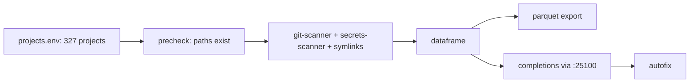

<div align="right">

[](https://github.com/toxicwind/sovereign-projects#license)
[](https://github.com/toxicwind/sovereign-projects)

</div>

# Maximal Sovereign Agentic Audit

> Production-grade, fully agentic repository audit system for the Sovereign ecosystem.

> **Why care? 327 projects, one command: local-first auditing with a multi-tier modular architecture — git scanning, secrets scanning, broken-symlink detection, pre-check validation, Parquet export, and AI-powered insights via the `:25100` API.**

- **Local-first — scans all 327 projects from `projects.env` directly, no cloning**
- **Modular — types, parser, git-scanner, secrets-scanner, completions, autofix, precheck, dataframe, parquet**
- **Secrets-aware — `/home/toxic/.secrets` scanned as a protected credential record (never committed)**
- **Parquet export — audit results as dataframes for analysis**
- **Agentic completions — AI insights via the 25100 API; 86%+ coverage target**



## Quick start

```bash
bun run start --all --precheck --parquet output/audit.parquet
bun test tests/local-audit.test.ts --coverage
bun run local --all --precheck
```

## License & security

- **License:** [MIT](https://github.com/toxicwind/sovereign-projects#license)
- **Security:** The `.secrets` file is a first-class credential record — scanned but never committed, excluded via `.gitignore`. Requirements: Bun 1.4+, parquetjs-lite, git repos in `/home/toxic/projects/` and `/home/toxic/sovereign/`.

---

A production-grade, fully agentic repository audit system for the Sovereign ecosystem.

## What It Does

- **Local-first auditing**: Scans all 327 projects from `projects.env` directly
- **Multi-tier modular architecture**: Types, constants, parser, git-scanner, secrets-scanner, completions, autofix, precheck, dataframe, parquet — each in its own module
- **First-class `.secrets` credential store**: Scans `/home/toxic/.secrets` as a protected credential record
- **Parquet export**: Exports audit results as Parquet files for data analysis
- **Agentic completions**: Uses the 25100 API for AI-powered insights
- **Symlink analysis**: Detects broken symlinks across all projects
- **Pre-check validation**: Verifies all required paths and files exist before auditing

## Quick Start

```bash
# Full audit
bun run start --all --precheck --parquet output/audit.parquet

# Run tests
bun test tests/local-audit.test.ts --coverage

# Local audit only
bun run local --all --precheck

# With completions
bun run start --all --completions
```

## Architecture

```
src/
├── index.ts              # CLI entry point
├── local-audit.ts        # Orchestrator (imports all modules)
└── modules/
    ├── types.ts          # RepoRecord, LocalAuditResult, SymlinkRecord, AuditMode
    ├── constants.ts      # All file paths and URLs
    ├── parser.ts         # parseProjectsEnvSync() — parses projects.env
    ├── git-scanner.ts    # scanDirSync(), scanSymlinksSync(), runGit()
    ├── secrets-scanner.ts# scanSecrets(), getSecretsRecord()
    ├── completions.ts    # analyzeWithCompletions()
    ├── autofix.ts        # autoFix()
    ├── precheck.ts       # preCheck()
    ├── dataframe.ts      # toDataFrame()
    └── parquet.ts        # exportParquet()
```

## Not Just for Auditing

This tool goes beyond simple repository auditing — it's a full agentic audit framework with AI completions, credential scanning, parquet export, and modular extensibility.

## `.secrets` First-Class

The `.secrets` file at `/home/toxic/.secrets` is treated as a first-class credential record in the audit. It is never committed to git and is excluded via `.gitignore`.

## Requirements

- Bun 1.4+
- parquetjs-lite
- Git repos in /home/toxic/projects/ and /home/toxic/sovereign/

## Coverage

Target: 86%+ code coverage across all modules.
