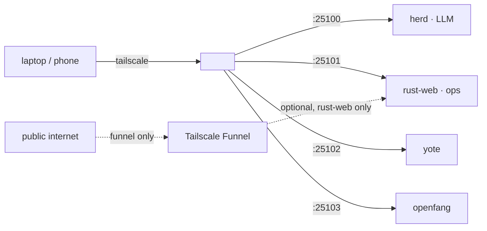

# Tailscale — the sovereign edge

<div align="right">

[](https://github.com/toxicwind/sovereign-projects#license)
[](https://github.com/toxicwind/sovereign-projects)

</div>

Tailscale is how sovereign services leave the box safely. Every daemon binds
localhost/tailnet, and remote lanes reach them over MagicDNS — no open ports,
no reverse-proxy path soup, no Caddy.

## Why this layout

- **Direct over the tailnet** beats a multi-service gateway: one DNS name per
  service, zero path rewriting, and the LAN firewall posture stays closed.
- **Funnel is opt-in, single-backend**: `funnel.sh` exposes *only* the
  rust-web ops dashboard (default port 25101) to the public internet. For LLM
  access remotely, use Tailscale + direct `:25100` — never funnel.

## Surfaces (use directly)

| Service                  | Port                   | Local URL                                | Over Tailscale            |
| ------------------------ | ---------------------- | ---------------------------------------- | ------------------------- |
| herd (LLM + chat UI)     | `25100` (`HERD_PORT`)  | `http://127.0.0.1:25100/ui/` · `/v1`    | `http://<magicdns>:25100` |
| rust-web (ops dashboard) | `25101` (`RUST_WEB_PORT`) | `http://127.0.0.1:25101/`             | `http://<magicdns>:25101` |
| yote                     | `25102` (`YOTE_PORT`)  | `http://127.0.0.1:25102/`               | `http://<magicdns>:25102` |
| openfang                 | `25103` (`OPENFANG_PORT`) | `http://127.0.0.1:25103/`             | `http://<magicdns>:25103` |
| everything else           | see `config/ports.env` | 25xxx SSOT                              | same pattern              |



## Quick start

```bash
# check / bring up the optional public edge (rust-web only)
bash /home/toxic/sovereign/tailscale/funnel.sh status
bash /home/toxic/sovereign/tailscale/funnel.sh up
bash /home/toxic/sovereign/tailscale/funnel.sh down
```

`funnel.sh up` sources `config/ports.env` for `RUST_WEB_PORT` (default 25101),
runs `tailscale funnel --bg`, and then parks (funnel dies with the process).
It is **not** a multi-service gateway: funnel exposes exactly one backend.

## Architecture

- **`funnel.sh`** — `up | down | status` wrapper around `tailscale funnel`.
  Single backend (no Caddy — removed: wrong ports, path conflicts with
  openfang `/api/*`, unused by `mise run up`). Logs under
  `/home/toxic/sovereign/.state/logs`.
- **`tailray.service`** — systemd user unit for the Tailray tray applet
  (`/home/toxic/.cargo/bin/tailray`, `Restart=always`, needs `DISPLAY=:0`).
  Independent of Caddy and of funnel; purely a local tray UI.

## Config

| Knob | Source | Default |
| ---- | ------ | ------- |
| `RUST_WEB_PORT` | `config/ports.env` | `25101` |
| Funnel target | `funnel.sh up` | `$RUST_WEB_PORT` |

## Dev / contributing

Edits here are shell-only: `funnel.sh` and `tailray.service` ship as-is in
this directory. Keep funnel single-backend — multi-service reverse proxying
was deliberately removed.

## License & security

MIT — see [LICENSE](https://github.com/toxicwind/sovereign-projects#license).

- Tailscale's WireGuard identity is the auth boundary; no secrets live in
  this directory.
- Funnel is the only public-internet surface and it is opt-in. Nothing else
  here binds `0.0.0.0`.
