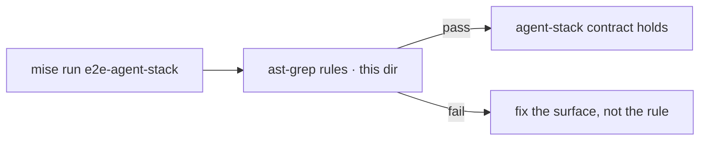

# agent-stack ast-grep checks

<div align="right">

[](https://github.com/toxicwind/sovereign-projects#license)
[](https://github.com/toxicwind/sovereign-projects)

</div>

> **Status: placeholder lane.** This directory currently holds only this
> README — no rule files are committed yet. The documented invocation below
> is the contract the rules will be exercised under; add `*.yml` rules here
> as the agent-stack surface stabilizes.

Static checks for the agent-stack surface, enforced with
[ast-grep](https://ast-grep.github.io/) instead of regex. The headline rule
family: tool-name lint (`name: "ghas_$NAME"`) over the MCP tools surface,
plus port-SSOT enforcement (ports are read from `.env.local`, never
invented in a check).



## Quick start

```bash
# full agent-stack E2E (includes the D8 check this lane exists for)
mise run e2e-agent-stack

# or target the rule family directly:
ast-grep run -p 'name: "ghas_$NAME"' --lang typescript \
  ~/github-advanced-search-mcp/apps/mcp/src/tools.ts
```

## Architecture

- One `*.yml` rule file per check family, living in this directory.
- Port SSOT: checks read `.env.local`; a rule that invents a port number
  is itself a violation.
- Consumers: `mise run e2e-agent-stack` (full), or direct `ast-grep run`
  for a single family.

## Config

None — rule files are the config. When adding a rule, document its `-p`
pattern and target path in this README.

## Dev / contributing

Add rules as `agent-stack/<family>.yml`; verify with the direct `ast-grep
run` invocation before wiring into `mise run e2e-agent-stack`.

## License & security

MIT — see [LICENSE](https://github.com/toxicwind/sovereign-projects#license).

Static analysis only: ast-grep reads source files and produces matches.
No execution, no network, no secrets involved.
