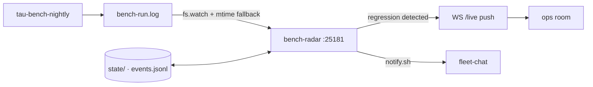

# BENCH-RADAR

<div align="right">

[](https://github.com/toxicwind/sovereign-projects#license)
[](https://github.com/toxicwind/sovereign-projects)

</div>

Nobody reads the nightly benchmark log — so this service does, and **pages
the moment a suite degrades** instead of letting anomalies sit unnoticed for
days. BENCH-RADAR is a resident, reactive regression-detection service for
the tau nightly benchmark (cron `tau-bench-nightly`, daily 03:30
America/Denver → `/home/toxic/bench-run.log`).



## Features

- **Reactive push, not polling** — `fs.watch` (500ms debounce) triggers an
  immediate scan; detections push over the `/live` WebSocket the moment they
  are evaluated. The 10s mtime/size poll remains as fallback.
- **Hard rules (page immediately)** — suite `exit != 0`; router-models
  `nonempty=0/N` (backend returning empty); title-models `warmMeanMs=0`
  while `coldMs>0` (warm runs not executing); suite section missing vs the
  previous complete run. `SKIP` lines (e.g. ollama-unreachable) are
  informational only.
- **Soft regressions** — rolling-median + MAD z-score per numeric series
  (z ≥ 3.5 and ≥25% relative move, ≥4 history points; ≥40% move on short
  history). Change-point aware: a soft regression must degrade **2
  consecutive runs** before paging — first sight only arms a pending watch.
- **Dedup** — one event per (suite, series, metric, night).
- **Backfill without spam** — boot-time backfill records historical events
  with `"backfill": true` and never fires the notify hook.

## Quick start

```bash
pitchfork start bench-radar
curl http://127.0.0.1:25181/status   # latest night, per-suite verdicts, open regressions
```

### Interface

| Method | Path | Purpose |
| --- | --- | --- |
| GET | `/health` | liveness |
| GET | `/status` | latest night, per-suite verdicts, open regressions with evidence |
| WS | `/live` | snapshot on connect, then `{type:"regression", event}` pushed on detection |
| GET | `/events` | last 50 events (newest first) |
| POST | `/scan` | force an immediate log rescan |

## Architecture

```
bench-radar/
  state/
    events.jsonl     — durable, append-only event log
    evaluated.json   — already-scored run|suite pairs
    pending.json     — armed 1-night watches
    alerts.log       — notify.sh output
    nights.jsonl     — one row per run (night, run_start, per-suite exit + series count)
    series.jsonl     — one row per run/suite/series/metric value
  notify.sh          — fires once per new event (argv $1 = event JSON)
```

Time-series exports (`nights.jsonl`, `series.jsonl`) are deterministic and
rewritten on every scan.

## Config / optional services

| Env | Default | Purpose |
| --- | --- | --- |
| `BENCH_RADAR_PORT` | `25181` | HTTP/WS port |
| `BENCH_RADAR_LOG` | `/home/toxic/bench-run.log` | benchmark log to watch |
| `BENCH_RADAR_STATE` | `tools/bench-radar/state` | state dir |
| `BENCH_RADAR_POLL_MS` | `10000` | fallback poll interval |
| `BENCH_RADAR_BACKFILL` | `1` | page on history when set |

Alerting: `notify.sh` appends to `state/alerts.log` and best-effort POSTs
to fleet-chat (`FLEET_CHAT_URL`, room `BENCH_RADAR_ROOM` default `ops`,
`BENCH_RADAR_AGENT_ID` default `bench-radar`). The lane wires the room.

Mesh: registered as `bench-radar` in `src/lib/ghas-mesh-features.ts`
(service IDs, catalog, dependency graph) with `BENCH_RADAR_PORT` in
`config/ports.env`.

## Dev / contributing

Pitchfork stanza in `sovereign/pitchfork.toml` (`pitchfork start
bench-radar`). To extend detection: add hard rules or series metrics in the
scan path, keeping the change-only paging contract (steady state = silence).

## License & security

MIT — see [LICENSE](https://github.com/toxicwind/sovereign-projects#license).

- Read-only over the benchmark log; the only write surface is its own
  `state/` dir and the fleet-chat alert POST.
- No credentials in this tree — fleet-chat wiring uses env at the lane level.
