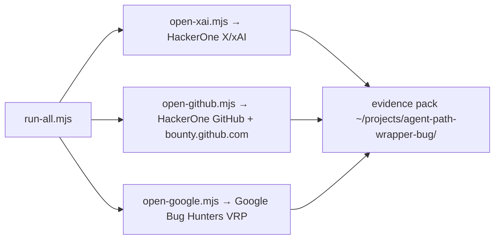

# bugbounty — sovereign bug-bounty openers

<div align="right">

[](https://github.com/toxicwind/sovereign-projects#license)
[](https://github.com/toxicwind/sovereign-projects)

</div>

Headed Playwright helpers that open the **real paid bounty programs** for
the agent PATH-wrapper hang pack. These are live **$$** programs — the
scripts open the portals; **you** map impact to in-scope assets for cash.



## Programs

| Script | Program | $$ surface |
| --- | --- | --- |
| `open-xai.mjs` | [HackerOne X / xAI](https://hackerone.com/x) | X/xAI/Grok security bounties |
| `open-github.mjs` | [HackerOne GitHub](https://hackerone.com/github) + [bounty.github.com](https://bounty.github.com/) | Criticals advertised **$30k+** |
| `open-google.mjs` | [Google Bug Hunters VRP](https://bughunters.google.com/) | Google VRP rewards ($$ tiers) |
| `run-all.mjs` | All three | One headed window, many tabs |

## Quick start

```bash
cd ~/sovereign/tools/bugbounty
export DISPLAY=:0
# optional: attach CDP instead of launching
# export BB_CDP_URL=http://127.0.0.1:9222

node run-all.mjs            # all three programs, one headed window
BB_CLOSE=1 node run-all.mjs  # screenshot-only, then exit
```

Artifacts land in `artifacts/{xai,github,google}/`.

## $$ framing — read program policy before you submit

These are **paid** programs. Your finding must still **match scope**:

| Program | Best $$ angle for this issue |
| --- | --- |
| **X / xAI** | Grok/API/web **security** impact (auth, data leak, prompt injection with impact) — pure local hang may be out-of-scope; frame **remote agent impact** if any |
| **GitHub** | In-scope **github.com** / Copilot cloud security only — local IDE hang usually **no bounty** unless cloud agent boundary |
| **Google** | Antigravity/Gemini **cloud** security if in VRP rules — local desktop hang often **no payout** |

## Architecture

- `lib/helpers.mjs` — Firefox-first launch, CDP attach, screenshots, manifests.
- `open-*.mjs` — per-program portal openers (headed Playwright).
- `run-all.mjs` — orchestrator: one headed window, many tabs.
- `artifacts/` — screenshots and evidence per program.
- Evidence pack to attach: `~/projects/agent-path-wrapper-bug/`.

## Config

| Knob | Purpose |
| --- | --- |
| `DISPLAY=:0` | headed browser target |
| `BB_CDP_URL` | optional: attach to existing CDP instead of launching |
| `BB_CLOSE=1` | screenshot-only, then exit |

## Dev / contributing

`package.json` + `package-lock.json` pin the Playwright stack. Keep launch
helpers in `lib/helpers.mjs` — per-program scripts stay thin openers.

## License & security

MIT — see [LICENSE](https://github.com/toxicwind/sovereign-projects#license).

- These scripts drive a real browser against live bounty portals under
  **your** HackerOne/Google identities — never run them against accounts
  you don't own.
- Submit only findings that are genuinely yours and within program scope;
  mis-framed reports burn researcher reputation, not just time.
