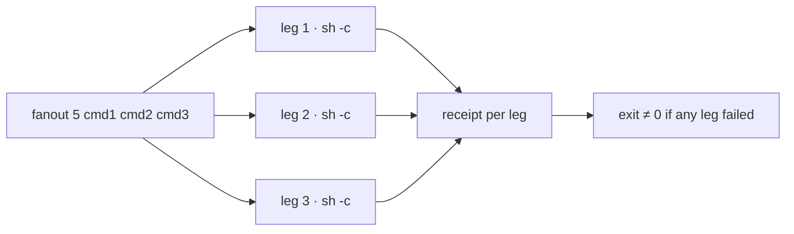

# fanout — parallel command fan-out

<div align="right">

[](https://github.com/toxicwind/sovereign-projects#license)
[](https://github.com/toxicwind/sovereign-projects)

</div>

Runs shell commands **concurrently** and prints a per-leg receipt. Built for
racing independent probes/checks from a single turn instead of running them
serially — measured ~4x speedup on 4 parallel legs.



## Quick start

```bash
fanout <timeout_s> <cmd1> [cmd2 ...]
```

Each command runs via `sh -c`. Stdout streams as each leg finishes, then one
receipt line per leg:

```
leg=N rc=<exit> ms=<wall_ms> cmd=<command>
```

- A leg exceeding `<timeout_s>` is killed and reports `rc=128`.
- Overall exit code is nonzero if any leg failed.

## Measured

- 2026-09-19 (cell): 4x `sleep 1` → 1042ms parallel vs 4159ms serial (~4.0x).
- Earlier run: 1.02s vs 3.50s (~3.4x).

## Architecture

Single script (`fanout`), no dependencies: fork legs with `sh -c`, enforce
per-leg timeout, stream stdout as legs complete, print the receipt table,
exit nonzero on any failure.

### Stagger discipline (2026-09-19, from live fleet incidents)

This tool parallelizes **your shell commands**. **Subagent spawns** are a
different surface — the runtime runs agents concurrently, but the spawn path
contends under bulk dispatch:

- Stagger bulk spawns ~2s apart. Never fire a large identical bulk spawn
  twice — simultaneous spawns hit DB lock timeouts.
- On a DB lock timeout: retry in **smaller batches**, never the identical
  bulk call.
- A spawn error with an infra signature (compaction-model resolution
  timeout before inference, DB lock timeout, daemon-restart handle loss)
  means the work **never ran** — re-dispatch reactively on a fresh agent.
  Never mark the work failed.
- `completed` + canned `final_response` = refused. Check the digest on
  every spawn, not the status badge.

## Placement

- Durable home: `sovereign/tools/fanout/` in `toxicwind/sovereign-projects`
  (this repo is the source of truth).
- Working copy on awrawr-pc: `/home/toxic/bin/fanout`.
- Cell copy: `~/workspace/bin/fanout` (cell storage is disposable).

## Dev / contributing

Keep it dependency-free and receipt-shaped: the per-leg receipt line is the
contract other lanes parse.

## License & security

MIT — see [LICENSE](https://github.com/toxicwind/sovereign-projects#license).

Runs arbitrary shell commands concurrently — the same trust boundary as
your shell. Timeouts cap runaway legs; they do not sandbox them.
