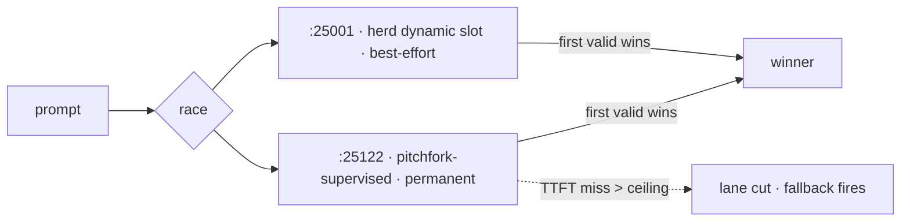

# fast-race — HFT-style inference racing for the `fast` alias

<div align="right">

[](https://github.com/toxicwind/sovereign-projects#license)
[](https://github.com/toxicwind/sovereign-projects)

</div>

`fast_race.py` applies the squawk HFT latency doctrine
(`shingle-workspace/squawk-hft-latency.md`) to local LLM inference on the
exaone-1.2b-iq4xs `fast` endpoint: race redundant lanes, fail fast, measure
every hop — first valid response wins.



## Features

| Doctrine | Implementation |
| --- | --- |
| Hot persistent connections | One keep-alive `HTTPConnection` per lane, dial once; silent re-dial on stale keep-alive |
| Redundant raced lanes | `:25122` (pitchfork-supervised, permanent) vs `:25001` (herd dynamic slot, auto-discovered, best-effort); first valid wins |
| Fail-fast ceilings | Per-lane TTFT deadline (default 2s); a miss cuts the lane, fallback fires |
| Measure every hop | JSONL race log + `--bench` P50/P95/P99 tables, warm-ups, hot-vs-cold |

## Quick start

```bash
fast_race.py "prompt"                    # primary with fail-fast fallback
fast_race.py --race "prompt"            # fire all healthy lanes, first valid wins
fast_race.py --bench [--reps N]         # reps x hot/cold + P50/P95/P99 per lane
fast_race.py --lanes 127.0.0.1:25122    # override lanes
fast_race.py --ceiling 2.0              # TTFT fail-fast ceiling (s)
echo "prompt" | fast_race.py            # stdin mode
```

Race log: `/home/toxic/sovereign/data/fast-race.log` (JSONL, one entry per
race: mode, attempts with ttft_ms/gen_tps per lane, winner).

## Measured (2026-09-20, RTX 3090, beellama v0.4.6)

- TTFT p50: 47.1 ms (:25122) / 50.8 ms (:25001); gen ~380–440 tok/s
- Hot-vs-cold delta: **+9.8 ms saved per request** by persistent connections
- Streaming SSE via `/v1/chat/completions` (`stream_options.include_usage`)

## Architecture

Single stdlib-only script (`fast_race.py`), no dependencies. Lane health is
probed at startup; dead lanes are excluded from the race (herd may evict
`:25001` at any time — that's why the race exists, not a failure to fix).

Complements the `race` skill (`~/workspace/skills/race/`): that races
generic commands; this races inference lanes with TTFT/gen_tps telemetry.

## Config

| Flag | Default | Purpose |
| --- | --- | --- |
| `--ceiling` | `2.0` s | per-lane TTFT fail-fast ceiling |
| `--lanes` | `:25122` + `:25001` | lane override |
| `--bench` / `--reps` | — | benchmark mode |

## Dev / contributing

Keep it stdlib-only. The JSONL race log schema (mode, attempts,
ttft_ms/gen_tps per lane, winner) is the contract — don't reshape it
without a lane announcement.

## License & security

MIT — see [LICENSE](https://github.com/toxicwind/sovereign-projects#license).

Local-only inference racing; sends prompts to localhost lanes only.
The race log may contain prompt text — keep `data/` out of shared repos.
