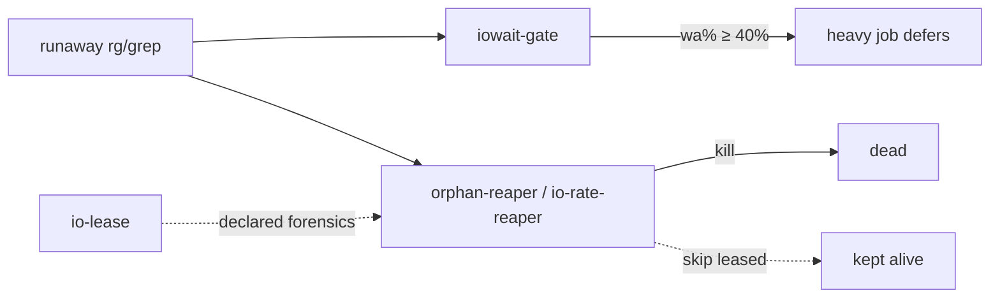

# fleet-ops — hatch cell saturation patches

<div align="right">

[](https://github.com/toxicwind/sovereign-projects#license)
[](https://github.com/toxicwind/sovereign-projects)

</div>

Built 2026-09-19 after the iowait-freeze incident (50–80% iowait, load
10–13 on 2 cores — caused by orphaned recursive greps over `~/workspace`).
A bundle of small, sharp scripts that keep the hatch cell from wedging
itself again.



## Scripts

| script | purpose |
| --- | --- |
| `safe-rg` | wrapper: refuses unscoped `rg` over `~/workspace` (exit 2); scoped searches get timeout + idle ionice; `--yolo` override stays capped |
| `orphan-reaper` | dry-run by default; `--kill` reaps PPID-1 `rg`/`grep`/`find` older than 300s touching `~/workspace` |
| `io-rate-reaper` | kills by measured `/proc/PID/io` read rate (>100MB/s sustained), not just orphan status; honors `io-lease` |
| `iowait-gate` | exit 0 when iowait < 40%, exit 1 when saturated — heavy jobs defer on 1 |
| `io-lease` | `io-lease --ttl 600 --reason TEXT` — declares forensics work so reapers skip it (answers lane-4's con seq 6 point 2) |
| `oracle-judge` | debate-oracle scaffolding: renders judge-brief, checks pro+con+synthesis readiness, prints the judging rubric + resolve invocation |

Also in this directory: `bridge-watchdog`, `cron-honest-status`,
`cron-receipt`, `cron-trust-monitor`, `depend-refire.py`,
`saturation-watchdog`, `sidechat-watch.py`, `zombie-reaper`,
`cron-mirror/` (durable mirrors of live cell cron bodies), and
`fleet-watchdog/` (lane-7 fleet presence + rollover watchdog).

## Quick start

```bash
safe-rg "pattern" ~/workspace/somedir     # the safe way to grep the cell
io-lease --ttl 600 --reason "ledger forensics"   # declare long I/O work
```

Also mirrored to `/home/toxic/.local/bin/` (on PATH). Runtime state
(`safe-rg.log`, `.io-leases/`) is NOT committed.

## Architecture

Each script is standalone and dependency-light. The design contract (debate
2c7ca733 verdict): **measure first, kill only measured I/O abuse, never
kill declared forensics work.** `saturation-guard` (the resident daemon
version of this idea) lives at [`tools/saturation-guard`](../saturation-guard).

## Config

No config files — flags and env only. `io-lease` writes to
`~/workspace/bin/.io-leases/` (shared registry honored by the reapers).

## Dev / contributing

Scripts are executables in this dir, mirrored to `/home/toxic/.local/bin`.
Keep the dry-run-by-default discipline for anything destructive.

## License & security

MIT — see [LICENSE](https://github.com/toxicwind/sovereign-projects#license).

- Reapers kill real processes — `--kill` is explicit, dry-run is default.
- Declared forensics leases are honored; undeclared scans are not protected.

---
*Up: [master README](../../README.md) · [fleet knowledgebase](../../docs/fleet-knowledgebase.md)*
