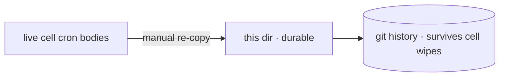

# cron-mirror

Durable mirrors of the LIVE cell cron bodies in `~/workspace/cron.d/minutely/`
on the cell. The cell is the live source the platform scheduler executes;
these mirrors are the durable record (awrawr-pc is the persistent store;
cell storage is disposable).

## Mirrored jobs

- **`lane-redrive__interval@5m.md`** — deterministic lane dirty-state reactor
  (2026-09-19). Reads the lane pollers' run ledger, classifies NEW/CHANGED
  dirty state, watermarks by `lane:debate_id:reason`, pages to
  `~/workspace/state/lane-redrive.pages.jsonl`. The fleet-watchdog driver
  syncs the pages file to awrawr-pc; `sweep.py` relays to the fleet room
  (watermarked, capped at 5/sweep). Never spawns, never kills.
- **`service-restart-watchdog__interval@4m.md`** — daemon self-heal incl. the
  io-governor root restart check (2026-09-19). NOTE: the io-governor self-heal
  step is ALSO patched into the durable
  `shingle-workspace/cron.d/minutely/service-restart-watchdog__interval@1m.md`
  (step 5), which is the canonical durable source for that check.

## Quick start

To update a mirror after editing the live cell body: re-copy the file here
and commit. The mirror is a record, not a deployment — the cell's copy is
what the scheduler executes.

## Architecture

One markdown file per cron body, named `<name>__interval@<cadence>.md`.
No code, no runner — just the durable text.

## Dev / contributing

After editing a live cell cron body, `cp ~/workspace/cron.d/minutely/<name>.md
tools/fleet-ops/cron-mirror/` and commit. A mirror that drifts from the live
body is worse than no mirror.

## License & security

MIT — see [LICENSE](https://github.com/toxicwind/sovereign-projects#license).

Mirrors may contain operational detail about the estate's cron surface —
treat like other internal docs, not public runbooks.
