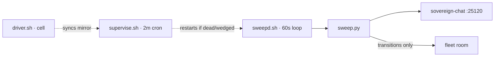

# fleet-watchdog v2

<div align="right">

[](https://github.com/toxicwind/sovereign-projects#license)
[](https://github.com/toxicwind/sovereign-projects)

</div>

Lane-7-owned fleet presence + rollover watchdog. Durable on awrawr-pc; the
cell only runs the driver. One consolidated fleet-room message **only on
transitions** — steady state is silence.



## Features

- **Direct 60s sweep path (v3)** — `sweepd.sh` runs on awrawr-pc executing
  `sweep.py` every 60s, immune to agent-dispatch jitter and bridge 502s.
  sovereign-chat presence TTL is 120s: the 60s cadence keeps the lane-7
  heartbeat alive with 60s of margin.
- **Supervisor/backstop, not the sweeper** — the platform cron
  (`fleet-presence-rollover-watchdog`, every 2m) runs `driver.sh`, which
  syncs the rollover mirror cell→awrawr-pc and runs `supervise.sh`.
  Healthy steady state = supervisor no-op, sweepd owns the sweeps.
- **Self-resurrecting** — `sweepd.sh` also runs as the systemd user unit
  `fleet-watchdog-sweepd.service` (Restart=always, RestartSec=10s; user
  lingering makes it reboot-resilient). A dead sweeper comes back in ~10s.
- **Rollover-safe** — the mirror is checked against `lane_manifest.json`;
  a lane whose whole block disappears is **reported, never silently dropped**.

### Paging rules (change-only)

- live→stale: `lane-N STALE (last heartbeat Xh Ym ago)`
- stale→live: `lane-N LIVE again after X dark`
- rollover block lost / restored (header + chat_id prefix both required)
- watchdog gap: no sweep for > 2× interval → page on resume
- watchdog blind: manifest + mirror both unreadable → at most hourly, no fabricated transitions

## Quick start

```bash
# manual sweep (on awrawr-pc)
bash /home/toxic/sovereign/tools/fleet-ops/fleet-watchdog/supervise.sh

# sweeper status
pgrep -af '[s]weepd.sh'; tail /home/toxic/var/fleet-watchdog/sweepd.log

# brain tests
python3 test_decide.py   # exit 0
```

## Architecture (awrawr-pc: `/home/toxic/sovereign/tools/fleet-ops/fleet-watchdog/`)

| file | role |
| --- | --- |
| `sweep.py` | the watchdog — heartbeats lane-7, reads `/v1/presence`, checks rollover blocks against the manifest, diffs `state.json`, posts one consolidated message on transitions |
| `lane_manifest.json` | canonical lane identity: chat_id prefix → lane (+ full chat_id); regenerate with `sweep.py --gen-manifest` after a verified rollover update, then commit |
| `driver.sh` | cell-side driver for the platform scheduler: syncs the rollover mirror, runs `supervise.sh` on awrawr-pc |
| `sweepd.sh` | the direct 60s sweeper daemon (flock single-instance, `isleep` pacing, no `sleep` binary) |
| `supervise.sh` | the 2m supervisor: restarts dead/wedged sweepd (systemd unit preferred, pgrep/setsid fallback), one backstop sweep when stale (>100s); prints one JSON line |
| `systemd/fleet-watchdog-sweepd.service` | systemd user unit for `sweepd.sh` (repo copy is the source of truth) |
| `state.json` | schema v2: per-lane `{block, live, last_seen_ts, last_transition, last_transition_ts}`, `last_sweep_ts`, capped `transitions` log (50); v1 migrates automatically |
| `fleet-rollover.md` | durable mirror of the lane-adoption doc |
| `test_decide.py` | synthetic transition scenarios against the pure `decide()` brain plus blind-spot checks |

## Known limitations

- Last-seen for stale lanes comes from this watchdog's own observation
  history (the server exposes `stale_count` but no per-stale-agent
  timestamps). A lane never seen live by v2 reports "first sighting" on
  recovery instead of a downtime duration.
- Dead-man's switch: if both sweeper and supervisor die, nobody pages until
  one resumes (then the gap page fires). A second independent monitor is
  the cross-check — not built here.
- The rollover mirror is synced cell→awrawr-pc by the driver each run; lanes
  still append to the cell original.

## Dev / contributing

Keep the change-only paging contract. Regenerate the manifest with
`sweep.py --gen-manifest` after verified rollover updates and commit it —
the mirror diff is only as good as the manifest.

## License & security

MIT — see [LICENSE](https://github.com/toxicwind/sovereign-projects#license).

Read-only observer: it pages, it never restarts lanes or mutates chat
state. No credentials in this tree.
