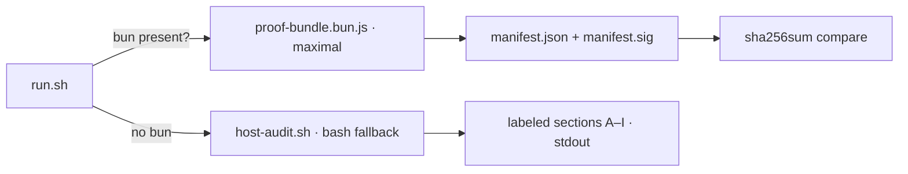

# host-proof

<div align="right">

[](https://github.com/toxicwind/sovereign-projects#license)
[](https://github.com/toxicwind/sovereign-projects)

</div>

A universal **read-only** host proof bundle. Point it at any box and it
identifies the machine — no hardcoded hostnames — producing a hashed,
verifiable artifact of what that box *is*. Used for estate audits and
machine-identity checks.



## Features

- **Two implementations, one contract** —
  `proof-bundle.bun.js`: maximal proof artifact (preferred when `bun`
  exists). Every command's stdout is hashed (sha256 + bun hash) and recorded
  as JSON. Records append to `manifest.jsonl` incrementally
  (crash-resilient). The final `manifest.json` is checksummed into
  `manifest.sig` for post-run integrity verification. Includes assertions
  (M) and a signed manifest (N).
  `host-audit.sh`: zero-dependency bash fallback. Labeled sections A–I with
  `CHECK-UNAVAILABLE` branches instead of assumptions. Stdout only.
- **Secret hygiene** — environment values are never printed; only presence,
  sha256, and length. Config files (e.g. MCP configs) are hashed, never
  dumped.
- **`run.sh`** picks bun when present, else bash, and sets a unique `OUT` dir.

## Quick start

```bash
./run.sh
# explicit output dir for the bun bundle:
OUT=~/host-proof-runs/mychat bun proof-bundle.bun.js
# bash fallback takes an optional entity-hunt target (defaults to hostname):
TARGET=mybox ./host-audit.sh
```

Verify a bun bundle:

```bash
sha256sum <OUT>/manifest.json
cat <OUT>/manifest.sig
```

The two hashes must match — if they don't, the manifest was modified after
the run completed.

## Architecture

Schema: `host-proof-bundle/v1`. Supersedes the `awrawr-proof` v3-bun draft
(fixed a parse-time SyntaxError in that draft — a `${n##*/}` inside a JS
template literal, i.e. JS interpolation, not shell).

## Dev / contributing

Keep both implementations in contract lockstep: any section added to the
bun bundle gets a `CHECK-UNAVAILABLE`-capable equivalent in the bash
fallback.

## License & security

MIT — see [LICENSE](https://github.com/toxicwind/sovereign-projects#license).

- Read-only by design: it observes, hashes, and reports. It installs
  nothing and changes nothing on the target box.
- The bundle proves *what the box is*, not who owns it — pair with an
  out-of-band identity check before trusting a new machine.
