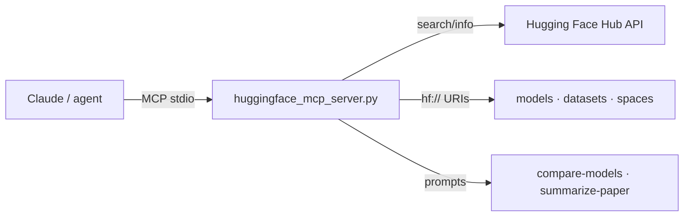

# 🤗 Hugging Face MCP Server

<div align="right">

[](./LICENSE)
[](https://smithery.ai/server/@shreyaskarnik/huggingface-mcp-server)
[](https://github.com/toxicwind/sovereign-projects)

</div>

> Vendored from
> [`shreyaskarnik/huggingface-mcp-server`](https://github.com/shreyaskarnik/huggingface-mcp-server)
> (MIT © 2025 Shreyas Karnik) — also installable via
> [Smithery](https://smithery.ai/server/@shreyaskarnik/huggingface-mcp-server).

A Model Context Protocol (MCP) server that gives LLMs read-only access to
the Hugging Face Hub: models, datasets, spaces, papers, and collections —
search, inspect, compare, and summarize, all through MCP tools.



## Features

- **Resources** — custom `hf://` URI scheme: `hf://model/{id}`,
  `hf://dataset/{id}`, `hf://space/{id}`, with descriptive names and JSON
  content type.
- **Prompts** — `compare-models` (model_ids, comma-separated) and
  `summarize-paper` (arxiv_id + optional brief/detailed level, with
  implementation details).
- **Tools** — model tools (`search-models`, `get-model-info`), dataset
  tools, space tools (incl. SDK filter), paper tools (`get-paper-info`,
  `get-daily-papers`), collection tools.

## Quick start

### Via Smithery (Claude Desktop)

```bash
npx -y @smithery/cli install @shreyaskarnik/huggingface-mcp-server --client claude
```

### Claude Desktop (manual)

On macOS: `~/Library/Application Support/Claude/claude_desktop_config.json`
— on Windows: `%APPDATA%/Claude/claude_desktop_config.json`:

```json
"mcpServers": {
  "huggingface": {
    "command": "uv",
    "args": ["--directory", "/absolute/path/to/huggingface-mcp-server",
             "run", "huggingface_mcp_server.py"],
    "env": { "HF_TOKEN": "your_token_here" }
  }
}
```

### Optional auth

Set `HF_TOKEN` (a Hugging Face API token) for higher rate limits, access
to private repos (if authorized), and better high-volume reliability.
The server works without it.

## Architecture

Python MCP server over stdio (`uv`-managed), thin over the public HF Hub
APIs. Read-only by design — it queries Hub data, it never mutates repos.

## Config

| Env | Required | Purpose |
| --- | --- | --- |
| `HF_TOKEN` | no | HF API token: rate limits + private repos |

## Example prompts for Claude

- "Search for BERT models on Hugging Face with less than 100 million parameters"
- "Find the most popular datasets for text classification on Hugging Face"
- "What are today's featured AI research papers on Hugging Face?"
- "Summarize the paper with arXiv ID 2307.09288 using the Hugging Face MCP server"
- "Compare the Llama-3-8B and Mistral-7B models from Hugging Face"
- "Show me the most popular Gradio spaces for image generation"
- "Find collections created by TheBloke that include Mixtral models"

## Dev / contributing

```bash
uv sync        # deps + lockfile
uv build       # dist/ artifacts
uv publish     # PyPI (needs UV_PUBLISH_TOKEN or username/password flags)
```

Debugging: MCP servers run over stdio — use the
[MCP Inspector](https://github.com/modelcontextprotocol/inspector):

```bash
npx @modelcontextprotocol/inspector uv --directory /path/to/huggingface-mcp-server run huggingface_mcp_server.py
```

### Troubleshooting

1. Check server logs in Claude Desktop — macOS:
   `~/Library/Logs/Claude/mcp-server-huggingface.log`; Windows:
   `%APPDATA%\Claude\logs\mcp-server-huggingface.log`.
2. Rate limiting? Add an `HF_TOKEN`.
3. Verify the machine reaches the Hugging Face API.
4. If one tool fails, check the same data on huggingface.co first.

## License & security

MIT © 2025 Shreyas Karnik — see [LICENSE](./LICENSE).

- Read-only over the Hub; your `HF_TOKEN` (if set) is used for API calls
  only and never logged.
- Keep `HF_TOKEN` in env or the MCP config — never in chat or repos.
