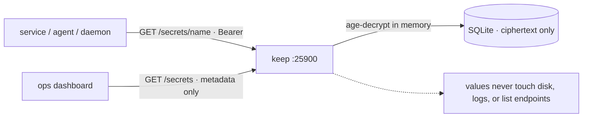

# keep — the single home for secrets

<div align="right">

[](https://github.com/toxicwind/sovereign-projects#license)
[](https://github.com/toxicwind/sovereign-projects)

</div>

**keep is the single home for secrets.** Nothing secret ever lives in chat,
env files, or repo history again — every service, agent, and daemon
references secrets *by name* through keep's API, and keep holds the only
encrypted copy. (Built after the 2026-09-17 credential incidents, where
tokens kept leaking into GitHub repos and chat logs. The fix is structural,
not procedural.)



## Features

- **Encrypted at rest** — values are age-encrypted (X25519) before touching
  SQLite; only ciphertext is persisted.
- **Zeroized in memory** — plaintext lives only inside
  `zeroize::Zeroizing` wrappers.
- **Values never leak through the API** — log lines carry the secret *name*
  only; `GET /secrets` returns metadata (name, purpose, rotation dates),
  never values.
- **Rotation is first-class** — `POST /secrets/:name/rotate` bumps the
  version.

## Quick start

```bash
cd tools/keep
cargo build --release   # Rust 1.70+ (2021 edition)

# one-time: generate an age identity
cargo run --bin genkey   # prints KEEP_AGE_IDENTITY=... — store it in your vault
# (or use age-keygen from the rage package)

export KEEP_API_TOKEN="$(head -c 48 /dev/urandom | base64)"  # >= 32 chars
export KEEP_AGE_KEY_FILE=/secure/path/keep-age.key
export KEEP_DB_PATH=/var/lib/keep/keep.db
# optional: bind + TLS
export KEEP_BIND=127.0.0.1:25900
export KEEP_TLS_CERT=/path/to/cert.pem
export KEEP_TLS_KEY=/path/to/key.pem

./target/release/keep
```

Without `KEEP_TLS_CERT`/`KEEP_TLS_KEY` it serves plaintext HTTP on localhost
with a loud warning — fine for local dev, not for production.

### API

All routes except `/health` require `Authorization: Bearer $KEEP_API_TOKEN`.

| Method | Path | Body | Returns |
| --- | --- | --- | --- |
| GET | `/health` | — | `ok` |
| PUT | `/secrets/:name` | `{value, purpose?}` | secret metadata |
| GET | `/secrets/:name` | — | `{value}` (authenticated only) |
| GET | `/secrets` | — | metadata list — **never values** |
| POST | `/secrets/:name/rotate` | `{value}` | secret metadata (version bumped) |

```bash
curl -H "Authorization: Bearer $KEEP_API_TOKEN" -X PUT \
  -d '{"value":"gsk_live_...","purpose":"groq key for herd lane"}' \
  http://127.0.0.1:25900/secrets/groq-main

curl -H "Authorization: Bearer $KEEP_API_TOKEN" \
  http://127.0.0.1:25900/secrets   # metadata only
```

## Architecture

```
tools/keep/
  Cargo.toml
  src/
    main.rs    — startup, env config, axum + rustls serve
    api.rs     — HTTP routes + bearer auth middleware
    crypto.rs  — age encrypt/decrypt, identity loading
    store.rs   — SQLite persistence (ciphertext only)
```

## Config

| Env | Purpose |
| --- | --- |
| `KEEP_API_TOKEN` | bearer token (≥32 chars) |
| `KEEP_AGE_KEY_FILE` | age identity for decrypt |
| `KEEP_DB_PATH` | SQLite path |
| `KEEP_BIND` | bind addr (default `127.0.0.1:25900`) |
| `KEEP_TLS_CERT` / `KEEP_TLS_KEY` | TLS (else plaintext localhost + loud warning) |

## Roadmap (not this scaffold)

- mTLS / SPIFFE for service-to-service auth instead of a shared bearer token
- Audit log of every read (who, when, which name — never values)
- Rotation webhooks and TTL/expiry enforcement
- Backup/restore of the encrypted DB + identity escrow

## Dev / contributing

Rust, axum, rustls. The security invariants (ciphertext-only storage,
metadata-only list/log, zeroized memory) are the contract — any change that
weakens them is a revert-on-sight bug.

## License & security

MIT — see [LICENSE](https://github.com/toxicwind/sovereign-projects#license).

- This service IS the secret boundary: the bearer token and the age
  identity are the crown jewels. They live in your vault, never in this
  repo, never in chat.
- Without TLS it binds localhost only — the "loud warning" is there
  because someone will eventually try to expose it; don't.
