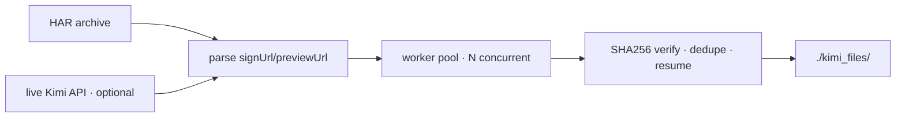

# Kimi File Downloader

<div align="right">

[](https://github.com/toxicwind/sovereign-projects#license)
[](https://github.com/toxicwind/sovereign-projects)

</div>

Fast concurrent file downloader for Kimi API/HAR archives. Point it at a
browser HAR export (or the live Kimi API) and it pulls every file out —
checksummed, deduplicated, resumable — with zero dependencies beyond the
Python standard library.



## Features

- **Concurrent downloads** with configurable worker count
- **Checksum verification** (SHA256) — skips already-downloaded files
- **Resume support** — continues partial downloads
- **HAR parsing** — extracts `signUrl`/`previewUrl` from browser archives
- **API pagination** — fetches all feed pages automatically
- **Filename extraction** — parses clean names from URL query params
- **Duplicate handling** — appends checksum prefix for collisions

## Quick start

```bash
# 1. list-only: see what would be downloaded
python3 kimi-file-downloader.py \
  --har "www.kimi.com_Archive [26-08-12 18-48-34].har.txt" \
  --list-only

# 2. download everything from the HAR
python3 kimi-file-downloader.py \
  --har "www.kimi.com_Archive [26-08-12 18-48-34].har.txt" \
  --output ./kimi_files \
  --workers 8

# 3. HAR + live API (discover files not captured in the HAR)
python3 kimi-file-downloader.py \
  --har "www.kimi.com_Archive [26-08-12 18-48-34].har.txt" \
  --api --jwt "eyJhbGciOiJIUzUxMi..." \
  --output ./kimi_files \
  --workers 8
```

## Architecture

Single stdlib-only script (`tools/kimi-file-downloader.py`, this README
is its doc file `tools/kimi-file-downloader.README.md`). HAR → URL
extraction → thread-pool download → SHA256 verify → sanitized filenames
(special chars replaced).

## Config

| Option | Description |
| --- | --- |
| `--har` | Path to HAR archive file |
| `--jwt` | JWT token (defaults to built-in; may expire — pass a fresh one) |
| `--output` | Output directory (default: `./kimi_downloads`) |
| `--api` | Also fetch from live API feeds |
| `--workers` | Concurrent downloads (default: 8) |
| `--list-only` | Only list URLs, don't download |

HAR files exported from browser dev tools work best.

## Dev / contributing

Python 3.8+, stdlib only — keep it that way. The download pipeline is
list → verify → write; new sources (feeds, endpoints) slot in before the
pool.

## License & security

MIT — see [LICENSE](https://github.com/toxicwind/sovereign-projects#license).

- The built-in JWT is a convenience, not a secret to share — pass your own
  `--jwt` and keep tokens out of chat/repos.
- Downloaded files are written under `--output` with sanitized names;
  review them before executing anything from an archive you didn't create.
