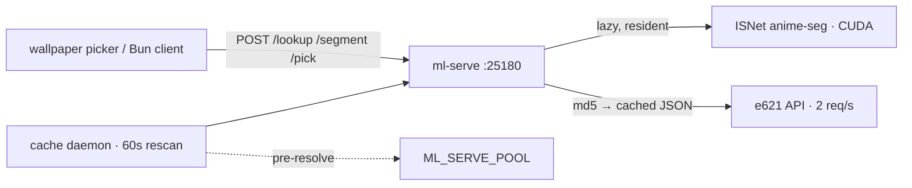

# ml-serve — resident ML inference daemon

<div align="right">

[](https://github.com/toxicwind/sovereign-projects#license)
[](https://github.com/toxicwind/sovereign-projects)

</div>

Hot-loaded ONNX segmentation + e621 native tag resolution over HTTP for the
desktop. No cold-start per call: the model loads lazily on first use and
stays resident; tag lookups are md5-cached. Built for the wallpaper pipeline
— pick the best image in a pool without waiting on inference spin-up.

There is deliberately **no local image tagger** — e621 already has maximal
tags, so redundant local compute is out. Tag resolution is
`md5(file) → e621 API → cached sidecar JSON`.



## Features

- **Resident ONNX segmentation** — SkyTNT `anime-seg` ISNet (anime subject
  seg), CUDA first (RTX 3090), CPU fallback. Load time and rolling inference
  ms exposed on `GET /health`.
- **e621 native tags, md5-cached** — no local tagger; resolution is
  `md5(file) → e621 → cached sidecar JSON`.
- **Smart `/pick`** — ranks a directory by
  `aspect_term + upscale − boost·furry·male − penalty·watermark`, where
  furry/male/watermark are binary hits on native e621 tags. Files missing
  from e621 score on geometry alone.
- **Cache daemon** — background thread re-scans `ML_SERVE_POOL` (default
  `~/Pictures/Wallpapers`) every `CACHE_INTERVAL_S` (default 60) and
  pre-resolves new/changed files, so `/pick` is cache-hot.

## Quick start

```sh
python3 tools/ml-serve/server.py            # foreground, :25180
systemctl --user enable --now ml-serve     # durable (unit in systemd/)
```

Or via pitchfork: `[daemons.ml-serve]` stanza in `pitchfork.toml`
(`auto = ["start"]`).

### Endpoints

| endpoint | model / artifact |
| --- | --- |
| `POST /segment` | SkyTNT `anime-seg` ISNet (anime subject seg) → `isnetis.onnx` |

- `GET /health` → providers, models, e621 cache stats, timings
- `POST /lookup` `{"path": "/abs/img.png"}` → md5 + native e621
  `tag_string` (`null` + `"source": "miss"` when the file isn't on e621)
- `POST /segment` `{"path": "/abs/img.png"}` → subject bbox/centroid/coverage
  in original pixel coords (`bbox: null` when no subject)
- `POST /pick` `{"dir": "/abs/dir", "furry_boost": 3.0, "wm_penalty": 1.5,
  "target_aspect": 1.78}` → best pick by the scoring formula above
  (defaults: furry=`anthro kemono`, male=`male`, watermark=`watermark text`;
  override via `E621_TAGS_FURRY` / `E621_TAGS_MALE` / `E621_TAGS_WM`).
  Files missing from e621 score on geometry alone.

## Architecture

Models live in a shared cache (`~/.cache/quickshell/wallpaper-ml/`, never
in git). The cache daemon writes `.wallpaper-ml-cache.json` inside the pool
dir — entry schema
`{"mtime","size","w","h","md5","tag_string":[…]|null,"source","ms"}`.
e621 lookups respect the 2 req/s limit (0.6s spacing), require no API key,
and send a descriptive `User-Agent` (`E621_USER_AGENT`).

## Config

| Env | Default | Purpose |
| --- | --- | --- |
| `ML_SERVE_POOL` | `~/Pictures/Wallpapers` | pool dir the cache daemon scans |
| `CACHE_INTERVAL_S` | `60` | rescan interval |
| `E621_USER_AGENT` | — | descriptive UA for e621 |
| `E621_TAGS_FURRY` / `E621_TAGS_MALE` / `E621_TAGS_WM` | see above | tag-list overrides for `/pick` |

## Bun client

[`client/ml-serve-client.ts`](client/ml-serve-client.ts) — dependency-free
(plain `fetch`), drop it into any Bun tree. See
[`client/README.md`](client/README.md).

## Dev / contributing

`server.py` is the daemon; the systemd unit in `systemd/` is the durable
install. Keep model artifacts out of git — the shared cache path is the
contract.

## License & security

MIT — see [LICENSE](https://github.com/toxicwind/sovereign-projects#license).

- e621 lookups are rate-limited and keyless; keep the descriptive
  User-Agent so the pool doesn't get throttled.
- `/pick` reads arbitrary dirs you point it at — bind the daemon to
  localhost and don't expose `:25180` beyond the box.
