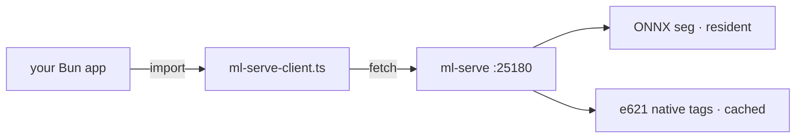

# ml-serve client (Bun/TypeScript)

<div align="right">

[](https://github.com/toxicwind/sovereign-projects#license)
[](https://github.com/toxicwind/sovereign-projects)

</div>

Dependency-free client for the [ml-serve](../README.md) resident inference
daemon. Plain `fetch` only — no npm packages, no build step. Drop
`ml-serve-client.ts` into any Bun tree and start ranking wallpapers.

Tags are e621 native (md5 lookup, daemon-side cached). There is no local
tagger and no `tag()` call — use `lookup()` for a file's native tags.



## Quick start

```ts
import { mlServe } from "<path-to>/ml-serve-client";

// Rank the pool on cached e621 native tags; furry-male-tagged art
// floats to the top.
const { best } = await mlServe.pick("/home/toxic/Pictures/Wallpapers", {
  furry_boost: 3.0,
  target_aspect: 16 / 9,
});
if (best) applyWallpaper(best.path);

// Native e621 tags for one file (null when not on e621).
const l = await mlServe.lookup("/path/to/img.png");
console.log(l.tag_string?.slice(0, 10), l.source);

// Subject bbox for crop placement (null when no subject found).
const s = await mlServe.segment("/path/to/img.png");
if (s.bbox) placeCropWindow(s.bbox, s.centroid);
```

## API

| method | daemon route | returns |
| --- | --- | --- |
| `health()` | `GET /health` | providers, models, e621 cache stats, timings |
| `waitReady(timeoutMs?)` | polls `/health` | resolves when the daemon is up |
| `lookup(path)` | `POST /lookup` | md5 + native e621 `tag_string` (cached) |
| `segment(path)` | `POST /segment` | bbox/centroid/coverage in original px |
| `pick(dir, opts?)` | `POST /pick` | best pick (lowest score wins) |

`new MlServeClient("http://127.0.0.1:25180")` for a custom address; the
default export `mlServe` points at the standard daemon port.

## Architecture

One file, zero deps. The client is a typed `fetch` wrapper — all inference,
caching, and scoring live daemon-side. Use `waitReady()` before first use
in long-lived apps; the daemon loads the model lazily.

## Dev / contributing

Keep it dependency-free. Method signatures mirror the daemon routes
one-to-one; if the daemon gains an endpoint, add the method here.

## License & security

MIT — see [LICENSE](https://github.com/toxicwind/sovereign-projects#license).

Client-side only: no credentials, no secrets. Point it at a daemon you
trust — it sends absolute file paths.
