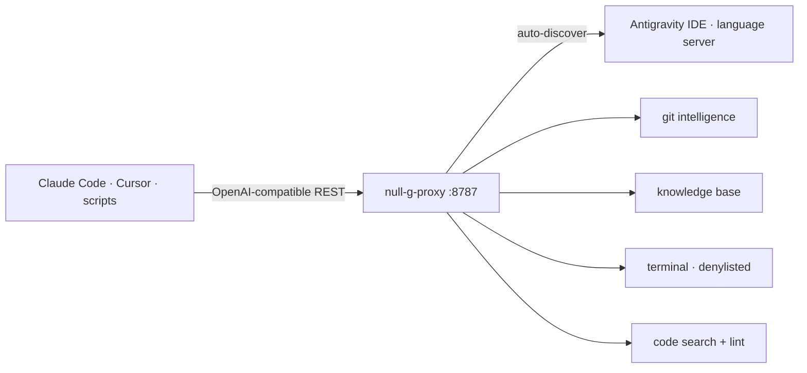

# null-g-proxy — OpenAI-Compatible AI Proxy for Antigravity IDE

<div align="right">

[](https://github.com/toxicwind/sovereign-projects#license)
[](https://github.com/toxicwind/sovereign-projects)
[](https://www.typescriptlang.org/)
[](https://bun.sh/)
[](https://hono.dev/)
[](http://127.0.0.1:25107/openapi.yaml)

</div>

> Vendored from [`cristianoaredes/null-g-proxy`](https://github.com/cristianoaredes/null-g-proxy)
> (MIT, by Cristiano Aredes) — pinned here as the estate's Antigravity bridge.

**Self-hosted OpenAI-compatible proxy that exposes every AI capability of the [Antigravity IDE](https://antigravity.dev) — chat completions, Git intelligence, knowledge base, terminal execution, and code intelligence — as a single REST API.**

Any OpenAI-compatible client (Claude Code, Cursor, Continue, custom
scripts) talks to Antigravity's Gemini/Claude/GPT engine over plain HTTP.
The proxy auto-discovers the running IDE — zero manual port configuration.



## Features

| Capability | Description |
| --- | --- |
| **Chat Completions** | OpenAI-compatible `POST /v1/chat/completions` with streaming and multi-turn support |
| **Multi-model** | Switch between Gemini, Claude, and GPT models per request |
| **Streaming** | Server-Sent Events (SSE) for real-time response streaming |
| **Multi-turn sessions** | Persistent cascade sessions for stateful conversations |
| **Agentic mode** | Antigravity autonomously plans and executes complex multi-step tasks |
| **Git intelligence** | AI-generated commit messages, repo listing, worktree management |
| **Knowledge base** | CRUD and full-text search over a personal Markdown knowledge base |
| **Terminal execution** | Sandboxed shell execution with a security denylist (HTTP 403 on blocked commands) |
| **Code search** | ripgrep-powered codebase search with file glob and result limit filters |
| **Code lint** | ESLint / TypeScript compiler lint via HTTP |
| **Swagger UI** | Interactive API docs at `GET /docs` |
| **Zero-config** | Auto-discovers the running Antigravity IDE — no manual port configuration needed |

## Quick start

```bash
git clone https://github.com/cristianoaredes/null-g-proxy.git
cd null-g-proxy
npm install
npm run dev        # hot-reload
```

The server starts on **port 8787**:

```
[proxy] Connected: port=61971 workspace="my-workspace"
[proxy]   GET    http://localhost:8787/health
[proxy]   GET    http://localhost:8787/v1/models
[proxy]   POST   http://localhost:8787/v1/chat/completions
```

> **Note:** the proxy uses lazy discovery — it connects to the Antigravity
> IDE only on the first real API request, not on `/health`. Make sure the
> IDE is running before sending requests.

```bash
# chat
curl -X POST http://localhost:8787/v1/chat/completions -H "Content-Type: application/json" \
  -d '{"model":"antigravity/gemini-3-flash","messages":[{"role":"user","content":"Explain dependency injection in one paragraph."}]}'

# AI commit message from a staged diff
curl -X POST http://localhost:8787/v1/git/commit-message \
  -H "Content-Type: application/json" \
  -d '{"workingDir": "/path/to/your/repo", "style": "conventional"}'

# knowledge search
curl "http://localhost:8787/v1/knowledge/search?q=authentication"
```

## Architecture

Hono on `Bun.serve`. Lazy IDE discovery on first real request (port +
CSRF token auto-detected, or pinned via env). Route families: `/v1/chat`,
`/v1/git`, `/v1/knowledge`, `/v1/terminal`, `/v1/code`, plus `/health`,
`/v1/models`, `/docs` (Swagger UI), `/openapi.yaml`.

### Available models

| Model ID | Provider | Best for | Timeout |
| --- | --- | --- | --- |
| `antigravity/gemini-3.1-pro-high` | Google | Complex reasoning, best quality | 120 s |
| `antigravity/gemini-3.1-pro-low` | Google | Balanced quality/speed | 90 s |
| `antigravity/gemini-3-flash` | Google | Fast, simple tasks | 60 s |
| `antigravity/claude-sonnet-4.6-thinking` | Anthropic | Extended thinking, analysis | 180 s |
| `antigravity/claude-opus-4.6-thinking` | Anthropic | Highest reasoning quality | 300 s |
| `antigravity/gpt-oss-120b` | OpenAI | Large capacity, versatile | 120 s |

Default: `antigravity/gemini-3.1-pro-high`.

Multi-turn: reuse a session via `cascade_id` (from `system_fingerprint`);
end with `DELETE /v1/chat/sessions/$SESSION`.

## Config

| Environment Variable | Default | Description |
| --- | --- | --- |
| `PORT` | `8787` | HTTP port to listen on |
| `ANTIGRAVITY_PORT` | _(auto)_ | Override language server port (disables auto-discovery) |
| `ANTIGRAVITY_CSRF_TOKEN` | _(auto)_ | Override CSRF token (required when `ANTIGRAVITY_PORT` is set) |
| `ANTIGRAVITY_WORKSPACE` | _(auto)_ | Filter discovery by workspace name (for multi-project setups) |

Requirements: Antigravity IDE running locally; Node.js ≥ 18; npm ≥ 9;
ripgrep optional (code search falls back to `grep`); pm2 ≥ 5 optional.

## Troubleshooting

**`"status": "error"` on `/health` after startup** — normal (lazy
discovery). Call any real endpoint (e.g. `GET /v1/models`); if it still
fails, confirm the IDE is running and check `ps aux | grep language_server`
for the port and CSRF token.

**Commit message takes 30–90 seconds** — expected; the AI processes the diff
asynchronously and the proxy polls up to 180s.

**Port 8787 in use** — `lsof -i :8787`, or `PORT=9090 npm start`.

## Dev / contributing

Production: `npm run build && npm start`. Persistent: `pm2 start
dist/index.js --name null-g-proxy && pm2 save`.

## License & security

MIT — by [Cristiano Aredes](https://github.com/cristianoaredes).

The proxy is designed for **local use only** — it inherits the filesystem
permissions of the user running it:

- The terminal endpoint runs commands via `/bin/sh`. A regex denylist
  blocks the most dangerous patterns (recursive deletion, privilege
  escalation, shell injection, fork bombs, network attacks → HTTP 403),
  but it is **not** a hardened sandbox.
- Do not expose port 8787 to the internet without a reverse proxy with IP
  whitelisting, rate limiting, and authentication.

<!-- SEO: OpenAI compatible proxy, Antigravity IDE, chat completions, AI proxy, code intelligence, self-hosted AI, OpenAI API alternative, local AI proxy, Git AI assistant, ripgrep code search -->
