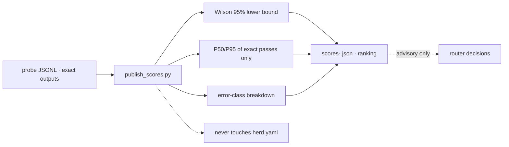

# routing-score — read-only calibrated routing scores

<div align="right">

[](https://github.com/toxicwind/sovereign-projects#license)
[](https://github.com/toxicwind/sovereign-projects)

</div>

Repo: [toxicwind/sovereign-projects](https://github.com/toxicwind/sovereign-projects)
(`tools/routing-score/`); index in the [master README](../../README.md#docs).

An advisory signal for routing decisions, computed from exact-output probe
results. **Read-only by construction**: this tool reads one probe JSONL
file and writes one score artifact. It never reads or writes `herd.yaml`,
never parks peers, never hardcodes model choices into router config, and
never alters selection logic. Router-adjacent only.



## Method

September-2026 calibration grade, empirical throughout:

- **Reliability is observed**, never model self-reported confidence
  (Claim-Level Confidence Calibration, arXiv 2608.22483; SCOPE, arXiv
  2602.13110).
- **Uncertainty is the Wilson 95% interval**; the published reliability is
  the interval *lower bound*, so small samples are automatically penalized
  (conformal spirit, cf. A-CRC-QA arXiv 2608.12008).
- **Latency is P50/P95 of exact passes only** — a fast wrong answer earns
  no speed credit.
- **Error classes counted separately** (`http_402`, `http_429`,
  `empty_200`, `wrong_200`, `transport`, …) so correlated failure modes stay
  visible (CAGE-CAL warning, arXiv 2605.30653: agreement can mask correlated
  failures).

Composite (transparent — every component is published alongside):

```
score = wilson95_lower_bound * 1000 / (1000 + p50_ms_of_exact_passes)
```

## Quick start

```bash
# probe JSONL lines: {"model", "http", "lat_ms", "content"} (+ optional "expect")
publish_scores.py --input reverify-20260920.jsonl --expect ABSTRACT-7X3Q \
    --min-samples 3 --out scores-20260920.json
```

Per-line `"expect"` fields override `--expect` when present. Models with
fewer than `--min-samples` attempts are flagged `"low_sample": true`.

### Artifact

`scores-<ts>.json`: `{generated_ts, input, records, expect, min_samples,
method, read_only: true, scope_warning, models: {…}, ranking: […]}`.
Per model: samples, exact count, reliability, Wilson interval, latency
P50/P95, error-class breakdown, low-sample flag, composite score.

## Scope warning

These scores cover **one exact-output probe task**. They are not a general
quality ranking — the same caveat as
[`projects/openrouter-probe/RANKING.md`](../../projects/openrouter-probe/RANKING.md).
Treat them as routing signal, not truth.

## Architecture / lineage

- Probe format + exact-output scoring:
  [`projects/openrouter-probe/probe_reliability.py`](../../projects/openrouter-probe/probe_reliability.py)
- Live probing (separate concern): [`tools/herd-ranker.py`](../herd-ranker.py)
- Keypool racing telemetry: [`bin/herd-keypool.py`](../../bin/herd-keypool.py)
  (`/status` → `race`)

## Dev / contributing

Keep the read-only contract: new scoring methods may add components to the
composite, but the tool must never gain write access to router config.

## License & security

MIT — see [LICENSE](https://github.com/toxicwind/sovereign-projects#license).

Pure computation over probe JSONL — no network, no credentials, no side
effects beyond the output artifact.
