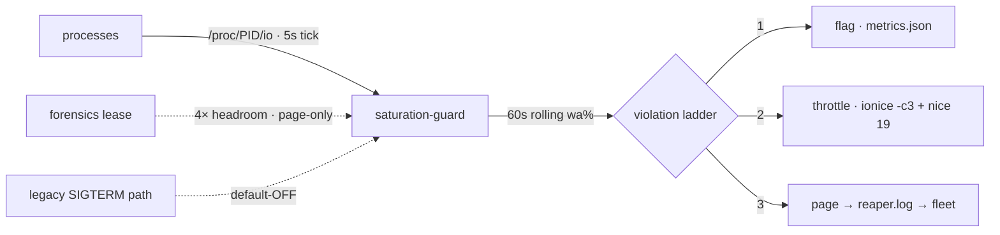

# saturation-guard — cell-side I/O supervisor/reaper daemon

<div align="right">

[](https://github.com/toxicwind/sovereign-projects#license)
[](https://github.com/toxicwind/sovereign-projects)

</div>

First-class patch for debate **2c7ca733** (hatch cell saturation,
2026-09-19). The crash was **50–80% iowait from runaway recursive greps, not
compute** — so this daemon gates every action on measured system iowait,
not CPU load. It throttles and pages; it **never kills** in the committed
default config.



## Features

- **Measured, not named** — tracks per-process disk I/O via `/proc/PID/io`
  and D-state time every 5s, plus a 60s rolling average of system iowait
  (`wa%` from `/proc/stat`). Orphaned processes (PPID 1) are the prime
  suspect class — the killer grep was orphaned — but actions fire on
  **measured I/O**, never on names alone.
- **Verdict-conformant ladder** (debate 2c7ca733, oracle winner seq 7):
  **flag** (attribution: pid/comm/ppid/rates in `metrics.json`) →
  **throttle** (`ionice -c3` idle class + `nice 19`, unleased violators
  only) → **page** (structured `page` event in `logs/reaper.log`, consumed
  by the 2m `saturation-watchdog` cron / fleet channel). **Never kills.**
  The pre-verdict SIGTERM/SIGKILL code path exists but is default-OFF
  (`kill_enabled = false`); enabling it contradicts the standing verdict
  and must never be the committed default.
- **Forensics leases** — a declared forensics job registers a lease
  (guard-local `leases/<pid>.json` via `daemon.py lease --pid …`, **or**
  the shared fleet registry `~/workspace/bin/.io-leases/<pid>` written by
  lane-7's `io-lease`) and gets 4× I/O headroom plus **page-only**
  treatment: flagged and attributed, never throttled, never killed. The
  guard cannot fratricide declared work.
- **Self-protection** — never touches PID 1, kernel threads, itself, the
  `hatch`/`hatch-execd` daemons (by process name), or fleet daemons
  (squawk-ws-client, squawk-push, ws_daemon, pitchfork — by distinctive
  script name). Protection is two-tier and deliberately narrow: a bare
  substring like "hatch" would match `/home/hatch` in every cmdline and
  blind the reaper.
- **Metrics** — `metrics.json` rewritten every tick (violations, throttles,
  terms, kills, pages, lease skips, iowait%, active flags, top I/O consumers).

## Quick start

```bash
cd ~/workspace/saturation-guard
python3 daemon.py start              # daemonize; idempotent (second start exits 0)
python3 daemon.py status             # live metrics
python3 daemon.py stop

# forensics lease: declare a long scan so it is throttled, never killed
python3 daemon.py lease --pid <PID> --minutes 30 --reason "ledger forensics" --by lane-7
python3 daemon.py release --pid <PID>
```

### Runbook (lane-6 diagnostic discipline)

**Cell slow → check `wa%` first, never load average alone.**

- `wa% > 30%` sustained = iowait (disk), not CPU. Load average folds D-state
  (disk-wait) processes into the number — load 12 on 2 CPUs lied on 2026-09-19.
- Quick check: `vmstat 1 5` — high `wa` column = disk; high `us`/`sy` = CPU.

## Architecture

- **Daemon, not cron** — own tick loop; no scheduler dependency.
- **CPU lever** — the cell grants no cgroup delegation (`/sys/fs/cgroup`
  is root-owned), so CPU "caps" are nice-deprioritization. The I/O lever is
  primary — which matches the measured failure mode.
- **Additive only** — escalation ends at throttle + page per the verdict.

| file | purpose |
| --- | --- |
| `daemon.py` | the daemon (stdlib only, Python 3.12) |
| `config.toml` | production config (iowait-gated, 60s sustain, throttle-first) |
| `test-config.toml` | aggressive timings for verification runs (NOT production) |
| `logs/reaper.log` | structured JSONL event log (rotated at 10 MB) |
| `leases/` | active forensics leases (`<pid>.json`) |
| `metrics.json` | live metrics snapshot |
| `saturation-guard.pid` | pidfile (with fcntl lock for idempotent start) |

### Oracle conformance (debate 2c7ca733, decided 2026-09-19 02:51 UTC)

The daemon was first built 02:25–02:47 UTC, minutes before the verdict
landed; the pre-verdict SIGTERM/SIGKILL ladder conflicted with the winning
seq-7 synthesis ("ionice plus page, never kill"). Reconciled forward
(2026-09-19, lane-4): kill ladder default-OFF, leased violators page-only,
shared `io-lease` registry honored. The constraints the oracle checked —
additive only, zero-blast-radius, never kill — now hold in the committed
default config.

## Dev / contributing

Keep `test-config.toml` out of production. Any escalation beyond
throttle+page needs a new debate verdict, not a config edit.

## License & security

MIT — see [LICENSE](https://github.com/toxicwind/sovereign-projects#license).

- A supervisor that can throttle processes is privileged by nature: it
  runs on the cell, touches only the cell, and its self-protection list is
  the line between guardian and fratricide. Review changes to the
  protection tiers carefully.
- Leases are trust: anyone who can write the lease registry can shield a
  process. Keep the registry paths (`leases/`, `~/workspace/bin/.io-leases/`)
  writable only by trusted lanes.
