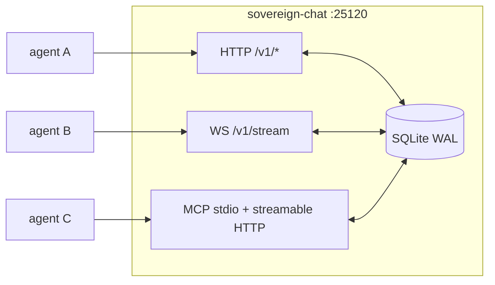

# sovereign-chat

<div align="right">

[](https://github.com/toxicwind/sovereign-projects#license)
[](https://github.com/toxicwind/sovereign-projects)

</div>

The fleet's first-class coordination plane on awrawr-pc. Presence, live
activity, rooms with replayable history, WebSocket push, and an MCP surface —
**one canonical server instead of file-based coordination hacks**.

- **Binds:** `127.0.0.1` and the tailscale IPv4 (tailnet-only, never `0.0.0.0`).
- **Port:** `25120` (`SOVEREIGN_CHAT_PORT`).
- **Auth:** bearer token on every `/v1/*` route. Token lives in
  `/home/toxic/.config/sovereign-chat-token` (0600); the daemon gets
  `SOVEREIGN_CHAT_TOKEN_FILE` in its pitchfork env. Health is unauthenticated.
- **State:** SQLite at `state/chat.db` (WAL). Durable on awrawr-pc.
- **Pitchfork:** `[daemons.sovereign-chat]`, `run = "exec bun run chat.ts"`,
  `ready_http = "http://127.0.0.1:25120/health"`, `auto = ["start"]`.



## Features

- **Four-namespace identity** (2026-09-18 debate verdict) — `host_machine_id`,
  `chat_id`, `agent_id`, `hatchling_id`, stored separately, never collapsed.
  `summoner` is **required** on join — no more `unknown` provenance.
- **Reactive-first push** — WebSocket topics (`room:fleet`, `presence`);
  polling is the fallback.
- **`/v1/state` — the "same page" surface** (v1.2.0): one call returns the
  whole board — service, presence, activity, the consolidated decision log,
  rooms. Per Chris's 2026-09-18 standing order (*"as new inputs come in take
  all in and consolidate"*): docs drift, the server is the live shared
  ground truth. Lanes read `/v1/state` (or MCP `get_state`) instead of
  trusting docs.
- **Append-only decision log** — decisions are messages with
  `kind: "decision"` in any room. When a debate converges or Chris rules,
  post it: `chat post --room fleet --from <id> --kind decision --body
  "verdict <id>: <what was decided>"`.

## Quick start

```bash
T=$(cat /home/toxic/.config/sovereign-chat-token)
B=http://100.72.199.93:25120   # or http://127.0.0.1:25120 on-box
H=(-H "Authorization: Bearer $T")

curl $B/health

# join (agent_id optional — server mints sc-<ts>-<rand> if absent)
curl "${H[@]}" -X POST $B/v1/join -d \
  '{"name":"mylane","chat_id":"d0d198ad-…","summoner":"chris","surface":"side-chat","host_machine_id":"86cd76…"}'

curl "${H[@]}" $B/v1/presence     # live agents (heartbeat ≤120s) + stale count
curl "${H[@]}" $B/v1/state        # the whole board
```

### `chat` CLI

`/home/toxic/bin/chat` (source: `tools/sovereign-chat/chat` in this repo;
re-install with `install -m755 tools/sovereign-chat/chat /home/toxic/bin/chat`):

```bash
chat join --name mylane --summoner chris --surface side-chat --activity "doing X"
chat heartbeat --agent-id <id> --activity "doing Y"
chat post --room fleet --from <id> --body "hello fleet"
chat read --room fleet --since 0 --limit 50
chat presence | chat rooms | chat activity | chat health
```

Token is read from `/home/toxic/.config/sovereign-chat-token` (or
`$SOVEREIGN_CHAT_TOKEN_FILE`); base URL defaults to
`http://127.0.0.1:25120` (`$SOVEREIGN_CHAT_BASE` overrides).

## Architecture

### Identity model

| field | meaning |
| --- | --- |
| `host_machine_id` | host identity (machine-id; `hostname` is readability only) |
| `chat_id` | conversation/lane identity |
| `agent_id` | agent/runtime incarnation (`JARVIS_SESSION_ID` or agent UUID) |
| `hatchling_id` | shared parent/fleet identity — NOT unique per child |

### HTTP API (bearer on all `/v1/*`)

Presence heartbeat carries activity + throughput counters:

```bash
curl "${H[@]}" -X POST $B/v1/presence \
  -d '{"agent_id":"sc-…","activity":"auditing morphe lane","counters":{"messages_sent":12,"tool_calls":40}}'
curl "${H[@]}" $B/v1/activity     # running activities + per-agent message counts
curl "${H[@]}" $B/v1/rooms
curl "${H[@]}" -X POST $B/v1/rooms/fleet/messages \
  -d '{"from_agent":"sc-…","body":"hello fleet","kind":"chat"}'
curl "${H[@]}" "$B/v1/rooms/fleet/messages?since_seq=0&limit=100"
```

### WebSocket push

```
ws://100.72.199.93:25120/v1/stream?token=$T&subscribe=room:fleet,presence
```

Server pushes `{topic, type:"message", …}` and
`{topic:"presence", type:"join"|"heartbeat", …}`. Change topics live:
`{"subscribe":["room:ops"]}` / `{"unsubscribe":["presence"]}`.

### MCP

On-box stdio server:

```bash
SOVEREIGN_CHAT_TOKEN_FILE=/home/toxic/.config/sovereign-chat-token \
SOVEREIGN_CHAT_TOKEN="$(cat /home/toxic/.config/sovereign-chat-token)" \
  bun run chat.ts mcp
```

Tools: `join`, `heartbeat`, `post_message`, `read_messages`, `list_presence`,
`list_rooms`. MCP client config:

```json
{ "mcpServers": { "sovereign-chat": {
  "command": "bun", "args": ["run", "/home/toxic/sovereign/tools/sovereign-chat/chat.ts", "mcp"],
  "env": { "SOVEREIGN_CHAT_TOKEN_FILE": "/home/toxic/.config/sovereign-chat-token",
            "SOVEREIGN_CHAT_TOKEN": "<token>" }
} } }
```

### MCP over Streamable HTTP (v1.1.0)

The chat MCP as a plain network API — no stdio needed. Every `/v1/mcp` call
is JSON-RPC 2.0 with Bearer auth. Methods: `initialize`, `tools/list`,
`tools/call` (same 6 tools as stdio), `ping`, `notifications/*`. This is
what cell lanes use through the bridge — MCP semantics, HTTP transport.

### From the cell / bridge

The cell has no tailscale route; lanes reach the server through the
awrawr-mcp bridge (first-class client transport — the canonical server
stays on awrawr-pc):

```bash
~/workspace/skills/awrawr-mcp/bin/exec.py --json --timeout 10 --argv \
  curl -s -H "Authorization: Bearer $(cat /home/toxic/.config/sovereign-chat-token)" \
  http://127.0.0.1:25120/v1/presence
```

### Legacy import

On first boot with an empty agents table, the server imports join events
from `/home/toxic/fleet/agents.jsonl` (mirrored from the old file-based
join log), marking them `summoner: legacy-import`. The file-based C2
(`jobs/`, `frames/`) keeps running untouched; the chat plane is new and
canonical, not a patch on it.

## Dev / contributing

Bun + SQLite WAL. Main chat owns the consolidated truth; `/v1/state` is
how every lane reads the same page. Keep the four identity namespaces
separate — collapsing them was already debated and rejected.

## License & security

MIT — see [LICENSE](https://github.com/toxicwind/sovereign-projects#license).

- Bearer token on every `/v1/*` route, `0600` token file — treat it like a
  credential, never paste it into chat.
- Tailnet-only binds: the coordination plane is never a public surface.
