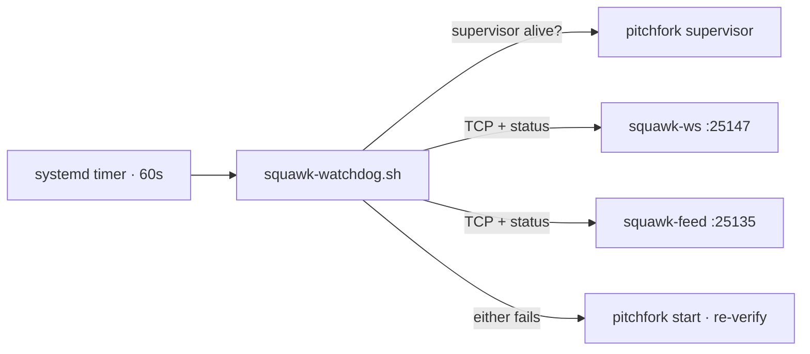

# squawk-watchdog

<div align="right">

[](https://github.com/toxicwind/sovereign-projects#license)
[](https://github.com/toxicwind/sovereign-projects)

</div>

Keeps the two Squawk fleet transports alive on awrawr-pc — because the
fleet's nervous system is useless if the wires are down:

- `squawk-ws` — WebSocket push feed, `127.0.0.1:25147` (pitchfork
  `sovereign/squawk-ws`)
- `squawk-feed` — fat long-poll relay-out, `127.0.0.1:25135` (pitchfork
  `sovereign/squawk-feed`)



## Why

2026-09-14: both daemons "died silently" twice each. Root cause was never
the daemons themselves — fleet workers ran `pitchfork supervisor
stop/start/--force` (5x that day), which kills every managed child, and
each replacement supervisor was started WITHOUT `--boot`, so `boot_start`
daemons never came back on their own. `retry = true` only covers crashes
under a LIVE supervisor. A third "death" was a direct `kill` by a
concurrent worker. See `/home/toxic/.shingle/directives.md` 2026-09-14
entries for the evidence trail.

## What it does

Every 60s (user systemd timer, survives machine restarts):

1. Checks the pitchfork supervisor is alive; if not,
   `pitchfork supervisor start`.
2. For each daemon: TCP-connects the port AND checks `pitchfork status`.
   If either fails, runs `pitchfork start <name>` and re-verifies.

It never stops or restarts anything healthy, and takes a flock so
overlapping runs are impossible. The pitchfork binary is resolved from the
live supervisor process (`/proc/<pid>/exe`) so CLI/supervisor versions
cannot skew (2.16.0 vs 2.25.0 hazard, 2026-09-14).

## Quick start

```sh
mkdir -p /home/toxic/.local/share/squawk-watchdog
cp tools/squawk-watchdog/squawk-watchdog.sh /home/toxic/.local/share/squawk-watchdog/
cp tools/squawk-watchdog/squawk-watchdog.{service,timer} ~/.config/systemd/user/
systemctl --user daemon-reload
systemctl --user enable --now squawk-watchdog.timer
```

Logs: `/home/toxic/.local/state/squawk-watchdog/watchdog.log`
Heartbeat: `/home/toxic/.local/state/squawk-watchdog/heartbeat`

## Architecture

Additive by design — the install touches nothing live. Single script +
systemd timer; the timer (not a daemon loop) is the 60s cadence, so it
survives machine restarts via the user manager.

## What it does NOT fix (needs Chris / fleet decision)

- Workers restarting the supervisor at will (`supervisor stop/start/--force`
  kills ALL 37 daemons fleet-wide). Convention needed: announce in
  directives.md first, or use `pitchfork restart <name>` for single daemons.
- Only 10 of 37 pitchfork daemons are running; 27 sit "available". On a real
  machine restart only the 6 `boot_start` daemons return.
- `pitchfork.service` unit pins 2.25.0 while the fleet runs 2.16.0.

## Dev / contributing

Keep the flock, keep the never-touch-healthy rule, keep the
`/proc/<pid>/exe` binary resolution. The watchdog must stay dumber than
the thing it watches.

## License & security

MIT — see [LICENSE](https://github.com/toxicwind/sovereign-projects#license).

The watchdog can start daemons — that's its job — but it never stops or
restarts anything healthy. Scope creep here is a fleet-wide outage vector.
