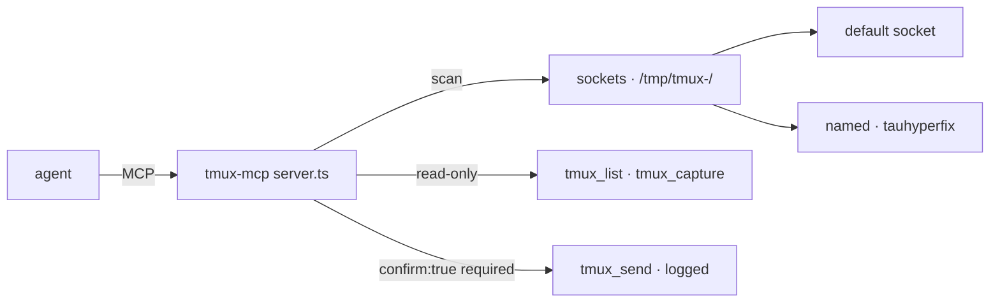

# tmux-mcp v2.0

<div align="right">

[](https://github.com/toxicwind/sovereign-projects#license)
[](https://github.com/toxicwind/sovereign-projects)

</div>

MCP server for tmux session inspection and control — hardened for
multi-socket estates. Agents can see what's running in every tmux session
(`tmux_list`, `tmux_capture`); sending keystrokes (`tmux_send`) is gated
behind explicit confirmation so it can never happen by accident.



## Tools

| Tool | Access | Description |
| --- | --- | --- |
| `tmux_list` | Read-only | Lists sessions across **all** discovered tmux sockets (default + named like `tauhyperfix`) |
| `tmux_capture` | Read-only | Captures pane scrollback (last 100 lines). `target` like `session:window.pane`, optional `socket` |
| `tmux_send` | **Destructive-gated** | Sends keys to a pane. Requires explicit `confirm:true` — refused otherwise |

## Features

- **Multi-socket discovery** — scans `/tmp/tmux-<uid>/` (or `$TMUX_TMPDIR`)
  for socket files; enumerates the default socket plus named ones (e.g.
  `tauhyperfix`). v1 only saw the default socket.
- **Destructive-send gating** — `tmux_send` is never accidental: the schema
  requires `confirm:true`, and the server logs every confirmed send to
  stderr.

## Quick start

```bash
/home/toxic/.bun/bin/bun /home/toxic/sovereign/tools/tmux-mcp/server.ts
```

Registered in the shep gateway (`projects/range/ranch/barn/shep/mcp_config.json`) as `tmux`
(currently disabled pending deployment review).

## Architecture

Single Bun script (`server.ts`). Socket scan → session enumeration →
per-tool handlers. Reads are free; sends are schema-gated and stderr-logged.

## Config

| Env / arg | Purpose |
| --- | --- |
| `$TMUX_TMPDIR` | override socket scan dir (default `/tmp/tmux-<uid>/`) |
| `target` | `session:window.pane` for capture/send |
| `confirm:true` | required for `tmux_send` |

## See also

- [Fleet Knowledgebase](../../docs/fleet-knowledgebase.md) — crew `tau-tmux-mcp`
- [Mesh gateway](../../projects/mesh/gateway/) — canonical MCP config

## Dev / contributing

Keep the gating: any new write-capable tool gets the same `confirm:true`
schema requirement and stderr audit line as `tmux_send`.

## License & security

MIT — see [LICENSE](https://github.com/toxicwind/sovereign-projects#license).

- Never send to interactive shells without the user's informed intent —
  `tmux_send` is destructive-gated for exactly this reason.
- Pane scrollback may contain secrets; treat `tmux_capture` output like a
  terminal screenshot.
