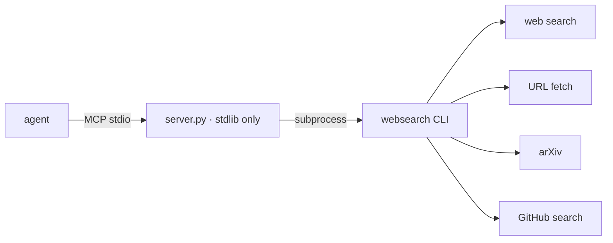

# websearch-mcp

<div align="right">

[](https://github.com/toxicwind/sovereign-projects#license)
[](https://github.com/toxicwind/sovereign-projects)

</div>

Stdlib-only MCP wrapper for the `websearch-skill` CLI package (v0.6.1).
`websearch-skill` 0.6.1 ships no MCP server — it's CLI-only. This wrapper
exposes its capabilities over MCP stdio using only the Python standard
library: no extra dependencies, nothing to install.



## Tools

| Tool | Description |
| --- | --- |
| `web_search` | Web search via `websearch web-search --json` |
| `web_fetch` | Fetch a URL via `websearch web-fetch --json` |
| `arxiv_search` | arXiv search |
| `github_search` | GitHub code/repo search |

## Quick start

```bash
python3 /home/toxic/sovereign/tools/websearch-mcp/server.py
```

Requires the `websearch` CLI on PATH (`uvx websearch-skill` provides it).

## Architecture

One Python file (`server.py`), stdlib only. MCP stdio framing in, CLI
subprocess out — the wrapper adds the protocol, not the capability.

## Verification

Live-tested 2026-09-20: initialize + tools/list + real `web_search` for
"Model Context Protocol" returned live Wikipedia results.

## Config

None — the wrapper inherits the `websearch` CLI's own config.

## See also

- [Fleet Knowledgebase](../../docs/fleet-knowledgebase.md) — crew `tau-tmux-mcp`
- [Shep gateway](../../projects/range/ranch/barn/shep/) — registered as `websearch-mcp`

## Dev / contributing

Keep it stdlib-only. New CLI subcommands from `websearch-skill` get a new
tool entry here with the same `--json` pass-through shape.

## License & security

MIT — see [LICENSE](https://github.com/toxicwind/sovereign-projects#license).

- The wrapper fetches arbitrary URLs on the agent's behalf — `web_fetch`
  of untrusted pages is the same trust call as the agent browsing itself.
- No credentials flow through this server; the CLI's own auth (if any)
  stays in the CLI.
